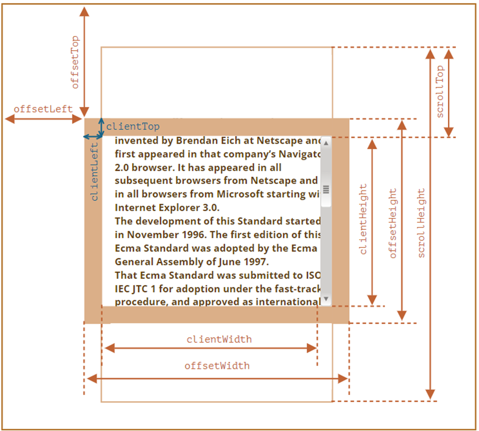
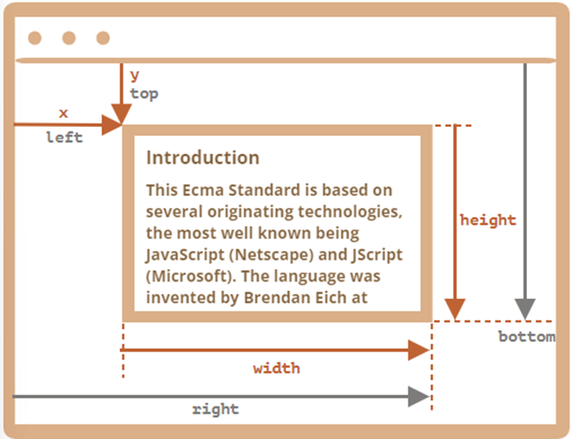

# Unidad 4 - El DOM

## Propiedades clave para interactuar con el DOM

### Acceso directo a elementos básicos

Permiten acceder a los elementos del documento:

-   **`document`** → Representa todo el documento.
-   **`document.body`** → Cuerpo del documento.
-   **`document.head`** → Cabecera del documento.

### **Navegación por el DOM**

**Recorrido por elementos del DOM**

| Propiedad                         | Descripción        |
| --------------------------------- | ------------------ |
| `elemento.parentElement`          | Elemento padre     |
| `elemento.previousElementSibling` | Hermano anterior   |
| `elemento.nextElementSibling`     | Hermano siguiente  |
| `elemento.children`               | Colección de hijos |
| `elemento.firstElementChild`      | Primer hijo        |
| `elemento.lastElementChild`       | Último hijo        |

**Recorrido por todos los nodos del DOM**

| Propiedad                  | Descripción              |
| -------------------------- | ------------------------ |
| `elemento.parentNode`      | Nodo padre               |
| `elemento.previousSibling` | Nodo hermano anterior    |
| `elemento.nextSibling`     | Nodo hermano siguiente   |
| `elemento.childNodes`      | Colección de nodos hijos |
| `elemento.firstChild`      | Primer nodo hijo         |
| `elemento.lastChild`       | Último nodo hijo         |

### Colecciones

Las colecciones tienen estas propiedades:

-   Iterables (`for..of`).
-   Accesibles por índice (`[]`).
-   Propiedad `.length` para el tamaño.
-   Transformables en arrays (`Array.from()`).
-   Solo lectura.
-   Algunas son colecciones vivas.

Ejemplo → `elemento.children`

## Propiedades específicas para tablas

Los elementos de las tablas tienen propiedades que facilitan acceder a sus elementos.

| Propiedad            | Descripción                            |
| -------------------- | -------------------------------------- |
| `tabla.caption`      | Elemento `<caption>`.                  |
| `tabla.thead`        | Elemento `<thead>`.                    |
| `tabla.tBodies`      | Colección de `<tbody>`.                |
| `tabla.tFoot`        | Elemento `<tfoot>`.                    |
| `tabla.rows`         | Colección de filas (`<tr>`).           |
| `tbody.rows`         | Filas (`<tr>`) en un `<tbody>`.        |
| `tr.cells`           | Celdas (`<td>` y `<th>`) de un `<tr>`. |
| `tr.sectionRowIndex` | Índice de la fila en su sección.       |
| `tr.rowIndex`        | Índice de la fila en la tabla.         |
| `celda.cellIndex`    | Índice de la celda en su fila.         |

## Métodos para búsqueda en el DOM

### **Por ID**

-   `document.getElementById("id")`
-   Exclusivo de `document`.

### Por etiqueta, clase o nombre

-   Colección viva:
    -   `elemento.getElementsByTagName("etiqueta")` → Elementos descendientes con esa etiqueta.
    -   `elemento.getElementsByTagName("*")` → Todos los elementos descendientes.
    -   `elemento.getElementsByClassName("clase")` → Elementos descendientes de esa clase.
    -   `elemento.getElementsByName("nombre")` → Elementos descendientes cuya propiedad `name` tiene ese valor.

### Por selectores CSS

| Método                                  | Descripción                              |
| --------------------------------------- | ---------------------------------------- |
| `elemento.querySelector("selector")`    | Primer descendiente que coincide.        |
| `elemento.querySelectorAll("selector")` | Colección de descendientes coincidentes. |

### Recorrido hacia antecesores

| Método                         | Descripción                                               |
| ------------------------------ | --------------------------------------------------------- |
| `elemento.closest("selector")` | Primer antecesor coincidente. Incluye el propio elemento. |

### Validación por selectores

| Método                         | Descripción                               |
| ------------------------------ | ----------------------------------------- |
| `elemento.matches("selector")` | Booleano: indica si el elemento coincide. |

## Tipos y propiedades de nodos del DOM

### Tipos de nodos

-   **`Element`**, **`Text`**, **`Comment`**, **`Document`**, etc.
-   Jerarquía: Los nodos son subtipos de `Node`.

### **Propiedades comunes a todos los nodos**

| Propiedad       | Descripción                                                                          |
| --------------- | ------------------------------------------------------------------------------------ |
| `nodo.nodeType` | Tipo numérico del nodo (`1`: Element, `3`: Text, `8`: Comment, `9`: Document, etc.). |
| `nodo.nodeName` | Nombre del nodo, `tagName` (mayúsculas para elementos, ej.: `"DIV"`).                |

### Propiedades de los nodos de tipo texto (`Text`)

| Propiedad                      | Descripción                                                                          |
| ------------------------------ | ------------------------------------------------------------------------------------ |
| `nodo.nodeValue` y `nodo.data` | Contienen el contenido del nodo de texto. Se utiliza comúnmente la propiedad `data`. |

### Propiedades de los nodos de tipo elemento (`Element`)

| **Propiedad**        | **Descripción**                                                                                                                                        |
| -------------------- | ------------------------------------------------------------------------------------------------------------------------------------------------------ |
| **`el.tagName`**     | Cadena que indica el tipo de elemento. Equivalente a `nodeName` y siempre en mayúsculas (por ejemplo, `"SPAN"`).                                       |
| **`el.innerHTML`**   | Cadena con el contenido HTML del elemento. Si contiene errores, JavaScript los corrige automáticamente. Permite insertar scripts, pero no ejecutarlos. |
| **`el.outerHTML`**   | Cadena con el contenido HTML del elemento, incluyendo la etiqueta del propio elemento.                                                                 |
| **`el.textContent`** | Cadena con el contenido en texto puro del elemento (sin formato HTML).                                                                                 |
| **`el.id`**          | Cadena que representa el atributo `id` del elemento.                                                                                                   |
| **`el.hidden`**      | Valor booleano que indica si el elemento está visible (`false`) o está oculto (`true`).                                                                |

### Propiedades específicas de los nodos de tipo elemento (`Element`)

Estas propiedades dependen del tipo de elemento:

| **Propiedad**  | **Descripción**                                                                                             |
| -------------- | ----------------------------------------------------------------------------------------------------------- |
| **`el.value`** | Cadena que representa el valor del elemento. Aplicable a etiquetas como `INPUT`, `SELECT` o `TEXTAREA`.     |
| **`el.href`**  | Cadena que representa el enlace en etiquetas como `A`.                                                      |
| **`el.src`**   | Cadena que representa la ruta de una fuente, imagen o script en etiquetas como `IMG`, `SCRIPT`, o `IFRAME`. |

## Atributos de las etiquetas HTML y propiedades del DOM

Este apartado explora la relación entre los atributos de las etiquetas HTML y las propiedades de los nodos del DOM asociados.

Por ejemplo, en el siguiente código HTML, el nodo correspondiente se manipula desde el DOM de esta forma

```html

```

```jsx
let img = document.getElementById("etiqueta");
console.log(img.id);
console.log(img.src);
console.log(img.alt);
```

### Creación y características de las propiedades del DOM

1. **Generación de propiedades desde los atributos estándar**
    - Al cargar la página, se crean propiedades para los atributos estándar definidos en el elemento HTML.
    - Ejemplo:
        - `.id` → disponible en todos los elementos.
        - `.src` → exclusivo para elementos como `IMG`.
    - Los atributos no estándar no generan automáticamente propiedades en el nodo del DOM.
2. **Tipos de datos de las propiedades del DOM**
    - Los atributos HTML son siempre cadenas de texto.
    - Las propiedades del DOM pueden tener otros tipos, por ejemplo:
        - `.hidden` → `boolean`
        - `.checked` → `boolean`
        - `.style` → `object`
3. **Diferencias entre valores de atributos y propiedades**
    - El valor de una propiedad no siempre coincide con el valor del atributo correspondiente, incluso si comparten tipo.
    - Ejemplo:
        - El atributo `href` (en un elemento `A`) puede contener una URL relativa, completa o un `#hash`.
        - La propiedad `href` siempre contiene una URL absoluta.
4. **Sincronización entre atributos y propiedades**
    - La mayoría de las veces, los cambios en un atributo estándar se reflejan en la propiedad correspondiente, y viceversa.
    - Excepción notable:
        - `.value` → Si el atributo cambia, la propiedad se actualiza; pero si cambia la propiedad, no se refleja en el atributo.

### Métodos para gestionar atributos (estándar o personalizados)

| **Método**                           | **Descripción**                                                                              |
| ------------------------------------ | -------------------------------------------------------------------------------------------- |
| `el.hasAttribute("nombre")`          | Devuelve `true` si el atributo existe.                                                       |
| `el.getAttribute("nombre")`          | Obtiene el valor del atributo como cadena.                                                   |
| `el.setAttribute("nombre", "valor")` | Establece el valor del atributo.                                                             |
| `el.removeAttribute("nombre")`       | Elimina el atributo del elemento.                                                            |
| `el.attributes`                      | Devuelve una colección de todos los atributos del elemento con propiedades `name` y `value`. |

**Nota**: Los nombres de los atributos HTML no distinguen entre mayúsculas y minúsculas. Ejemplo: `"id"`, `"ID"`, `"Id"` son equivalentes.

### `dataset`

JavaScript permite crear y gestionar atributos personalizados fácilmente usando `dataset`.

**Condiciones**:

-   Los nombres de los atributos deben comenzar con `data-`, por ejemplo: `data-about` o `data-user-name`.
-   Se puede acceder mediante `element.dataset.nombre` (donde `"nombre"` corresponde al sufijo del atributo).

**Ejemplo**:

Dado el siguiente HTML → `<p id="p" data-about="Mi párrafo favorito">Texto</p>`

Podemos acceder al atributo personalizado de dos formas:

```jsx
document.getElementById("p").dataset.about; // "Mi párrafo favorito"
document.getElementById("p").getAttribute("data-about"); // "Mi párrafo favorito"
```

## Modificar un documento

### Creación de elementos o nodos de texto

-   **Crear un nodo de tipo elemento (`ELEMENT`) →** `elemento = document.createElement("etiqueta");`
-   **Crear un nodo de tipo texto (`TEXT`) →** `texto = document.createTextNode("texto");`

### Inserción de nodos en el árbol del DOM

Para insertar un nodo, primero debemos localizar el elemento de referencia dentro del DOM y usar los métodos adecuados según la ubicación deseada:

1. **Insertar como último hijo**

-   `elem.append(...nodosOStrings)` → Inserta nodos o cadenas de texto al final del contenido del elemento `elem`.
    -   Las cadenas se convierten automáticamente en nodos de texto.
    -   Se pueden añadir varios nodos o cadenas a la vez.
        **Ejemplos:**
    -   Añadir un elemento:
        ```jsx
        let div = document.createElement("div");
        let p = document.createElement("p");
        div.append(p);
        console.log(div.childNodes); // NodeList [ <p> ]
        ```
    -   Añadir texto:
        ```jsx
        let div = document.createElement("div");
        div.append("Texto adicional");
        console.log(div.textContent); // "Texto adicional"
        ```
    -   Añadir múltiples nodos y texto:
        ```jsx
        let div = document.createElement("div");
        let p = document.createElement("p");
        div.append("Texto", p);
        console.log(div.childNodes); // NodeList [ #text "Texto", <p> ]
        ```

1. **Insertar como primer hijo**
    - `elem.prepend(...nodosOStrings)` → Inserta nodos o cadenas al inicio del contenido de `elem`.
2. **Insertar antes de un elemento**
    - `elem.prepend(...nodosOStrings)` → Inserta nodos o cadenas justo antes de `elem`, dentro del mismo padre.
3. **Insertar después de un elemento**
    - `elem.after(...nodosOStrings)` → Inserta nodos o cadenas justo después de `elem`, dentro del mismo padre.

**Nota:** Estos métodos no solo permiten insertar nuevos nodos, sino que también pueden mover nodos existentes dentro del árbol del DOM.

### Reemplazo de nodos

-   `elem.replaceWith(...nodosOStrings)` → Reemplaza el elemento `elem` con el conjunto de nodos o cadenas especificadas.
    -   Las cadenas se convierten en nodos de texto.

### Insertar HTML como texto con `insertAdjacentHTML`

El método **`elem.insertAdjacentHTML(posición, texto)`** permite insertar contenido HTML o XML directamente en el árbol del DOM, sin alterar los elementos existentes dentro del nodo. A diferencia de **`innerHTML`**, no reemplaza el contenido del elemento.

| **Posición**  | **Descripción**                               |
| ------------- | --------------------------------------------- |
| `beforebegin` | Inserta antes del propio elemento `elem`.     |
| `afterbegin`  | Inserta como el primer hijo dentro de `elem`. |
| `beforeend`   | Inserta como el último hijo dentro de `elem`. |
| `afterend`    | Inserta después del propio elemento `elem`.   |

```html
<!-- beforebegin -->
<p>
    <!-- afterbegin -->
    foo
    <!-- beforeend -->
</p>
<!-- afterend -->
```

```jsx
// HTML inicial:
// <div id="one">one</div>

let d1 = document.getElementById("one");
d1.insertAdjacentHTML("afterend", '<div id="two">two</div>');

// Resultado en el DOM:
// <div id="one">one</div><div id="two">two</div>
```

### Eliminar nodos

**`elem.remove()`** → Elimina el nodo especificado del DOM, incluyendo sus hijos.

```jsx
let elem = document.getElementById("example");
elem.remove(); // Elimina el elemento con id="example" del DOM.
```

### Clonar nodos

El método **`elem.cloneNode(clonarHijos)`** permite duplicar un nodo. Se puede optar por una **clonación profunda** (incluyendo todos los nodos hijos) o **clonación superficial** (sin incluir los hijos).

```html
<div class="alert" id="div">
    <strong>¡Hola!</strong> Este es un mensaje importante.
</div>
<script>
    let divOriginal = document.getElementById("div");

    // Crear una clonación profunda:
    let divClon = divOriginal.cloneNode(true);
    divClon.querySelector("strong").innerHTML = "¡Adiós!"; // Modificar el clon.

    // Insertar el clon después del original:
    divOriginal.after(divClon);

    // Resultado en el DOM:
    // <div class="alert" id="div"><strong>¡Hola!</strong> Este es un mensaje importante.</div>
    // <div class="alert"><strong>¡Adiós!</strong> Este es un mensaje importante.</div>
</script>
```

## Estilos y clases

### Métodos para aplicar estilos a un elemento

-   **Mediante clases**: utilizando el atributo `class`. Ejemplo: `<div class="mi-clase">`
-   **Mediante estilos en línea**: utilizando el atributo `style`. Ejemplo: `<div style="color: red;">`

**Recomendación**: siempre que sea posible, utiliza clases (`class`) para mantener el código más limpio y reutilizable.

### Clases: Propiedades y métodos

`elem.className` → Representa el atributo `class` del elemento. Se puede usar para leer o modificar directamente todas las clases del elemento.

```html
<body class="documento importancia1">
    <script>
        alert(document.body.className); // documento importancia1
    </script>
</body>
```

También puedes manipular el atributo `class` utilizando los métodos genéricos **`getAttribute`** y **`setAttribute`**:

```html
<body class="documento importancia1">
    <script>
        alert(document.body.getAttribute("class")); // documento importancia1
    </script>
</body>
```

`elem.classList` → Proporciona métodos más avanzados para trabajar con clases.

| **Método**                         | **Descripción**                                                 |
| ---------------------------------- | --------------------------------------------------------------- |
| `el.classList.add("clase",...)`    | Añade una o varias clases.                                      |
| `el.classList.remove("clase",...)` | Elimina una o varias clases.                                    |
| `el.classList.toggle("clase")`     | Alterna una clase: la añade si no está o la elimina si ya está. |
| `el.classList.replace("c1", "c2")` | Sustituye una clase existente por otra.                         |
| `el.classList.contains("clase")`   | Devuelve `true` si el elemento contiene la clase especificada.  |

`classList` es iterable, por lo que puedes recorrer las clases del elemento:

```jsx
for (let clase of document.body.classList) {
    alert(clase); // documento, activo
}
```

### Estilos

**`elem.style`** → Permite manipular estilos en línea definidos en el atributo `style`.

Para asignar un estilo:

```jsx
div.style.color = "red";
div.style.backgroundColor = "blue"; // camelCase para nombres compuestos
```

Para eliminar un estilo → `div.style.color = "";`

`elem.cssText` → Permite asignar varios estilos en una sola operación.

```jsx
let div = document.getElementById("div");
div.style.cssText = "color: red; background: gray";
```

### Estilos computados

`getComputedStyle(elem)` → Devuelve un objeto con los estilos finales de un elemento, combinando las hojas de estilo externas, internas y los estilos en línea.

```jsx
let estilos = getComputedStyle(div);
console.log(estilos.backgroundColor); // Estilo final aplicado al fondo
console.log(estilos.width); // Ancho calculado
```

## Tamaño de los elementos y scroll

En JavaScript, existen múltiples propiedades para obtener información sobre las dimensiones y características geométricas de un elemento HTML. Estas propiedades son esenciales para mover, posicionar o trabajar con elementos visuales de una página.

| **Propiedad**               | **Descripción**                                                                                |
| --------------------------- | ---------------------------------------------------------------------------------------------- |
| **`elemento.clientTop`**    | Ancho del borde superior del elemento.                                                         |
| **`elemento.clientLeft`**   | Ancho del borde izquierdo, incluyendo el scroll vertical si está presente.                     |
| **`elemento.offsetWidth`**  | Ancho total del elemento, incluyendo padding, bordes y barra de scroll (si existe).            |
| **`elemento.offsetHeight`** | Altura total del elemento, incluyendo padding, bordes y barra de scroll (si existe).           |
| **`elemento.clientWidth`**  | Ancho del área visible del contenido, incluyendo el padding, pero excluyendo bordes y scroll.  |
| **`elemento.clientHeight`** | Altura del área visible del contenido, incluyendo el padding, pero excluyendo bordes y scroll. |
| **`elemento.scrollWidth`**  | Ancho total del contenido, incluyendo el contenido no visible debido al overflow.              |
| **`elemento.scrollHeight`** | Altura total del contenido, incluyendo el contenido no visible debido al overflow.             |
| **`elemento.scrollLeft`**   | Número de píxeles desplazados horizontalmente hacia la izquierda. Puede leerse o modificarse.  |
| **`elemento.scrollTop`**    | Número de píxeles desplazados verticalmente hacia arriba. Puede leerse o modificarse.          |

-   **`offsetWidth`** y **`offsetHeight` →** Incluyen el ancho/alto del contenido, el `padding`, los bordes y las barras de scroll (si las hay).
-   **`clientWidth`** y **`clientHeight` →** Miden únicamente el área visible del contenido, incluyendo el `padding`, pero excluyen bordes y barras de scroll.
-   **`scrollWidth`** y **`scrollHeight` →** Reflejan el tamaño total del contenido, incluyendo cualquier parte que se desborde fuera del área visible.
-   **`scrollLeft`** y **`scrollTop` →** Indican el desplazamiento horizontal y vertical del contenido respecto a su posición inicial. Son propiedades tanto de lectura como de escritura.



## Tamaño de ventana y desplazamiento

JavaScript proporciona propiedades y métodos para obtener información sobre las dimensiones visibles de un documento, el desplazamiento del contenido y para controlar su posición dentro de la ventana.

### **Tamaño de la parte visible del documento**

| **Propiedad**                           | **Descripción**              |
| --------------------------------------- | ---------------------------- |
| `document.documentElement.clientWidth`  | Ancho visible del documento. |
| `document.documentElement.clientHeight` | Alto visible del documento.  |

### **Tamaño completo del documento**

El tamaño completo del documento incluye el contenido visible y el no visible debido al overflow.

Para calcularlo, se utiliza el siguiente código para determinar la altura máxima:

```jsx
let scrollHeight = Math.max(
    document.body.scrollHeight,
    document.documentElement.scrollHeight,
    document.body.offsetHeight,
    document.documentElement.offsetHeight,
    document.body.clientHeight,
    document.documentElement.clientHeight
);
```

### **Desplazamiento del documento**

Desplazamiento actual.

| **Propiedad**        | **Descripción**                                                     |
| -------------------- | ------------------------------------------------------------------- |
| `window.pageXOffset` | Número de píxeles desplazados horizontalmente (hacia la izquierda). |
| `window.pageYOffset` | Número de píxeles desplazados verticalmente (hacia arriba).         |

Desplazar el documento respecto a la ventana.

| **Método**                                                  | **Descripción**                                           |
| ----------------------------------------------------------- | --------------------------------------------------------- |
| `window.scrollBy(x, y)`                                     | Desplaza la página en relación a su posición actual.      |
| Por ejemplo: `scrollBy(0, 10)` desplaza 10px abajo.         |
| `window.scrollTo(pageX, pageY)`                             | Desplaza la página a coordenadas absolutas.               |
| Ejemplo: `scrollTo(0, 0)` desplaza al inicio del documento. |
| `elem.scrollIntoView(top)`                                  | Desplaza la página para hacer visible el elemento `elem`. |

Si `top = true` (valor predeterminado), el borde superior de `elem` se alinea con la parte superior de la venta.
Si `top = false`, el borde inferior de `elem` se alinea con la parte inferior de la ventana. |

### Control del `scroll`

Deshabilitar el scroll en todo el documento → `document.body.style.overflow = "hidden";`

Restaurar el scroll → `document.body.style.overflow = "";`

## Coordenadas

Las coordenadas son esenciales para mover, posicionar o interactuar con elementos en la página.

**`element.getBoundingClientRect()` →** Devuelve un objeto con las coordenadas del elemento respecto a la ventana (viewport).

| **Propiedad** | **Descripción**                                |
| ------------- | ---------------------------------------------- |
| `width`       | Ancho del elemento.                            |
| `height`      | Alto del elemento.                             |
| `top`         | Coordenada Y del borde superior del elemento.  |
| `bottom`      | Coordenada Y del borde inferior del elemento.  |
| `left`        | Coordenada X del borde izquierdo del elemento. |
| `right`       | Coordenada X del borde derecho del elemento.   |

Las coordenadas se expresan en relación con la parte visible de la ventana y pueden incluir valores decimales.

**Nota:** No es necesario redondear los valores de `top` o `left` para aplicarlos directamente con `style.left` o `style.top`.



**`document.elementFromPoint(x, y)`** → Permite identificar el elemento que se encuentra en un punto específico de la ventana (coordenadas `x`, `y`).

| **Uso**                           | **Descripción**                                                                                                    |
| --------------------------------- | ------------------------------------------------------------------------------------------------------------------ |
| `document.elementFromPoint(x, y)` | Devuelve el elemento más profundamente anidado en las coordenadas dadas.                                           |
| Coordenadas fuera de la ventana   | Si las coordenadas especificadas están fuera del área visible del navegador (viewport), el método devuelve `null`. |
