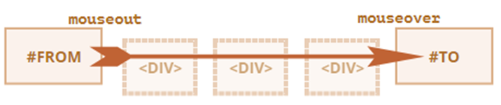
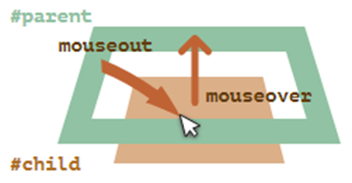

# Unidad 5 - Eventos

## **Introducción a los eventos en el navegador**

Los eventos en JavaScript permiten ejecutar código cuando ocurre una interacción específica en la página, como hacer clic en un botón (`click`), presionar una tecla (`keydown`), mover el ratón (`mousemove`), entre otros.

### **Tipos de eventos**

-   **Eventos del mouse**
    | **Evento** | **Descripción** |
    | ------------- | ------------------------------------------------------- |
    | `click` | Ocurre cuando se hace clic en un elemento. |
    | `contextmenu` | Se activa al hacer clic con el botón derecho del ratón. |
    | `mouseover` | Cuando el cursor entra en un elemento. |
    | `mouseout` | Cuando el cursor sale de un elemento. |
    | `mousedown` | Al presionar un botón del ratón sobre un elemento. |
    | `mouseup` | Al soltar un botón del ratón sobre un elemento. |
    | `mousemove` | Cuando el cursor se mueve dentro de un elemento. |
-   **Eventos del teclado**
    | **Evento** | **Descripción** |
    | ---------- | --------------------------------- |
    | `keydown` | Se activa al presionar una tecla. |
    | `keyup` | Se activa al soltar una tecla. |
-   **Otros eventos relevantes**
    | **Evento** | **Descripción** |
    | ------------------ | -------------------------------------------------------------------------------------------------------- |
    | `submit` | Se produce al enviar un formulario. |
    | `focus` | Ocurre cuando un elemento recibe el foco del teclado. |
    | `blur` | Ocurre cuando un elemento pierde el foco del teclado. |
    | `DOMContentLoaded` | Se activa cuando el DOM está completamente cargado y construido, pero antes de cargar recursos externos. |

### Controladores de eventos

Los controladores o listeners son funciones que se ejecutan cuando ocurre un evento específico.

Hay tres formas principales de asignarlos:

-   **Atributo HTML:** Se define directamente en el elemento HTML usando el atributo `on<Evento>`.
    ```html
    <button onclick="alert('¡Hola!')">Haz clic</button>
    ```
    -   **Nota:** Los atributos `on<Evento>` no se pueden asignar con `setAttribute`.
-   **Propiedad del DOM:** Se asigna una función a la propiedad `on<Evento>` del nodo en el DOM.
    ```jsx
    const boton = document.querySelector("button");
    boton.onclick = () => alert("¡Hola!");
    ```
-   **Método `addEventListener`:** Permite agregar múltiples controladores para un mismo evento y ofrece mayor flexibilidad.
    ```jsx
    const boton = document.querySelector("button");
    boton.addEventListener("click", () => alert("¡Hola!"));
    ```
    **Ventajas:**
    -   Admite múltiples controladores para un mismo evento.
    -   Permite escuchar eventos específicos como `DOMContentLoaded`.
    -   Se puede especificar si el controlador actúa en la fase de **captura** o **burbuja**.
        **Eliminar un evento:** Utiliza el método `removeEventListener`.
    ```jsx
    boton.removeEventListener("click", miFuncion);
    ```

### Objeto asociado al evento

Cuando ocurre un evento, se crea un objeto asociado con detalles como el tipo de evento y el elemento objetivo. Este objeto se pasa como parámetro al controlador.

```jsx
boton.addEventListener("click", (evento) => {
    console.log("Evento:", evento.type);
    console.log("Elemento objetivo:", evento.target);
});
```

### **Propiedades importantes del objeto evento:**

| **Propiedad**         | **Descripción**                                                                     |
| --------------------- | ----------------------------------------------------------------------------------- |
| `type`                | Tipo de evento (por ejemplo, `click`, `keydown`).                                   |
| `target`              | Elemento donde se originó el evento.                                                |
| `currentTarget`       | Elemento al que está asociado el controlador (igual a `this`, salvo excepciones).   |
| `clientX` / `clientY` | Coordenadas del cursor relativas a la ventana (para eventos de ratón).              |
| `preventDefault()`    | Impide la acción predeterminada asociada al evento (por ejemplo, seguir un enlace). |

### Propagación y captura de eventos

-   **Propagación de eventos**: Los eventos en el DOM se propagan hacia los elementos ascendentes, salvo excepciones como `focus`.
-   `event.target` vs `evento.currentTarget`:
    -   `event.target` → Elemento donde se originó el evento.
    -   `event.currentTarget` → Elemento que ejecuta el manejador (el asociado al evento).
-   **Fases de propagación de eventos**
    Según el estándar del DOM, los eventos se propagan a través de tres fases:
    1. **Fase de captura (_capture_):** El evento desciende desde el elemento más externo (`html`) pasando por cada elemento contenedor hasta llegar al objetivo.
        - Los manejadores pueden asociarse tanto a la fase de captura como a la de burbuja usando `addEventListener`. Por defecto, los eventos se asocian a la fase de burbuja, pero para capturar eventos en la fase de captura se usa:
            ```jsx
            elem.addEventListener("evento", manejador, { capture: true });
            // Forma abreviada
            elem.addEventListener("evento", manejador, true);
            ```
        - La fase de captura se utiliza con poca frecuencia.
        - Solo es posible asociar eventos a la fase de captura con `addEventListener` (no con otros métodos).
        - Al eliminar un manejador con `removeEventListener`, se debe especificar la fase si se trata de la de captura. Por defecto, se elimina de la fase de burbuja:
            ```jsx
            elem.addEventListener("evento", manejador, true);
            elem.removeEventListener("evento", manejador, true);
            ```
    2. **Fase de objetivo:** El evento llega al elemento que lo disparó.
    3. **Fase de burbuja (_bubbling_):** El evento se propaga hacia arriba, pasando desde el elemento objetivo hacia sus ascendientes.

### Delegación de eventos

La delegación de eventos es un patrón eficiente para gestionar múltiples elementos similares con un único controlador:

-   En lugar de asignar controladores individuales, se coloca uno en un ancestro común.
-   Se utiliza la propiedad `event.target` para identificar el elemento donde ocurrió el evento.
-   Si el evento ocurrió en un elemento de interés, se gestiona desde el controlador.

### Acciones predeterminadas del navegador

Muchos eventos desencadenan acciones predeterminadas, como:

-   Navegar al hacer clic en un enlace `<a>`.
-   Enviar un formulario al hacer clic en un botón de tipo `submit`.
-   Seleccionar texto al arrastrarlo con el ratón.

**Para evitar estas acciones predeterminadas:**

1. Usar `event.preventDefault()`:

    ```html
    <a href="/" onclick="event.preventDefault()">Aquí</a>
    ```

2. Retornar `false` (solo válido con `on<evento>`):

    ```html
    <a href="/" onclick="return false">Haz clic aquí</a>
    ```

## Eventos de la interfaz de usuario

### Eventos del ratón

| **Evento**            | **Descripción**                                                                       |
| --------------------- | ------------------------------------------------------------------------------------- |
| `mousedown`/`mouseup` | Ocurre al presionar/soltar un botón del ratón sobre un elemento.                      |
| `click`               | Sigue a `mousedown` y `mouseup` con el botón izquierdo.                               |
| `dblclick`            | Doble clic con el botón izquierdo (hoy poco usado).                                   |
| `contextmenu`         | Se activa al usar el botón derecho o atajos de teclado para abrir el menú contextual. |

**Orden típico de eventos:**`mousedown → mouseup → click → mousedown → mouseup → click → dblclick`

**Propiedades relevantes:**

| **Propiedad**                                                      | **Descripción**                                                        | **Valores**                          |
| ------------------------------------------------------------------ | ---------------------------------------------------------------------- | ------------------------------------ |
| `event.button`                                                     | Indica el botón presionado.                                            | 0: Izquierdo, 1: Central, 2: Derecho |
| `event.buttons`                                                    | Representa múltiples botones presionados (en bits).                    |                                      |
| `event.shiftKey`, `event.altKey`, `event.ctrlKey`, `event.metaKey` | Indican si se usaron teclas modificadoras como Shift, Alt, Ctrl o Cmd. |                                      |

**Coordenadas del evento del ratón:**

-   **`event.clientX` y `event.clientY`** → Proporcionan las coordenadas del ratón relativas a la ventana.
-   **`event.pageX` y `event.pageY`** → Proporcionan las coordenadas del ratón relativas al documento HTML.

**Impedir la selección de texto (`preventDefault`):**

-   El comportamiento por defecto, como seleccionar texto al hacer doble clic o al arrastrar el ratón, puede evitarse anulando el evento `mousedown`:
    ```html
    <p ondblclick="alert('Click!')" onmousedown="return false">texto</p>
    ```

**Impedir copiar texto al portapapeles:**

-   Para bloquear la acción de copiar, se puede anular el evento `oncopy`:
    ```html
    <div oncopy="alert('¡Copiado prohibido!');return false;">texto</div>
    ```

### Eventos de movimiento del ratón

| **Evento**  | **Descripción**                                                 |
| ----------- | --------------------------------------------------------------- |
| `mouseover` | Se mueve el puntero hacia el elemento o un descendiente.        |
| `mouseout`  | Se mueve el puntero fuera del elemento o hacia un descendiente. |
| `mousemove` | Cualquier movimiento sobre el elemento.                         |

**Diferencias con `mouseenter` y `mouseleave`:**

-   Estos no consideran movimientos hacia/desde descendientes.
-   No burbujean, por lo que no son útiles para delegación de eventos.

**Nota:** Si el movimiento es rápido, algunos elementos pueden no detectar el evento.



**Propiedad relacionada**

| **Propiedad**         | **Descripción**                                                                                            |
| --------------------- | ---------------------------------------------------------------------------------------------------------- |
| `event.relatedTarget` | Elemento hacia o desde el que se mueve el puntero. Puede ser `null` si se mueve hacia fuera del documento. |

-   Si el ratón entra en un hijo, se genera `mouseout` en el padre y `mouseover` en el hijo.
-   Al salir del hijo hacia el padre, ocurre lo contrario: `mouseout` en el hijo y `mouseover` en el padre.



### **Eventos `mouseenter` y `mouseleave`**

Similares a `mouseover` y `mouseout`, pero con diferencias clave:

1. **No cuentan movimientos hacia o desde descendientes.**
2. **No burbujean**, por lo que no pueden capturarse en un elemento padre ni usarse para delegación de eventos.

| **Evento**   | **Se activa cuando**                        |
| ------------ | ------------------------------------------- |
| `mouseenter` | El puntero entra en el área de un elemento. |
| `mouseleave` | El puntero sale del área de un elemento.    |

### Teclado: `keydown` y `keyup`

Los eventos de teclado permiten gestionar acciones al presionar o soltar teclas, incluyendo teclados físicos y virtuales. Son útiles para responder a combinaciones de teclas, flechas de navegación, teclas de función, entre otros.

| **Evento** | **Se produce cuando**                |
| ---------- | ------------------------------------ |
| `keydown`  | Una tecla es presionada.             |
| `keyup`    | Una tecla es liberada.               |
| `keypress` | **Obsoleto**, no se recomienda usar. |

**Propiedades asociadas a `keydown` y `keyup`**

| **Propiedad**  | **Descripción**                                                             |
| -------------- | --------------------------------------------------------------------------- |
| `event.key`    | Carácter que representa la tecla presionada (ej. `"a"`, `"Z"`, `"Enter"`).  |
| `event.code`   | Código físico de la tecla presionada (ej. `"KeyA"`, `"Digit1"`, `"Enter"`). |
| `event.repeat` | Indica si la tecla está siendo mantenida presionada.                        |

**Comportamiento de autorepetición**

-   Si se mantiene una tecla presionada, el evento `keydown` se dispara repetidamente.
-   Cuando la tecla se libera, se genera un único evento `keyup`.

**Acciones por defecto**

Dependiendo de la tecla presionada, el navegador puede ejecutar ciertas acciones predeterminadas:

-   Presionar un carácter: **se inserta en el campo de texto activo.**
-   Tecla `Delete`: **elimina un carácter.**
-   Combinaciones del sistema operativo (ej. `Alt + F4`): **cierran ventanas o realizan otras acciones inmodificables desde JavaScript.**

**Cancelar acciones predeterminadas:** Usar `event.preventDefault()` para evitar ciertos comportamientos por defecto, con excepciones para comandos del sistema operativo.
