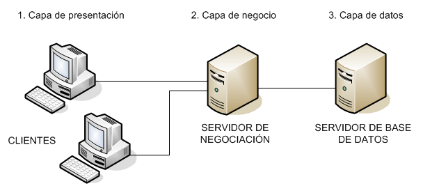

# Unidad 1 - Selección de arquitecturas y herramientas de programación

## Evolución de la web

### Web 1.0 (1990-2004)

- Se caracterizó por el uso de páginas estáticas y unidireccionales, donde los usuarios solo podían consumir contenido sin interactuar. Estas páginas estaban escritas en HTML y servidas por los primeros servidores web.
- Las tecnologías del lado del servidor, como CGI (Common Gateway Interface), empezaron a permitir una interacción básica entre el cliente y el servidor. En 1994, surge PHP, uno de los primeros lenguajes para la programación del lado del servidor.

### Web 2.0 (2004-2010)

- Las aplicaciones web comienzan a ser dinámicas y colaborativas. Los usuarios no solo consumen contenido, sino que también pueden crearlo e interactuar. Este periodo está marcado por el auge de las redes sociales, blogs, foros y diversas plataformas colaborativas.
- La arquitectura de las aplicaciones se modela en capas, con una clara distinción entre la interfaz de usuario, la lógica de negocio y la gestión de datos.

### Web 3.0 (2010-2016)

- La web semántica introduce una manera más inteligente de buscar y gestionar información, con aplicaciones que pueden entender y procesar datos de manera más eficiente.
- El crecimiento de dispositivos móviles (smartphones y tablets) impulsó la necesidad de aplicaciones web más personalizadas y optimizadas para diferentes plataformas.
- Las tecnologías de cloud computing permitieron escalar las aplicaciones para soportar más usuarios y proporcionar servicios más robustos.

### Web 4.0 (2016 en adelante)

- Esta etapa se enfoca en la integración de inteligencia artificial y tecnologías contextuales, como el reconocimiento de voz, para mejorar la interacción entre el usuario y la web.

## Aplicaciones web frente a aplicaciones de escritorio

### Aplicaciones web

- **Accesibilidad**: Se **ejecutan en servidores remotos** y son **accesibles desde cualquier navegador** a través de una URL.
- **Arquitectura**: Están basadas en la arquitectura **cliente-servidor**. Los usuarios **pueden acceder de manera simultánea** desde múltiples dispositivos.


- **Ventajas**:
    - No es necesario instalar software adicional en el cliente, lo que facilita las actualizaciones y el mantenimiento.
    - Se accede siempre a la última versión de la aplicación.
    - La movilidad es total, ya que se puede usar en cualquier dispositivo con acceso a Internet.
- **Inconvenientes**:
    - La disponibilidad **depende de la conexión a internet** o del servidor.

### Aplicaciones de escritorio

- **Accesibilidad**: Están instaladas de forma local en el equipo del usuario y generalmente solo permiten el **uso** por un **único** usuario a la vez.
- **Ventajas**: No dependen de una conexión a internet para funcionar.
- **Inconvenientes**: Las actualizaciones requieren intervención en cada equipo, lo que puede generar problemas de versiones desactualizadas.

## Aplicaciones web

Una aplicación web debe cumplir varias funciones clave para su correcto funcionamiento:

- **Distribución de información**: Facilitar la entrega de contenido a través de Internet.
- **Gestión de concurrencia**: Permitir que **múltiples usuarios accedan simultáneamente** al mismo recurso sin conflictos.
- **Generación de contenido dinámico**: Crear páginas web de manera dinámica a partir de la interacción de los usuarios.
- **Seguridad**: Implementar mecanismos de **control de acceso** y **protección de los recursos** web.
- **Conexión con bases de datos**: Mantener datos de forma persistente, asegurando actualizaciones confiables y consistentes.
- **Escalabilidad y portabilidad**: Capacidad para **ejecutarse en múltiples máquinas**, permitiendo que la aplicación **crezca según la demanda** y **funcione en diferentes entornos**.


## Tipos de aplicaciones web

- **Aplicaciones web estáticas**: Ofrecen el **mismo contenido para todos los usuarios** y están implementadas principalmente en HTML.
- **Aplicaciones web animadas**: Utilizan tecnologías como **Flash** para añadir **animaciones y efectos visuales**, como banners o vídeos.
- **Aplicaciones web dinámicas**: **Generan contenido en tiempo real** tanto en el cliente como en el servidor. Suelen utilizar lenguajes de programación como **PHP**, **ASP.NET** o **Python**.
- **Aplicaciones web interactivas**: **Permiten personalizar la experiencia** del usuario. Por ejemplo, en un juego en línea, el usuario puede continuar desde donde lo dejó en sesiones anteriores mediante el uso de sistemas de control de sesiones.

## Acceso a una aplicación web

El acceso a una aplicación web se realiza mediante la solicitud de su **URI o URL en un navegador** web. La estructura de esta dirección incluye varios componentes:

- **Protocolo**: El método de transferencia de datos (ej. HTTP).
- **Dirección IP o dominio**: El servidor donde se aloja la aplicación (ej. `www.debian.org`).
- **Puerto**: El puerto en el servidor donde se recibe la solicitud (por defecto, el puerto 80).
- **Directorio y archivo**: El archivo que el servidor debe enviar (ej. `index.html`).

Por ejemplo, la URL `http://www.debian.org:80/index.html` especifica que la solicitud se realiza a través de HTTP al puerto 80, obteniendo el archivo `index.html` en el dominio **debian.org**.

## Plataformas web

Una **plataforma web** es el **entorno de software utilizado para desarrollar y ejecutar aplicaciones web**. Las plataformas combinan diferentes componentes:

- **Sistema operativo**: Proporciona la base para la ejecución de las aplicaciones web.
- **Servidor web**: Procesa las peticiones de los usuarios y les devuelve los recursos solicitados.
- **Gestor de bases de datos**: Almacena y gestiona los datos empleados por la aplicación web.
- **Lenguaje de programación**: Define la lógica del servidor para manejar las interacciones y generar el contenido dinámico.

### Clasificación de plataformas web

1. **Plataformas libres**:
    - Ej. **LAMP**: Linux (SO), Apache (servidor web), MySQL (gestor de bases de datos), PHP (lenguaje).
2. **Plataformas propietarias**:
    - Ej. **WISA**: Windows (SO), Internet Information Services (servidor web), SQL Server (BBDD), ASP.NET (lenguaje).
3. **Plataformas híbridas**:
    - Ej. **WAMP**: Windows (SO), Apache (servidor web), MySQL (BBDD), PHP (lenguaje).

## Servidores web frente a servidores de aplicaciones

- **Servidor web**: **Maneja las peticiones** HTTP, sirviendo páginas estáticas o dinámicas (usualmente con tecnologías como PHP). Ejemplo: **Apache**.
- **Servidor de aplicaciones**: Ofrece un entorno completo que no solo procesa peticiones HTTP, sino que **también maneja la lógica de negocio**, la **gestión de bases de datos** y **otros procesos** complejos. Ejemplo: **Tomcat** (para aplicaciones Java EE).

**Nota**: **Todo servidor de aplicaciones también es un servidor web**, pero **no todo servidor web es un servidor de aplicaciones**.

## Lenguajes de programación de scripts del lado del servidor

**PHP (Hypertext Processor)**: Es una tecnología ampliamente soportada por la mayoría de los servidores web. Ejemplo básico en PHP:

```php
<html>
	<head>
		<title>Hola mundo (en PHP)</title>
	<head>
	<body>
		<?php echo "Hola mundo"; ?>
	</body>
</html>
```

**JSP (Java Server Pages)**: Utiliza Java para generar contenido dinámico. Requiere un servidor de aplicaciones como **Tomcat**. Ejemplo básico en JSP:

```java
<html>
	<head>
		<title>Hola mundo (en PHP)</title>
		<%! String message = "Hola mundo"; %>
	<head>
	<body>
		<%= message %>
	</body>
</html>
```

**ASP (Active Server Pages)**: Ahora **ASP.Net**, es una tecnología de Microsoft diseñada para ejecutarse en **IIS (Internet Information Server)**, pero también puede funcionar en otros servidores web.

## Arquitecturas web

Una **arquitectura web** es un **conjunto ordenado de subsistemas** que **estructuran la aplicación** para lograr una **mejor organización y escalabilidad**. Estas arquitecturas siguen el modelo **cliente-servidor**.


### Tipos de arquitecturas

1. **Arquitectura en capas**: Divide la aplicación en capas lógicas:
    - **Capa de presentación**: Interfaz de usuario y procesado de las solicitudes del cliente.
    - **Capa de lógica de negocio**: Implementa las reglas del negocio (ej. proceso de compra en una tienda en línea).
    - **Capa de persistencia de datos**: Interactúa con las bases de datos.
    
    
    
2. **Arquitectura en niveles**: Similar a la arquitectura en capas, pero **las capas se implementan en máquinas separadas físicamente**, **facilitando la escalabilidad** en sistemas distribuidos.
3. **Arquitectura orientada a servicios (SOA)**: Basada en la exposición de **servicios web** que permiten la **interacción entre diferentes sistemas**, facilitando la **interoperabilidad entre aplicaciones**.
    
    
    

### Características

- **Separación de responsabilidades:** Cada capa tiene funciones específicas.
- **Portabilidad:** Adaptación a diferentes entornos sin reprogramación.
- **Gestión de sesión de usuario:** Esencial en el desarrollo.
- **Escalabilidad:** La aplicación debe adaptarse al aumento de usuarios, generalmente requiriendo un clúster de servidores.
    - **Escalabilidad vertical:** Las **capas lógicas** se **implementan físicamente separadas**, utilizando Middleware para la comunicación remota.
    - **Escalabilidad horizontal:** Se **clona el sistema y se balancea la carga**, lo que puede generar problemas de mantenimiento de sesión, que se pueden abordar con herramientas como cookies.
- **Aplicación de patrones de diseño:** Ejemplo del patrón MVC, que divide la aplicación en **Vista, Controlador y Modelo**.

## Herramientas para desarrollar aplicaciones web en entorno servidor. IDE y framework

El desarrollo de aplicaciones web requiere varias herramientas:

- **Navegadores**: Para probar y acceder a las aplicaciones (Edge, Chrome, Firefox).
- **Editores de código**: Para escribir el código (Notepad++, PhpStorm, Brackets, Atom).
- **Gestores de bases de datos**: Para gestionar y administrar las bases de datos (PhpMyAdmin).
- **IDE (Entorno de desarrollo integrado)**:
    - **Genéricos**: Eclipse (Java, C, PHP), Visual Studio Code.
    - **Específicos**: NetBeans (Java), Visual Studio (.NET).
- **Frameworks**: Facilitan el desarrollo de aplicaciones al proporcionar librerías y componentes reutilizables. Ejemplos: **Laravel**, **Symfony**.

## Cloud computing y servicios

**Cloud computing** implica el uso de servidores remotos para almacenar, procesar y gestionar datos y aplicaciones. **Proporciona un entorno escalable y flexible** para el desarrollo y ejecución de aplicaciones web.


### Modelos de servicios

1. **Software-as-a-Service (SaaS)**: Servicios basados en la **web donde el proveedor gestiona todo**, desde el mantenimiento hasta las actualizaciones. Ej. **Google Drive**, **Dropbox**.
2. **Platform-as-a-Service (PaaS)**: **Proporciona una infraestructura completa** para desarrollar y desplegar aplicaciones. Ej. **Google App Engine**, **Windows Azure**.
3. **Infrastructure-as-a-Service (IaaS)**: Además del desarrollo, **el usuario gestiona la infraestructura física o virtual** necesaria para el despliegue. Ej. **Amazon Web Services (AWS)**.


### Windows Azure y Google App Engine

Windows Azure, ahora conocido como Microsoft Azure, es una plataforma de servicios en la nube que ofrece una amplia gama de servicios, incluyendo almacenamiento, computación, análisis y redes. Permite a los desarrolladores crear, implementar y gestionar aplicaciones en la nube, utilizando una variedad de lenguajes de programación y herramientas.

Google App Engine, por otro lado, es una plataforma de desarrollo en la nube de Google que permite a los desarrolladores crear y escalar aplicaciones web sin preocuparse por la infraestructura subyacente. Ofrece un entorno completamente gestionado donde puedes desplegar tu aplicación y utilizar servicios como bases de datos, almacenamiento y análisis.

---

## Web 3.0

La Web 3.0 representa una evolución significativa de Internet, enfocándose en una experiencia más personalizada y eficiente para los usuarios. A diferencia de la Web 2.0, que se centraba en la interacción social y el contenido generado por los usuarios, la Web 3.0 introduce la **Web Semántica**, que utiliza lenguajes y procedimientos para interpretar las características del usuario y ofrecer una interfaz más personalizada.

Entre las características más destacadas de la Web 3.0 se encuentran las **búsquedas inteligentes**, que permiten una clasificación de páginas web basada en las necesidades del usuario, y la **evolución de las redes sociales**, que se vuelven más complejas y numerosas. Además, la Web 3.0 requiere de una **conexión a Internet más rápida** y permite la **conectividad a través de múltiples dispositivos**, como celulares, tablets y relojes.

Otras características incluyen el **contenido libre**, con un aumento en el uso de programas y licencias 'Creative Commons', y la creación de **espacios tridimensionales** para una visualización más avanzada de la web. También se destaca la **Web Geoespacial**, que ofrece información basada en la localización geográfica del usuario, y la **computación en la nube**, que convierte la web en un espacio de almacenamiento y ejecución de programas. Por último, la **vinculación de datos** permite unificar información de diversas fuentes para ofrecer respuestas más completas a los usuarios.

## Web 4.0

La Web 4.0 representa un avance significativo en la experiencia del usuario, donde la inteligencia artificial y la web semántica juegan un papel crucial. Según Daniel Chicoma, docente de ESAN, esta nueva web permitirá una interacción más activa y personalizada, funcionando como un asistente virtual capaz de realizar tareas complejas como reservas de hoteles o entradas al cine basándose en preferencias y datos previos del usuario.

Además, la Web 4.0 se beneficiará del big data y el aprendizaje automático para predecir acciones y optimizar tareas, lo que permitirá una máxima personalización. Las empresas deberán adaptarse a esta tecnología para mejorar sus productos y servicios, aprovechando herramientas como la nube, las redes sociales y los dispositivos móviles para mantenerse competitivas en un entorno digital en constante evolución.

## Aplicaciones Web

Cuatro aplicaciones web típicas:

- Correo electrónico: Servicios como Gmail y Outlook permiten enviar y recibir correos electrónicos a través de un navegador web.
- Calendarios en línea: Aplicaciones como Google Calendar permiten gestionar eventos y recordatorios desde cualquier dispositivo con acceso a Internet.
- Comercio electrónico: Plataformas como Amazon y Shopify facilitan la compra y venta de productos en línea.
- Calculadoras en línea: Herramientas como Desmos ofrecen funciones avanzadas de cálculo matemático accesibles desde el navegador.

## Tecnologías del lado servidor

La tecnología de desarrollo web más utilizada para los scripts del lado servidor es PHP.


## Servidores web

El servidor web más utilizado es Nginx.


## Apache vs Nginx

- **Arquitectura**: Apache utiliza una arquitectura basada en procesos o hilos, mientras que Nginx se basa en una arquitectura dirigida por eventos, lo que le permite manejar múltiples conexiones simultáneamente con menos recursos.
- **Manejo de Contenidos Dinámicos**: Apache puede procesar contenidos dinámicos internamente mediante módulos como `mod_php`, mientras que Nginx externaliza esta tarea a servidores de aplicaciones especializados.
- **Configuración**: Apache permite configuraciones descentralizadas a través de archivos `.htaccess`, lo que puede ralentizar el servidor. Nginx, en cambio, utiliza una configuración centralizada en `nginx.conf`, lo que mejora la seguridad y el rendimiento.
- **Compatibilidad y Uso**: Ambos servidores son compatibles con múltiples plataformas y se utilizan en escenarios similares, aunque Apache es más común en entornos de alojamiento compartido y Nginx es preferido para manejar tráfico elevado y como balanceador de carga.

## GWS

Google Web Server (GWS) es un software de servidor web propietario utilizado por Google para su infraestructura web2. Este servidor web se encarga de alojar y servir páginas web de manera eficiente dentro del ecosistema de Google.

## Xampp

**XAMPP** es una distribución gratuita y fácil de instalar que incluye varios componentes esenciales para el desarrollo web². Su nombre es un acrónimo que representa los componentes principales que incluye:

- **X**: Cross-platform (multiplataforma, compatible con Windows, Linux y macOS)
- **A**: Apache (servidor web)
- **M**: MariaDB (sistema de gestión de bases de datos)
- **P**: PHP (lenguaje de programación)
- **P**: Perl (lenguaje de programación)

### Componentes de XAMPP

1. **Apache**: Servidor HTTP que procesa las solicitudes web.
2. **MariaDB**: Sistema de gestión de bases de datos que reemplaza a MySQL.
3. **PHP**: Lenguaje de programación del lado del servidor.
4. **Perl**: Lenguaje de programación.
5. **phpMyAdmin**: Herramienta para la administración de bases de datos MariaDB.
6. **FileZilla FTP Server**: Servidor FTP.
7. **Mercury Mail Transport System**: Servidor de correo.
8. **Tomcat**: Servidor de aplicaciones Java.
9. **OpenSSL**: Herramienta para la implementación de protocolos de seguridad.
10. **Webalizer**: Herramienta de análisis de logs web.

### DocumentRoot por defecto

El **DocumentRoot** por defecto en XAMPP es la carpeta donde se almacenan los archivos web que Apache servirá. En una instalación típica de XAMPP en Windows, el DocumentRoot se encuentra en `C:\\xampp\\htdocs`.

En esta carpeta puedes colocar tus archivos HTML, PHP y otros recursos web para que sean accesibles a través del servidor web Apache.

## LEMP

El término **LEMP** se refiere a un conjunto de software utilizado para desarrollar y servir aplicaciones web. Es un acrónimo que representa:

- **L**: Linux (sistema operativo)
- **E**: Nginx (servidor web, pronunciado "Engine-X")
- **M**: MySQL o MariaDB (sistema de gestión de bases de datos)
- **P**: PHP (lenguaje de programación del lado del servidor)

### Componentes de LEMP

1. **Linux**: Un sistema operativo de código abierto que sirve como base para los demás componentes.
2. **Nginx**: Un servidor web conocido por su alto rendimiento y eficiencia en la gestión de grandes volúmenes de tráfico.
3. **MySQL/MariaDB**: Sistemas de gestión de bases de datos relacionales utilizados para almacenar y gestionar datos.
4. **PHP**: Un lenguaje de programación utilizado para generar contenido dinámico en las páginas web.