# Unidad 1 - Arquitectura TCP/IP

## Conceptos básicos de redes de comunicaciones

La **red de comunicación** o red de transmisión de datos es una **estructura formada por** determinados **medios físicos y lógicos** destinada a satisfacer las necesidades de comunicación de una determinada zona geográfica **ofreciendo al usuario un conjunto de servicios**.

## Normalización

Las primeras redes de computadores que se construyeron, tanto comerciales como militares, utilizaban sus propias normas de diseño y funcionamiento. Han llegado a existir compañías, como es el caso de IBM, que utilizaban normas de comunicación diferentes para sus propios productos.

- Problema: cuando una empresa instala una red y todos los computadores son del mismo fabricante la red funcionaba bien; pero cuando esa red necesitaba crecer y se instaban nuevos equipos de otro fabricante para llevar a cabo la ampliación surgen problemas de incompatibilidad entre ellos.
- Solución: definir un **conjunto de normas estandarizadas** que permitiera **coordinar a todos los fabricantes**. Con estos estándares no solo sería posible la comunicación entre diferentes computadores, sino que, además, los productos fabricados tuvieron un menor coste y una mayor aceptación.

## Organismo de normalización

**ISO**: Organización Internacional de Normalización. Formada por una **agrupación de organismos nacionales de normalización** de varios países. Es no gubernamental, pero tiene gran influencia y colabora con gobiernos y otras organizaciones internacionales.

AENOR (Asociación Española de NORmalización) es el organismo español que forma parte de esta organización y ANSI es el representante de EEUU.

ISO está organizada en diferentes comités, siendo uno de ellos el encargado de los temas relacionados con los sistemas de información. **Diseñó el modelo de referencia OSI** (Open Systems Interconnection) **para diseñar arquitecturas de red** (**conjunto** organizado **de capas y protocolos de una red**).

## Modelo OSI - Niveles y funciones

OSI es el nombre del modelo de referencia (es decir, un modelo teórico) de una arquitectura de capas para redes de ordenadores propuesta por ISO como estándar de interconexión de sistemas abiertos, es decir, **sistemas capaces de interconectarse con otros de acuerdo con unas normas establecidas**.

Los principios teóricos en los que se basa:

- **Cada capa** de la arquitectura **está pensada para realizar una función** bien definida
- El número de niveles debe ser suficiente para que **no se agrupen funciones distintas**, pero no tan grande que haga la arquitectura inmanejable (en este modelo el número de niveles es **7**).
- **Cada nivel debe interaccionar únicamente con los niveles contiguos** a él (el superior y el inferior).
- **La función** de cada capa **se definirá en los protocolos correspondientes** diseñados por los organismos de estandarización.
- Para que dos computadoras se comuniquen a través de una red, los protocolos utilizados en cada nivel del sistema emisor deben estar duplicados en el sistema receptor.

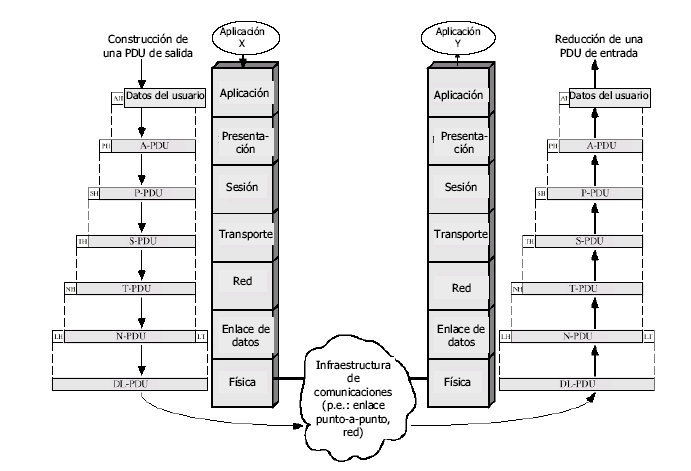

**Nivel físico**: **Transmisión de una cadena de bits a través de medios físicos** (cables, fibra óptica, señales inalámbricas). Codifica los datos binarios proporcionados por el nivel de enlace de datos, convirtiéndolos en voltajes eléctricos, pulsos de luz, etc. para ser transmitidos por el medio físico de la red.

**Nivel de enlace**: **Asegura una conexión libre de errores entre dos ordenadores de la misma red**. Fundamentalmente **organiza los bits en forma de tramas y los pasa a la capa física** para que sean transmitidos al receptor a través del medio de transmisión. (identificador de nivel la MAC o dirección física).

**Nivel de red**: su función principal es el **control de la subred** (encaminamiento de los datos a través de redes múltiples, proporcionando direcciones lógicas y rutas). Para ello se ocupa de:

- **Determinar cuál es la mejor ruta** por la cual enviar la información (encaminamiento). Esta decisión tiene que ver con el camino más corto, el más rápido, el que tenga menor tráfico, etc.
- **Controlar** también **la congestión de red** (cuellos de botella), **intentando repartir la carga** lo más equilibradamente posible entre las distintas rutas.
- Resolver el problema que se produce cuando el destinatario de un paquete no está en la misma red, sino en otra en la que el sistema de direccionamiento es distinto que en la red origen. En este nivel hay que tener en cuenta que la unidad de información que se maneja es el paquete el cual incluirá las direcciones de identificación tanto del emisor como del receptor de dicho paquete (las IP).

**Nivel de transporte**: este nivel se encarga de **aceptar los datos de la capa de sesión** (segmentos), **fraccionándoles** adecuadamente de modo que sean aceptados por el nivel de red **y asegurarse de que llegan correctamente al nivel de transporte del destinatario** (los paquetes recibidos pueden llegar desordenados y es labor de este nivel ordenarlos).

**Nivel de sesión**: **gestiona y controla el diálogo entre aplicaciones**, su función es establecer, mantener y finalizar una sesión (conexión).

**Nivel de presentación**: este nivel se ocupa de la **sintaxis de la información** que se pretende transmitir, es decir, si el ordenador emisor utiliza el código ASCII para la representación de la información y el ordenador receptor utiliza EBCDIC no podrían entenderse si no es llevada a cabo una conversión de la representación a un código neutro. También se ocupa de los **mecanismos de compresión y de encriptación** de la información que garantizan la privacidad.

**Nivel de aplicación**: este es el nivel que está en contacto directo con los programas o aplicaciones informáticas de las estaciones de trabajo y su función consiste en **proporcionar los servicios de comunicación más utilizados en las redes**.

## Arquitectura TCP/IP

La primera red fue desarrollada en 1969 por la Agencia de proyectos avanzados de investigación del departamento de defensa de EEUU (ARPA). Se creó así la red ARPANET. Posteriormente, TCP/IP se convirtió en el estándar a partir del cual se diseñó INTERNET.

**TCP/IP** se suele confundir muchas veces con un protocolo de comunicaciones cuando en realidad es una **compleja arquitectura de red que incluye varios protocolos apilados en cuatro capas**. No sigue estrictamente la estructura del modelo OSI (siete capas) pero se puede establecer un paralelismo entre ellas.

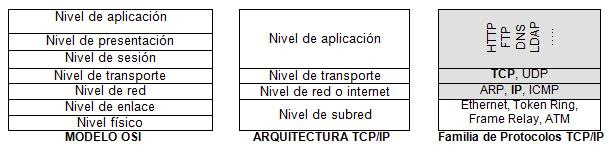

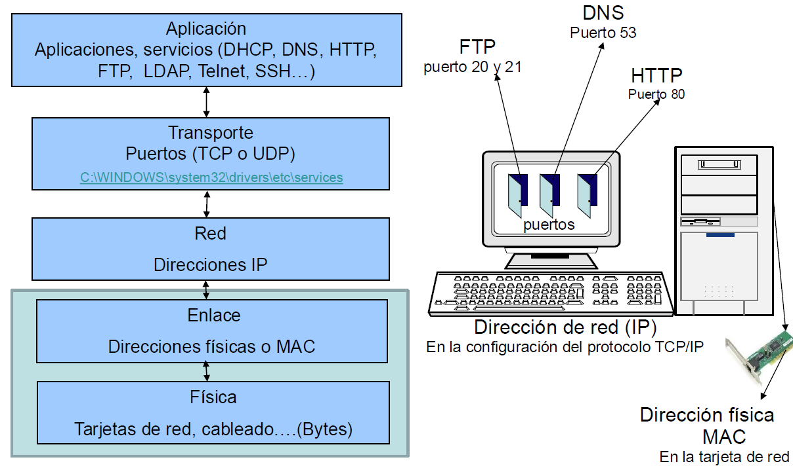

- La organización encargada de definir los protocolos de Internet es la IETF (The Internet Engineering Task Force, http://www.ietf.org).
- En 1969 se inició una serie de documentos llamados RFC (Request for Comments), que describen el conjunto de protocolos y estándares de Internet. En español, algunos RFCs importantes pueden consultarse en www.rfc-es.org, aunque solo se han traducido los más relevantes.

## Utilidades propias de TCP/IP

Las utilidades TCP/IP son comandos del sistema que solo están disponibles si TCP/IP está correctamente instalado.

- Utilidad `ping`: **comprueba el estado de la conexión** establecida **con un host remoto**, enviando mensajes a una dirección de red concreta con el fin de realizar un test a la red utilizando el protocolo ICMP. **El nodo destinatario reenviará el paquete** recibido **para confirmar la conexión** entre ambos equipos.
    
    Sintaxis: `ping [-a][-n número][-w tiempo]`
    
    `-a` → Resuelve direcciones a nombres DNS de equipos.
    
    `-n número` → Número de paquetes de eco especificados en número. Por defecto es 4.
    
    `-w tiempo` → Tiempo de espera máximo para la respuesta en milisegundos.
    
    `-i TTL` → Especifica el valor TTL de IP para cada paquete Petición de eco.
    
    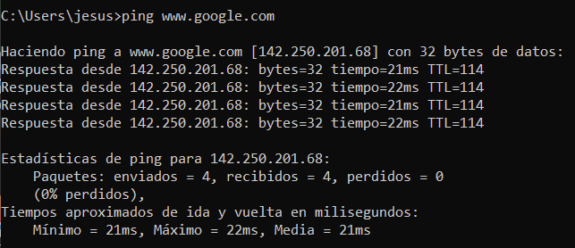
    
- Utilidad `ipconfig`: se utiliza para **consultar la configuración de los parámetros TCP/IP** del equipo. También se puede utilizar para activar o desactivar la configuración de red. Para modificar estos parámetros hay que hacerlo desde Windows.
    
    Sintaxis: `ipconfig [/all][/release][/renew]`
    
    `ipconfig /all` → Muestra información detallada sobre la configuración de red
    
    `ipconfig /release` → Desactiva la configuración TCP/IP
    
    `ipconfig /renew` → Activa la configuración (TCP/IP y asigna los parámetros de red establecidos).
    
    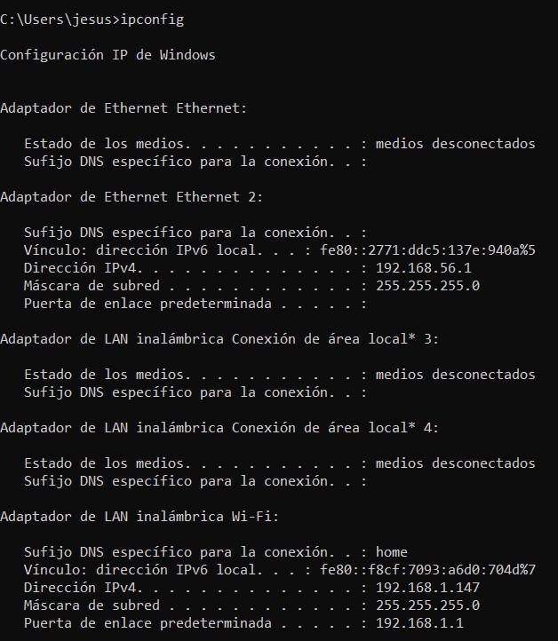
    
- Utilidad `tracert`: se utiliza para **conocer la ruta de acceso a un destino mediante** el envío de mensajes **ICMP**.
    
    Sintaxis: `tracert -d -h maximum_hops -j host-list -w timeout target_host`
    
    `-d` → Para especificar que no se quiere resolver ningún nombre.
    
    `-h maximum_hops` → Máximo número de saltos para buscar si somos capaces de llegar al objetivo.
    
    `-j host-list` → Especifica una ruta origen flexible a través de hosts.
    
    `-w timeout` → Espera un número de milisegundos especificado para cada una de las respuestas.
    
    `target_host` → Especifica el nombre (ej: www.google.es o la dirección IP del host objetivo).
    
    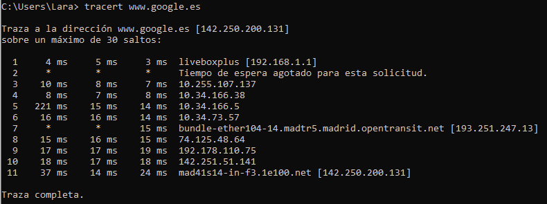
    
- Utilidad `route print`: se utiliza para **conocer la tabla de enrutamiento** que posee el propio ordenador.
    
    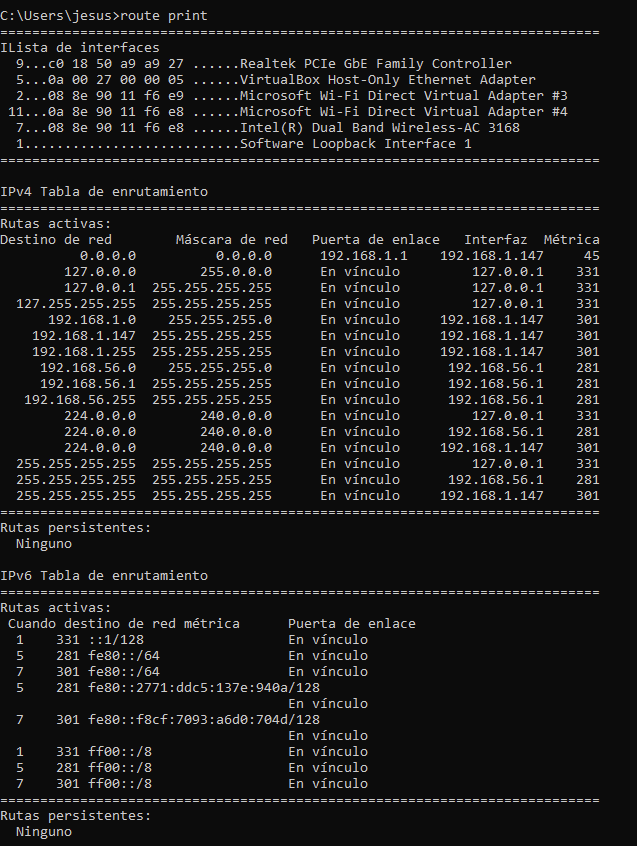
    

## Cómo ver configuración de red de nuestro ordenador

1. Inicio → Ver conexiones de red
2. Botón derecho en una de ellas → Propiedades
3. Protocolo de Internet versión 4 → Propiedades

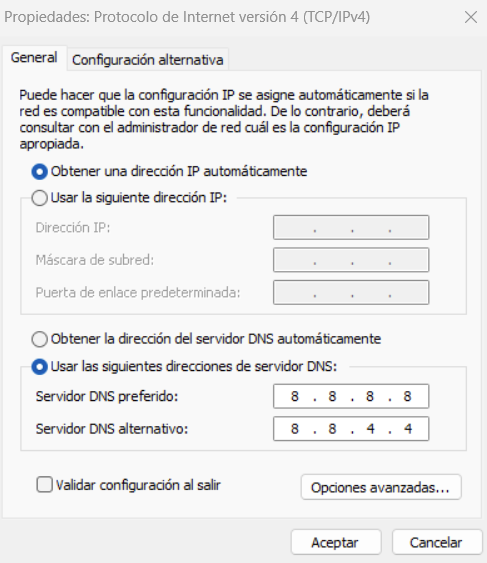

## Trabajar en red

### Modelo cliente-servidor

- La mayoría de los servicios ofrecidos por una red de comunicaciones de ordenadores se basan en el funcionamiento en modo cliente-servidor.
- La arquitectura cliente/servidor consiste básicamente en que **un programa** (el cliente informático), **realiza peticiones a otro programa** (el servidor), que les da respuesta.

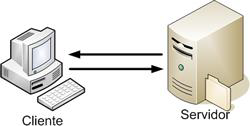

- Herramientas de trabajo
    
    Una de las herramientas más utilizadas para implementar una red de datos que ofrezca servicios en red basada en la arquitectura TCP/IP es VirtualBox.
    
    Alternativas:
    
    - VMWare
    - Hyper-V
    - Parallels Desktop

### Servicios proporcionados

Detrás del buen funcionamiento de una aplicación web está el buen funcionamiento de los **servicios que ofrece al usuario** el nivel de aplicación de la arquitectura **TCP/IP**. Dichos servicios se clasifican en:

Servicios de **bajo nivel**:

- DHCP
- DNS

Servicios de **alto nivel**:

- Consulta de información en hipertexto (servicio web)
- Transferencia de archivos entre equipos (servicio FTP)
- Acceso remoto a equipos

## VirtualBox

### Configuraciones de red

**NAT**: La VM obtendrá una dirección IP privada de una subred definida por el
propio VirtualBox.

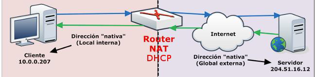

Máquina virtual

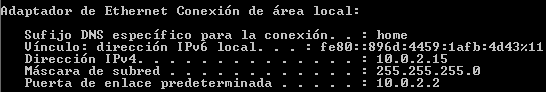

PC Real

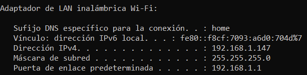

Podemos conectarnos a cualquier equipo de la red local a la que el PC real alcance y tenemos internet automáticamente (si el PC real tiene internet)

**Adaptador puente**: La VM obtendrá una dirección IP de la red a la que está conectado el PC real.

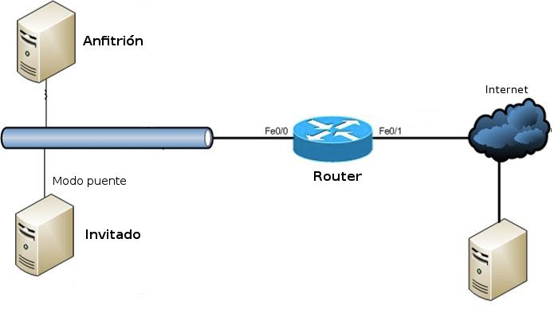

Máquina virtual

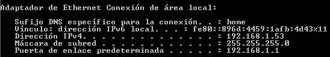

PC Real

Tenemos comunicación con el resto de equipos de la red local y con internet. El resto de equipos puede comunicarse con la VM sin problemas.

**Red interna**: Se puede crear una red local de dos o más máquinas virtuales para que se comuniquen entre sí. No tendrán acceso a la red local.

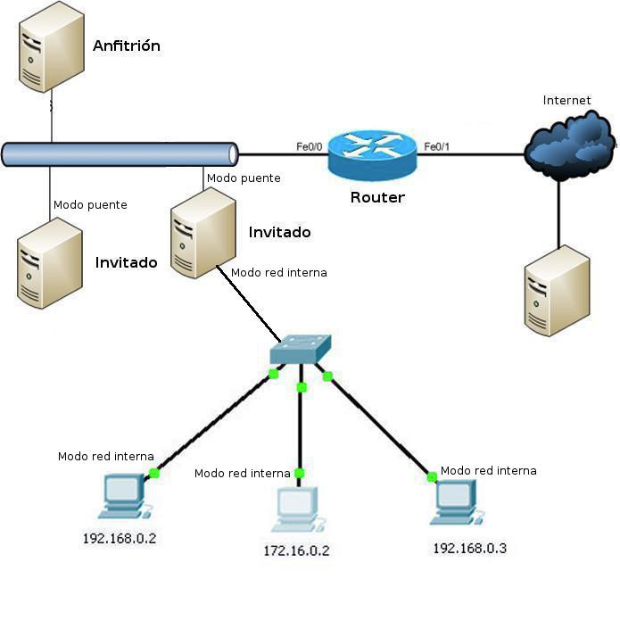

**Adaptador solo-anfitrión**: Solo se tendrá conectividad con el equipo anfitrión (el PC real).