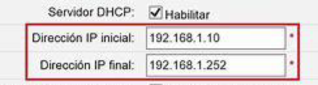
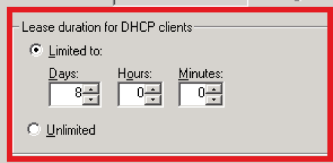
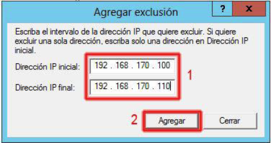
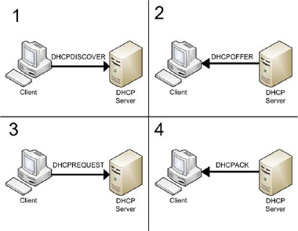
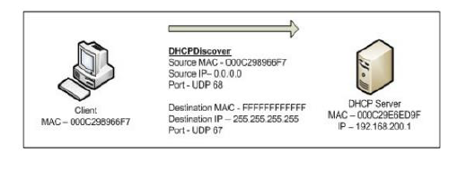
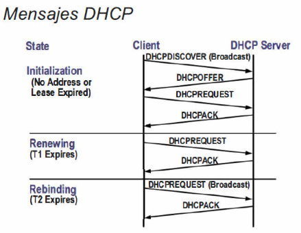
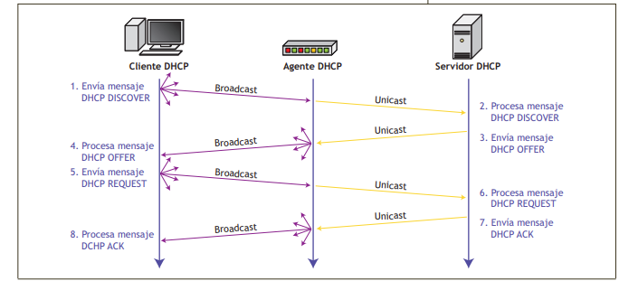

# Unidad 2 - DHCP y DNS

## DHCP (Dynamic Host Configuration Protocol)

Este protocolo sirve para proporcionar un servicio de red que permita a equipos de una red TCP/IP **obtener automáticamente los parámetros de configuración de red**.

## ¿Por qué usar DHCP?

Todos los **dispositivos** de una red **basada** en **TCP/IP** deben tener una **dirección IP** de unidifusión única para acceder a la red y sus recursos.

-   Con DHCP el **servidor DHCP** mantiene un grupo de **direcciones IP** y concede una **dirección** a **cualquier cliente habilitado** para DHCP cuando se inicia en la red.
-   Si no, las **IP** serían **estáticas**, y las deberíamos de **configurar manualmente** en cada equipo.
-   Los servidores DHCP que mantienen la información de configuración de TCP/IP y proporcionan la configuración de direcciones a los clientes habilitados para DHCP en forma de una oferta de concesión.
-   DHCP se basa en la utilización del primitivo protocolo BOOTP (Bootstrap Protocol)
-   Este protocolo permite a los equipos sin disco obtener una dirección IP antes de cargar un sistema operativo.

## Ventajas de DHCP

-   Configuración de dirección IP confiable. DHCP minimiza los errores de configuración como errores tipográficos, asignación de una dirección IP a más de un equipo al mismo tiempo.
-   Administración de red reducida. reduce la administración de red:
    -   Configuración de TCP/IP centralizada y automatizada.
    -   La capacidad de asignar un intervalo completo de valores de configuración adicionales de TCP/IP mediante opciones DHCP
    -   Los equipos pueden cambiar de ubicación (subred) sin tener que reconfigurar la dirección IP manualmente
    -   El reenvío de mensajes DHCP iniciales mediante un agente de retransmisión DHCP, lo que elimina la necesidad de un servidor DHCP en cada subred.
    -   Configuración segura y libre de errores. Se evitan errores manuales al introducir las configuraciones de red.

## Inconvenientes

-   Dependencia del servidor DHCP, si el servidor falla puede interrumpir la conectividad de todos los dispositivos.
-   Mucho tráfico de difusión (broadcast)
-   DHCP por sí solo no tiene mecanismos de seguridad nativos para verificar la autenticidad de las solicitudes de DHCP (Spoofing o starvation)
-   Gestionar el "pool" de direcciones IP disponibles y asegurarse de que no se agoten.
-   Conflictos de IP: IP estática entra en conflicto con asignación DHCP o varios servidores DHCP están mal configurados.

## Tipos de asignaciones

Sin DHCP, cada dirección IP debe configurarse manualmente en cada dispositivo y, si el dispositivo se mueve a otra subred, se debe configurar otra dirección IP diferente.

El DHCP le permite al **administrador supervisar y distribuir** de forma **centralizada** las **direcciones IP** necesarias y, automáticamente, asignar y enviar una nueva IP si fuera el caso de un dispositivo que es conectado en un lugar diferente de la red.

### Asignación manual o estática

La asignación manual implica que un administrador de red configura manualmente una dirección IP fija a un dispositivo específico (como un servidor o una impresora) en la red.

**Características**:

-   La dirección IP no cambia a menos que sea modificada por el administrador.
-   Usualmente se usa para dispositivos que necesitan estar siempre disponibles en la misma dirección IP, como servidores o dispositivos críticos.

**Ventaja**: Proporciona control completo al administrador

**Desventaja**: Es laboriosa en redes grandes y propensa a errores si no se gestiona correctamente.

### Asignación automática (DHCP auto)

El servidor **DHCP (Dynamic Host Configuration Protocol)** asigna automáticamente direcciones IP a los dispositivos de una red a partir de un rango predefinido (conocido como "pool" de direcciones IP). La asignación puede ser temporal.

**Características**:

-   El dispositivo solicita una IP cuando se conecta a la red, y el servidor DHCP le asigna una dirección IP automáticamente.
-   El dispositivo recibirá siempre la misma IP cada vez que se conecte a la red, incluso después de desconectarse por períodos largos (asociada a MAC).

**Ventaja**: IP constante, facilita la gestión en redes grandes, ya que no requiere intervención manual para cada dispositivo.

**Desventaja**: podría agotarse el "pool" de direcciones IP, especialmente en redes grandes con frecuentes conexiones y desconexiones.

### Asignación dinámica

Similar a la asignación automática, también se gestiona a través de DHCP, pero en este caso, la IP asignada al dispositivo tiene un tiempo de arrendamiento limitado. Una vez que expire este tiempo, la IP puede reasignarse a otro dispositivo.

**Características**:

-   Las direcciones IP se otorgan por un tiempo limitado
-   El dispositivo puede recibir una dirección IP diferente cada vez que se conecte

**Ventaja**: Optimiza el uso de direcciones IP en redes donde hay más dispositivos que direcciones disponibles

**Desventaja**: No es adecuada para dispositivos que requieren una IP fija

### Asignación estática con reserva (DHCP reserva)

Se trata de una asignación dinámica controlada, donde el servidor DHCP asigna siempre la misma dirección IP a un dispositivo específico basado en su dirección MAC. Es una especie de mezcla entre asignación manual y automática.

**Características**:

-   El administrador reserva una dirección IP específica para un dispositivo, que el servidor DHCP otorga cada vez que el dispositivo se conecta.
-   Se utiliza generalmente para dispositivos que necesitan tener siempre la misma IP, pero gestionados automáticamente por el servidor DHCP.

**Ventaja**: El dispositivo recibe una dirección IP constante sin necesidad de configuración manual en el dispositivo

**Desventaja**: Requiere configurar la reserva en el servidor DHCP, lo que puede implicar cierta complejidad administrativa.

## Parámetros DHCP

Un cliente habilitado para DHCP, al aceptar una oferta de concesión, recibe los siguientes parámetros:

Parámetros por defecto:

-   Dirección IP del cliente
-   Máscara de subred

Parámetros opcionales:

-   Puerta de enlace
-   Direcciones de los servidores DNS
-   Nombre o sufijo del dominio DNS

## Necesidades del cliente

-   **Dirección IP** que actúe como identificador y le permita ser reconocido unívocamente en Internet o en una intranet.
-   **Máscara de subred**, para conocer la parte de la dirección IP que describe la red o subred donde se halla el equipo y la otra parte que sirve para identificarlo.
-   **Dirección IP de la puerta de enlace**, usada por defecto, que se corresponde con un router que permitirá enrutar el tráfico a Internet o a otras partes de la red.
-   **Direcciones IP de los servidores DNS**, encargados de "resolver" o traducir los nombres de dominio usados en Internet en su correspondiente dirección IP. Así se evita que el usuario deba conocer las direcciones IP de los equipos a los que desea acceder.

## Información que almacena el servidor DHCP en una base de datos

-   Parámetros de configuración TCP/IP
-   Direcciones IP válidas, direcciones excluidas
-   IP reservada direcciones asociadas a clientes DHCP concretos
-   La duración de la concesión de la dirección IP

## Rango de direcciones

Es un conjunto ordenado de direcciones IP consecutivas.

-   Definido por la primera y la última del rango y que incluye ambas.
-   Especifica el número máximo de clientes a los que puede dar servicio
-   Ej: Un rango de 51 equipos sería desde 10.0.0.150 hasta 10.0.0.200.

## Reserva

Una reserva permite **asignar** direcciones **IP** de forma **fija a través** de la dirección **MAC** o dirección física de la tarjeta de red.

## Lease o concesión

La concesión o **lease** se define como el **período de tiempo** durante el cual un servidor DHCP asigna una **dirección IP** a un cliente.

El período de concesión configurado para un servidor DHCP se aplica a todas las direcciones IP que un servidor DHCP asigna dinámicamente a sus clientes.

## Exclusión

Es la dirección o **rango IP** que **no puede conceder** un servidor DHCP.

-   Ej: si se excluye el rango 10.0.0.8-10.0.0.10, la única forma de que un equipo pueda obtener una de esas tres direcciones es a través de su configuración manual o estática.

## Funcionamiento del protocolo DHCP

-   Un cliente obtiene los parámetros de red validos para que se pueda conectar a la red.
-   Usa la capa de transporte con el protocolo **UDP** (evita usar TCP que es más lento por el establecimiento de conexión) usando el **puerto 68** para **enviar** datos y el **67 para recibir**.
-   De este modo el cliente enviará por difusión una petición de dirección IP a los posibles servidores que se encuentren a la escucha en la red. A su vez, estos remitirán su respuesta utilizando como medio un paquete que contenga una IP válida.

## Funcionamiento DHCP (Solicitud de IP)

Para que el servicio de DHCP funcione, tanto en servidor como en cliente, deben enviarse varios mensajes el uno al otro para la correcta comunicación y asignación de las direcciones.

### Estructura del protocolo

El modo de funcionamiento más sencillo para un cliente que no dispone de dirección IP se denomina ciclo básico DHCP y consta de cuatro mensajes que se detallan a continuación:

1. El cliente emite un mensaje **DHCP DISCOVER** por **difusión** para poder descubrir si existe algún servidor DHCP a la escucha en la subred. En él podría incluir su dirección MAC y el tiempo de concesión requerido.

    - El cliente hace un broadcast de un mensaje DHCP DISCOVER en su subred física que llega al servidor DHCP

    

2. Los servidores DHCP activos envían un mensaje **DHCP OFFER**, donde **ofrecen una configuración IP** al cliente, es decir, una dirección libre.
    - Cada servidor puede responder con un mensaje **DHCP OFFER** que incluye una dirección de red disponible y otras opciones de configuración.
    - El cliente recibe uno o más mensajes **DHCP OFFER** de uno o más servidores y elige uno basándose en los parámetros de configuración. Hace un **broadcast** de un mensaje **DHCP REQUEST** que incluye la opción identificadora del servidor para indicar qué **mensaje ha seleccionado**.
3. El cliente manda por **difusión (broadcast)** la primera **oferta aceptada** a todos los **servidores DHCP**. Esto lo hace a través de un mensaje por difusión **DHCP REQUEST** que debe incluir el identificador del servidor elegido y la dirección IP ofrecida. Así, se declinan las demás ofertas.
    - Los servidores reciben el broadcast de DHCP REQUEST del cliente. Los servidores no seleccionados utilizan el mensaje como notificación que el cliente ha obtenido dirección de otro servidor. El servidor seleccionado, vincula al cliente al almacenamiento y responde con un mensaje DHCP ACK.
4. El servidor seleccionado indica que se **acepta** la **petición solicitada** enviando un mensaje **DHCP ACKNOWLEDGE**
    - El **servidor** seleccionado **vincula la IP al cliente** y **responde** con un mensaje **DHCP ACK** que contiene los parámetros de configuración para el cliente.
    - El campo "your IP address" en los mensaje **DHCP ACK** se rellena con la dirección de red seleccionada
    - El **cliente recibe** el mensaje **DHCP ACK** con **parámetros de configuración**. Realiza un chequeo final de estos parámetros y registra la duración del arrendamiento y la cookie de identificación de éste especificado en el mensaje **DHCP ACK**. En este punto, el cliente está configurado.
    - Si el cliente recibe un mensaje DHCPNAK, el cliente reinicia el proceso de configuración.
5. DHCP DECLINE (opcional)
    - Si el cliente detectase un problema con los parámetros en el mensaje DHCP ACK, enviaría un mensaje DHCP DECLINE al servidor y reinicia el proceso de configuración. El cliente espera al menos diez segundos antes de reiniciar este proceso para evitar un exceso de tráfico en la red en caso de que se produzca algún bucle.

### Renovación de la concesión

Cuando se acepta el DHCP ACK proveniente del servidor DHCP, se colocan tres valores de temporización y el cliente DHCP se mueve al estado BOUND (asociado).

-   T1 → temporizador de renovación de alquiler
-   T2 → temporizador de reenganche
-   T3 → duración del alquiler

El DHCP ACK siempre trae consigo el valor de T3. Los valores de T1 y T2 se configuran en el servidor DHCP; de no ser así, se usan los valores por defecto siguientes:

-   T1 = 0,5 \* T3
-   T2 = 0,875 \* T3

El tiempo actual en que los temporizadores expiran se calcula añadiendo el valor del temporizador al tiempo en que se envió el mensaje DHCP REQUEST, el cual generó la respuesta DHCP ACK.

-   La RFC 2131 recomienda añadir un factor a T1 y T2 para evitar que varios clientes DHCP expiren sus temporizadores al mismo tiempo.

### Todos los mensajes DHCP

Los mensajes en verde son ordenes enviadas por el cliente y en azul son enviadas por el servidor.

| Mensaje       | Descripción                                                                                                                                 |
| ------------- | ------------------------------------------------------------------------------------------------------------------------------------------- |
| DHCP DISCOVER | Mensaje que envía el cliente en una trama de difusión para detectar los servidores DHCP activos en la red                                   |
| DHCP OFFER    | Mensaje de respuesta del servidor hacia el cliente como respuesta a un DHCP DISCOVER que incluye una oferta de configuración (parámetros).  |
| DHCP REQUEST  | Mensaje para aceptar la configuración propuesta (acepta la oferta de un servidor determinado y rechaza el resto de ofertas recibidas).      |
| DHCP ACK      | Mensaje para confirmar la configuración asignada                                                                                            |
| DHCP RENEW    | Mensaje utilizado para solicitar una renovación del tiempo de concesión de la IP                                                            |
| DHCP RELEASE  | Mensaje para indicar que la IP queda libre                                                                                                  |
| DHCP NACK     | Indica al cliente que su dirección IP ya no es valida, por que ha finalizado el tiempo de concesión.                                        |
| DHCP DECLINE  | Mensaje del cliente que indica al servidor que la IP asignada ya esta en uso                                                                |
| DHCP INFORM   | Mensaje del cliente al servidor DHCP para consultar los parámetros de configuración local. Cuando se envía, el cliente ya esta configurado. |

## Servidor autorizado DHCP

Un servidor DHCP no autorizado o mal configurado puede causar problemas.

-   Ej: un servidor DHCP no autorizado, podría empezar a conceder direcciones IP incorrectas a los clientes o a confirmar de forma negativa los clientes DHCP que intenten renovar las concesiones actuales de direcciones IP.

Los servidores DHCP pertenecientes a una red de dominio comprueban en el **controlador de dominio si están autorizados**. Si lo están, inician el servicio y si no lo están no inician el servicio.

Por tanto, en un entorno de red de dominio, para que se pueda **iniciar un servidor DHCP** hay que:

-   Instalar y configurar el servidor.
-   Autorizar al servidor en el controlador de dominio
-   Cuando hay dos o más servidores, se encarga de ofrecer las direcciones IP y, en caso de que algún cliente tenga una IP no válida en la subred, procederá a enviarle un mensaje DHCP NACKNOWLEDGE para que deje de utilizarla.

## Configuración dinámica sin servidor DHCP

En ocasiones, un fallo inesperado en un switch puede impedir el acceso al servidor DHCP.

-   En este caso, el sistema operativo asignará automáticamente una dirección IP en el rango 169.254.0.1-169.254.255.254 con una máscara de subred de clase B: 255.255.0.0. Este tipo de asignación se conoce como **APIPA** (Automatic Private IP Addressing).
-   APIPA es un método de autoconfiguración creado por el IETF para redes sin servidor DHCP, permitiendo la asignación dinámica de direcciones IP.
-   El paquete avahi-autoipd es el encargado de gestionar esa situación en GNU/Linux, mientras que Microsoft tiene previsto ese escenario en su implementación interna del protocolo TCP/IP

## Servicio DHCP a varias redes: Agente Relay DHCP

El **Agente Relay DHCP** es un equipo o router configurado para escuchar broadcast DHCP/BOOTP de clientes DHCP y reenviar esos mensajes a los DCHP Servers en diferentes subredes.

-   Los clientes **DHCP utilizan broadcasts** para obtener el lease del DHCP Server, pero los Routers normalmente **no dejan pasar** tráfico con direcciones **IP de broadcast** excepto que estén configurados específicamente para **dejarlos pasar**.
-   Por lo tanto, sin configuración adicional, los **DHCP Servers** solo proveen direcciones **IP a clientes en su subred local**.
-   Para que se puedan asignar direcciones a clientes en otros segmentos, se debe configurar la red para que los DHCP broadcasts puedan llegar desde el cliente al DCHP Server.
-   Esto se puede hacer de dos maneras: configurando los routers que conectan las subredes para dejar pasar DHCP broadcasts, o configurando Agente Relay DHCP.

### Cómo funciona el agente relay DHCP

Si el cliente realiza una petición de IP, el Agente Relay DHCP cogerá la petición y se la enviará mediante un mensaje unicast al servidor DHCP, el cual se encuentra en otra red, que le devolverá la dirección MAC y la IP asociada, que el Relay DHCP enviará por broadcast a toda su red.
