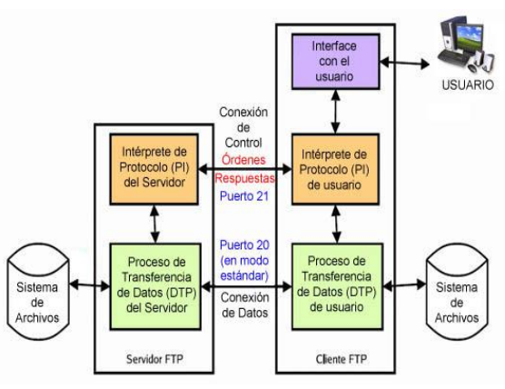
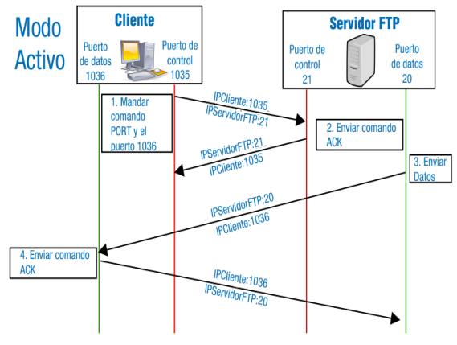
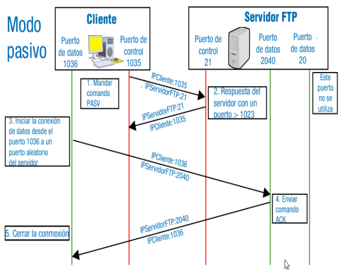
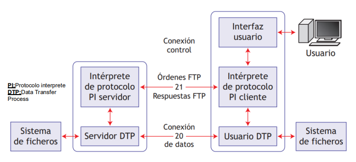
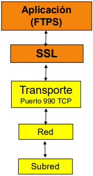
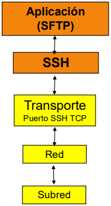
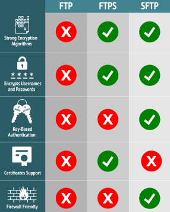

# Unidad 3 - FTP

El **FTP (File Transfer Protocol)** es el protocolo estándar para la transferencia de archivos entre sistemas a través de redes TCP/IP. Permite tanto subir archivos desde una máquina local a un servidor remoto como descargar archivos desde el servidor a la máquina local, incluso de manera simultánea.

## Principales características

-   **Requisitos**: Se necesita una cuenta en el servidor FTP para enviar o recibir archivos. Sin embargo, muchos servidores en Internet permiten acceso mediante una cuenta anónima validada con una dirección de correo.
-   **Versatilidad**: Es ampliamente utilizado en Internet, redes corporativas e intranets.
-   **Usos comunes**:
    -   Gestión de sitios web y blogs.
    -   Acceso a repositorios de software de código abierto.
    -   Transferencias transparentes al usuario desde enlaces web.
-   **Compatibilidad**: Funciona en todos los sistemas operativos y cuenta con una variedad de software basado en el protocolo FTP.

## Funcionamiento del servicio FTP

El FTP se basa en una arquitectura cliente-servidor, utilizando dos puertos predeterminados:

-   **Puerto 20**: Para la transferencia de datos.
-   **Puerto 21**: Para la transferencia de órdenes (control y autenticación).

### Modo activo

En el modo activo, el cliente establece una conexión de control utilizando un puerto aleatorio (mayor a 1024), mientras el servidor utiliza el puerto 21. Para iniciar la transferencia de datos:

1. El cliente envía el comando `PORT` al servidor, indicando el puerto en el que estará escuchando los datos.
2. El servidor inicia la conexión de datos desde su puerto 20 hacia el puerto especificado por el cliente.

Este modo puede presentar problemas al atravesar firewalls o NAT, ya que requiere que el cliente acepte conexiones entrantes.

### **Modo pasivo**

En el modo pasivo, el cliente evita conexiones entrantes inseguras. El proceso es el siguiente:

1. El cliente envía el comando `PASV` al servidor a través del canal de control.
2. El servidor responde abriendo un puerto efímero (entre 1024 y 5000) y notifica al cliente sobre este puerto.
3. El cliente inicia la conexión de datos hacia ese puerto, lo que mejora la compatibilidad con firewalls y NAT.

En este modo, el servidor no utiliza el puerto 20 para datos, delegando la conexión al cliente.

### Activo o pasivo

| **Características**              | **Modo Activo**                               | **Modo Pasivo**                           |
| -------------------------------- | --------------------------------------------- | ----------------------------------------- |
| Iniciador de conexión de datos   | El servidor inicia la conexión al cliente     | El cliente inicia la conexión al servidor |
| Compatibilidad con firewalls/NAT | Problemas comunes para el cliente             | Mejor manejo para el cliente              |
| Simplicidad de configuración     | Más simple para el servidor                   | Más simple para el cliente                |
| Seguridad                        | Menos seguro, expuesto a conexiones entrantes | Mayor control por parte del cliente       |
| Carga en el servidor             | Menor carga                                   | Mayor carga en el servidor                |

## Modos de acceso

-   **Acceso privado**: Requiere autenticación mediante un usuario y contraseña registrados en el servidor.
-   **Acceso anónimo**: Permite acceso público utilizando una cuenta genérica (como `anonymous` o `ftp`).
    -   **Con aislamiento de usuarios**: Restricción al directorio particular de cada usuario.
    -   **Sin aislamiento de usuarios**: Acceso a la estructura general de directorios.

## Modos de transferencia

-   **Texto**: Para archivos de texto plano (ASCII).
-   **Binario**: Para archivos no textuales (ejecutables, imágenes, videos, etc.). La mayoría de los programas actuales autodetectan el tipo de archivo.

### Esquema funcionamiento FTP

### Comandos FTP

| **Comando**      | **Parámetro**                 | **Descripción**                                                             |
| ---------------- | ----------------------------- | --------------------------------------------------------------------------- |
| `cd`             | directorio                    | Cambia el directorio de trabajo en el servidor FTP.                         |
| `delete`         | archivo-remoto                | Borra el archivo especificado en el servidor.                               |
| `dir`            | directorio-remoto             | Lista los archivos y directorios en el directorio remoto especificado.      |
| `get`            | archivo-remoto, archivo-local | Descarga un archivo del servidor remoto y lo guarda en el sistema local.    |
| `put` y `send`   | archivo-local, archivo-remoto | Sube un archivo desde el sistema local al servidor remoto.                  |
| `bye`            |                               | Cierra la sesión y desconecta del servidor FTP.                             |
| `lcd`            | directorio                    | Cambia el directorio de trabajo en el sistema local.                        |
| `pwd`            |                               | Muestra el directorio actual de trabajo en el servidor remoto.              |
| `rename`         | archivo-remoto, nuevo-nombre  | Cambia el nombre de un archivo en el servidor remoto.                       |
| `rmdir`          | directorio                    | Borra un directorio vacío en el servidor remoto.                            |
| `bin` y `binary` |                               | Cambia el modo de transferencia a binario (para archivos no textuales).     |
| `ascii`          |                               | Cambia el modo de transferencia a texto (para archivos ASCII).              |
| `mkdir`          | directorio                    | Crea un nuevo directorio en el servidor remoto.                             |
| `quote`          | comando                       | Envía comandos directos al servidor FTP (útil para opciones avanzadas).     |
| `!`              | comando                       | Ejecuta un comando en el sistema operativo local sin salir del cliente FTP. |
| `?`              | comando                       | Muestra información sobre los comandos disponibles o sobre uno específico.  |

## Clientes y servidores FTP

-   **Servidores**:
    -   Windows: Configuración mediante IIS.
    -   Linux: Uso de paquetes como `proFTPD` o `vsftpd`.
    -   Otros: FileZilla Server.
-   **Clientes**:
    -   Modo texto (línea de comandos): Utiliza comandos básicos como `get` y `put`.
    -   Modo gráfico: Programas como FileZilla Client y WinSCP.
    -   Modo web: Acceso desde navegadores utilizando la URL `ftp://IP_o_nombre`.

## Seguridad en FTP

El FTP tradicional presenta vulnerabilidades:

-   Las credenciales y los datos se transmiten en texto plano, siendo susceptibles a herramientas de captura de paquetes (sniffers) como Wireshark.
-   No ofrece cifrado en la sesión.

**Alternativas más seguras**:

**FTPS**: Extiende FTP con cifrado SSL/TLS.

**SFTP**: Opera sobre el protocolo SSH, proporcionando seguridad adicional.

