# Unidad 4 - HTTP

## ¿Qué es HTTP?

HTTP (Protocolo de Transferencia de Hipertexto) fue desarrollado en el CERN en 1990 para facilitar el acceso intuitivo a información en la Web, un sistema basado en hipertexto que conecta páginas electrónicas mediante hiperenlaces. La World Wide Web Consortium (W3C) supervisa los estándares para el desarrollo de aplicaciones web.

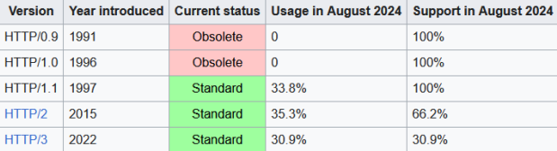

### Modelo Cliente-Servidor

La comunicación en la Web sigue el modelo cliente-servidor:

-   **Clientes HTTP**: Navegadores como Chrome, Firefox, Edge, Safari y Opera.
-   **Servidores HTTP**: Ejemplos incluyen Apache, IIS (de Microsoft) y Nginx, cada uno con características específicas para su implementación en diversas plataformas.
    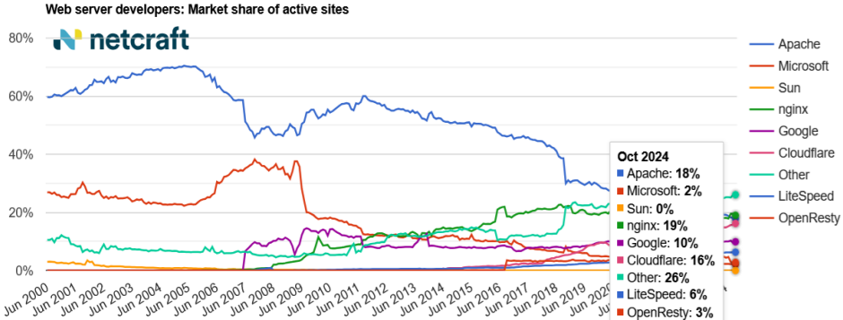

## La URL

Una URL (Uniform Resource Locator) identifica recursos en la Web. Su estructura incluye:

1. **Protocolo** (HTTP o HTTPS).
2. **Nombre de dominio o dirección IP** (`www.debian.org`).
3. **Puerto** (por defecto 80 para HTTP y 443 para HTTPS).
4. **Directorio y archivo** (`index.html`, `index.htm`, `index.php`).

Por defecto, el protocolo, el puerto y el archivo suelen asumirse automáticamente por los navegadores. (`http://www.debian.org:80/index.html`)

## El servicio web y DNS

1. El cliente consulta al servidor DNS para obtener la IP del dominio solicitado.
2. Realiza una petición HTTP `GET`.
3. El servidor responde con un código `200 OK` y envía el contenido.
4. El navegador renderiza el contenido recibido.

### Versiones de HTTP

-   **`1.0` y `1.1`** → Introdujeron los métodos de petición y códigos de estado básicos.
-   **`2.0`** → Añade mejoras de rendimiento con `streams` y requiere cifrado para optimización.
-   **`3.0`** → Utiliza UDP con el protocolo QUIC para mayor velocidad y eficiencia.

### Métodos de petición

-   **GET** → Solicita un recurso mediante la URL.
-   **POST** → Envía datos al servidor, típicamente usados en formularios.
-   **HEAD** → Similar a GET, pero solo devuelve las cabeceras.

### Códigos de respuesta

-   **1xx** → Informativo: La petición se recibe y sigue el proceso.
-   **2xx** → Éxito: La acción requerida por la petición ha sido recibida, entendida y aceptada.
-   **3xx** → Redirección: Para completar la petición se han de tomar más acciones.
-   **4xx** → Error del cliente: La petición no es sintácticamente correcta y no se puede llevar a cabo.
-   **5xx** → Error del servidor: El servidor falla al atender la petición que aparentemente es correcta.

## Alojamiento virtual

Permite alojar múltiples sitios web en un mismo servidor, optimizando recursos:

1. **Por IP** → Cada sitio tiene una dirección IP distinta.
2. **Por nombre** → Múltiples dominios comparten una IP.
3. **Por puerto** → Sitios diferenciados por puertos.

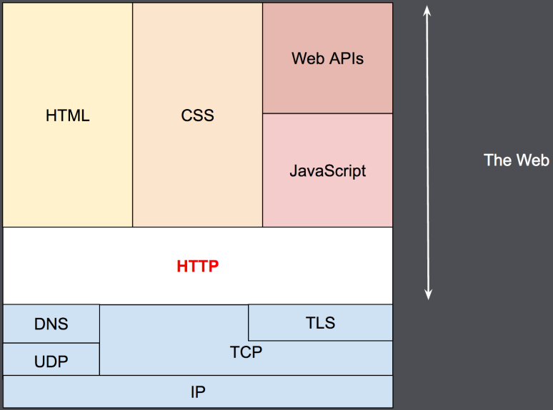

## Directorios virtuales

Funcionan como accesos directos a directorios remotos o locales fuera de la jerarquía del sitio web. Esto permite aplicaciones web distribuidas sin necesidad de especificar su ubicación física en la URL.

## Protocolos seguros SSL y HTTPS

-   SSL (Secure Sockets Layer) y su sucesor TLS (Transport Layer Security) son protocolos que garantizan transacciones web seguras mediante autenticación entre cliente y servidor.
-   Proveen autenticación, integridad y confidencialidad, habilitando el uso de firmas digitales y algoritmos criptográficos.
-   Con SSL/TLS, un servidor puede verificar la confiabilidad del cliente en la comunicación, siendo fundamental para operaciones sensibles.
-   HTTPS es la implementación de HTTP sobre SSL/TLS.

## Sistema criptográfico

-   HTTPS asegura privacidad, integridad e identificación en los sitios web mediante el uso de **cifrado**.
-   Este cifrado se logra a través de dos tipos principales de algoritmos: **clave simétrica** y **clave asimétrica**.

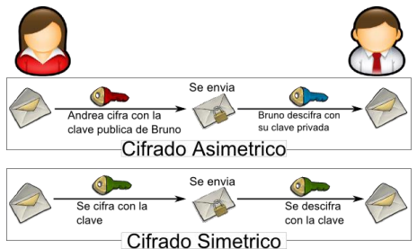

### **Clave simétrica**

-   Utiliza una única clave para cifrar y descifrar mensajes, la cual debe ser compartida previamente entre emisor y receptor.
-   **Ventajas:**
    -   Es muy rápida, ideal para cifrar grandes volúmenes de datos.
-   **Desventajas:**
    -   La clave, al transmitirse en claro, puede ser interceptada.
    -   Dificultad para compartir la clave de forma segura.

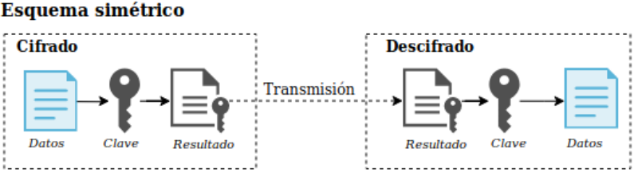

### **Clave asimétrica**

-   Emplea dos claves:
    -   Una **pública**, compartida libremente con cualquier usuario.
    -   Una **privada**, mantenida en secreto por el propietario.
-   Estas claves son complementarias: lo que una cifra, la otra puede descifrar.
-   **Ventajas:**
    -   Como solo se transmite la clave pública, la seguridad de la comunicación no se ve comprometida incluso si es interceptada.
-   **Desventajas:**
    -   El proceso es más lento que el cifrado simétrico.
    -   Se requiere un método para verificar que la clave pública pertenece realmente a su propietario, lo que se logra mediante un **certificado digital** y una **firma electrónica**.

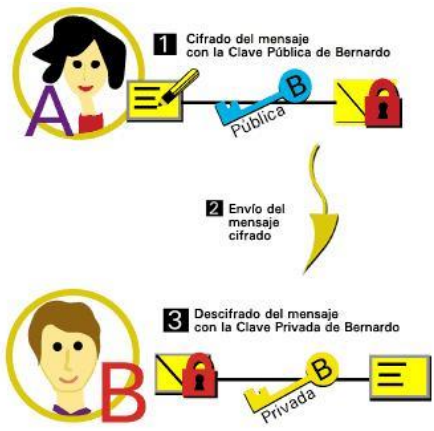

### Confidencialidad

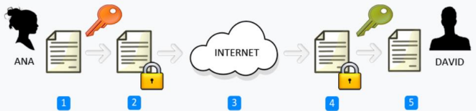

1. Ana redacta un mensaje.
2. Ana cifra el mensaje con la **cable publica** de David.
3. Ana envía el mensaje cifrado a David a través de internet, ya sea por correo electrónico, mensajería instantánea o cualquier otra cosa.
4. David recibe el mensaje cifrado y lo descifra con su **clave privada**.
5. David ya puede leer el mensaje original que le envió Ana.

### Autoría

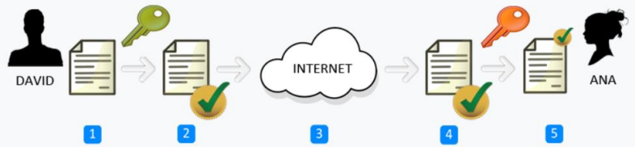

1. David redacta un mensaje.
2. David firma digitalmente el mensaje con su **clave privada**.
3. David envía el mensaje firmado digitalmente a Ana a través de internet, ya sea por correo electrónico, mensajería instantánea o cualquier otro medio.
4. Ana recibe el mensaje firmado digitalmente y comprueba su autenticidad usando la **clave publica** de David.
5. Ana ya puede leer el mensaje con total seguridad de que ha sido David el remitente.

## Comparación

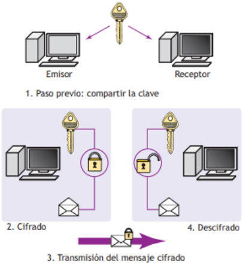

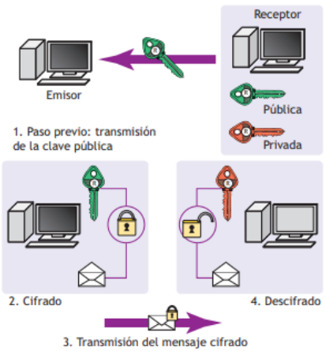

## Funcionamiento SSL y TLS

### **Handshake inicial:**

1. **El servidor** envía su **certificado digital** al cliente, el cual incluye su **clave pública**.
2. **El cliente** verifica la autenticidad del certificado para asegurarse de que proviene de una entidad confiable.
3. A través de la clave pública del servidor, se establece una **clave compartida** para la sesión.

### **Comunicación cifrada:**

-   Tras el handshake, tanto el cliente como el servidor utilizan la **clave compartida** para cifrar y descifrar la información de manera rápida mediante **criptografía simétrica**.
-   Este enfoque asegura tanto la privacidad como la integridad de los datos intercambiados.

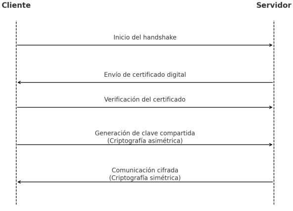

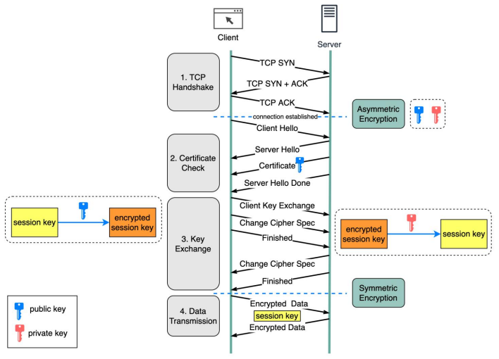
