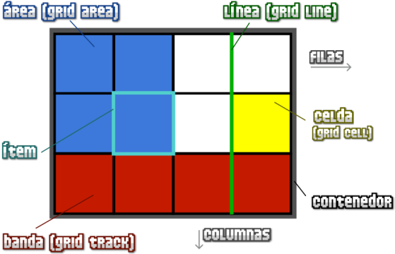
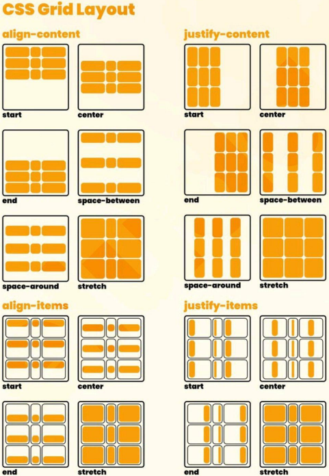
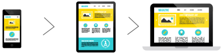
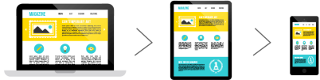

# Unidad 4 - CSS Avanzado

## Flexbox (Flex Layout)

Flexbox es un sistema para crear diseños flexibles en páginas web, que permite que los elementos HTML se adapten automáticamente.

### **Conceptos básicos**

-   **Contenedor flex**: Elemento padre que contiene ítems flexibles y donde se definen las propiedades flexibles.
-   **Eje principal**: Dirección principal de los elementos flex (por defecto: horizontal, `row`).
-   **Eje secundario**: Dirección perpendicular al eje principal.
-   **Ítems**: Elementos hijos dentro del contenedor.


### **Propiedades principales**

**`flex-direction` (Dirección del eje principal)**

-   `row` → Horizontal (por defecto).
-   `row-reverse` → Horizontal invertido.
-   `column` → Vertical.
-   `column-reverse` → Vertical invertido.

**Flex multilínea (`flex-wrap`) →** Permite que los elementos ocupen varias líneas:

-   `nowrap` → Sin desbordamiento (por defecto).
-   `wrap` → Divide en múltiples líneas.
-   `wrap-reverse` → Divide en líneas inversas.

**`gap` (Huecos entre ítems)** → Define espacios entre elementos sin necesidad de usar `margin`.

-   `row-gap` → Espacio entre filas.
-   `column-gap` → Espacio entre columnas.

### **Alineación de elementos**

-   **`justify-content` (eje principal)** → Controla la distribución de ítems: `start`, `end`, `center`, `space-between`, `space-around`, `space-evenly`.
-   **`align-items` (eje secundario)** → Define la alineación vertical: `start`, `end`, `center`, `stretch`, `baseline`.
-   **`align-content` (en contenedores multilínea)** → Alinea el espacio entre líneas.

### **Elementos flexibles**

-   **`flex-basis` →** Define el tamaño base inicial del ítem antes de distribuir el espacio adicional o reducirse.
    ```css
    flex-basis: 100px; /* El ítem inicia con un ancho de 100px */
    ```
-   **`flex-grow` →** Determina cuánto puede crecer un ítem si hay espacio sobrante.
    ```css
    flex-grow: 1; /* El ítem se expande para ocupar el espacio disponible. */
    ```
    Condiciones:
    -   Debe tener un `flex-basis` definido.
    -   Los ítems deben cubrir inicialmente el tamaño total del contenedor.
-   **`flex-shrink` →** Indica cuánto puede reducirse un ítem si el espacio es insuficiente.
    ```css
    flex-shrink: 1; /* El ítem se reduce proporcionalmente si el espacio es limitado. */
    ```
    **Condiciones:**
    -   Debe tener un `flex-basis` definido.
    -   Los ítems no deben cubrir inicialmente el tamaño total del contenedor.

**Comportamiento flexible**

-   Los ítems pueden crecer o reducirse dinámicamente según los límites de `flex-basis`, `flex-grow` y `flex-shrink`.
-   Esto optimiza el uso del espacio en el contenedor.

## Grid layout

Grid es un sistema avanzado para alinear elementos en dos dimensiones (filas y columnas), útil para diseños complejos.

### **Conceptos básicos**

-   `display: grid;` → Activa el modo grid.
-   **`grid-template-columns` y `grid-template-rows`** → Definen las dimensiones de columnas y filas.



### **Unidades y funciones comunes**

-   `auto` → Usa el tamaño restante.
-   `fr` → Fracciones del espacio libre.
-   `repeat()` → Repite configuraciones.
-   `minmax()` → Define un rango flexible.

### **`gap`**

Espacios entre elementos:

-   `row-gap` → Filas.
-   `column-gap` → Columnas.

### **Alineación en grid**

-   **`justify-items` (eje horizontal)** → `start`, `end`, `center`, `stretch`.
-   **`align-content` y `justify-content` (toda la cuadrícula)** → Controlan alineación global (`start`, `end`, `center`, `stretch`, `space-between`, etc.).



### **Áreas de grid**

Permite nombrar secciones de la cuadrícula con `grid-template-areas` y asignar elementos con `grid-area`.

### **Celdas irregulares**

-   **`grid-column-start` y `grid-column-end`** → Controlan las columnas que ocupa un ítem.
-   **`grid-row-start` y `grid-row-end`** → Controlan las filas que ocupa un ítem.

## **Diseño responsive**

El diseño responsive adapta el contenido al tamaño y formato de pantalla, mejorando la experiencia del usuario.

### **Buenas prácticas**

-   Usar unidades relativas (`%`, `em`, `rem`) en lugar de estáticas (`px`).
-   Controlar tamaños con `max-width` y `min-width` para ajustar imágenes y contenido.


### `breakpoint`

-   Puntos de ruptura para cambiar el diseño según el tamaño del dispositivo.


### Estrategias de diseño

-   **Mobile first**: Comienza con diseño móvil y expande hacia dispositivos más grandes.
    
-   **Desktop first**: Diseña para escritorio y ajusta para pantallas más pequeñas.
    

### **Media queries**

Las `@media` permiten aplicar estilos CSS según las características del dispositivo o pantalla.

-   `@media (<condición>)` → Aplica estilos si se cumple la condición.
-   `@media not (<condición>)` → Aplica estilos si no se cumple la condición.
-   `@media only (<condición>)` → Aplica estilos si se cumple la condición en navegadores modernos.
-   `@media (<condición>) and (<condición>)` → Aplica estilos si ambas condiciones se cumplen.

Usan comparadores como `<`, `<=`, `>`, `>=` para definir los límites.
