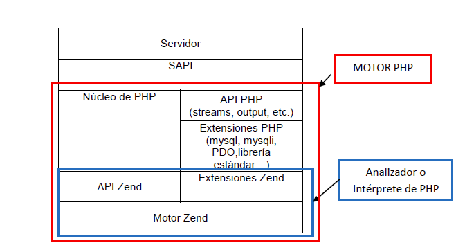

# Unidad 2 - Elementos base de PHP



## ¿Qué es PHP?

-   PHP es un lenguaje diseñado para el desarrollo de aplicaciones web; la versión PHP 7 fue lanzada en noviembre de 2015.
-   Es un lenguaje de scripting del lado del servidor, embebido en HTML, y no tipado (aunque los estándares recomiendan la tipificación).
-   Los scripts embebidos pueden estar en cualquier parte del recurso web y se integran con el HTML al enviarse al navegador.

## Estructura básica de una página PHP

-   Uso de etiquetas para abrir y cerrar el script: `<?php … ?>`.
-   Cada instrucción termina en punto y coma, excepto la última antes de la etiqueta `?>`.
-   Comentarios:
    -   De línea: `//` o `#`
    -   De bloque: `/* ... */`
-   Las entidades PHP (variables, constantes, funciones) deben comenzar con una letra o guion bajo.
-   PHP distingue entre mayúsculas y minúsculas.
-   `echo`: construcción de PHP para mostrar literales y variables en pantalla.

## Las bases del lenguaje PHP

### Variables: áreas de memoria modificables

-   Comienzan con `$` (ej: `$nombre`, `$num`).
-   No necesitan declaración previa; se definen al asignarles un valor.

```php
$num = 4;
echo var_dump($num);
$num = 4.5;
echo var_dump($num);
$nombre = 'Esther';
echo var_dump($nombre);
$otro = NUULL;
echo var_dump($otro);
$estado = true;
echo var_dump($estado);
```

-   PHP tiene variables predefinidas que almacenan información del entorno (`$_POST`, `$_SERVER`, `$_COOKIE`, etc.).
    ```php
    foreach($_SERVER as $componente => $valor) {
    	echo "$componente: $valor <br>";
    }
    ```
-   Alcance: generalmente, el archivo `.php` en que se definen.
-   Variables dinámicas (`$$`) permiten nombrar variables de forma flexible.
    ```php
    $una_variable = 10;
    $nombre_variable = "una_variable";
    echo $$nombre_variable;
    ```

### Constantes: áreas de memoria no modificables

-   Usan mayúsculas y pueden definirse con `define` o `const`.
-   Admiten tipos escalares y matrices.

```php
define (“PI”, 3.1416);
const PI = 3.1416;
```

-   Alcance: el archivo `.php` en el que se definen.
-   Existen constantes predefinidas (`false`, `true`) y mágicas (`__LINE__`, `__FILE__`).

### Tipos de datos

-   **Escalares**: enteros (`int`), flotantes (`float`), booleanos (`bool`), cadenas (`string`).
    -   Los caracteres especiales en cadenas deben escaparse (`"`, `'`, `$`).
        -   Se pueden utilizar múltiples secuencias de escape siempre y cuando el `string` esté delimitado por comillas.
    -   Para delimitación de variables, usar `{}`.
    -   `0`, `""` y `NULL` → `False`
    ```php
    $dato = 'aula'; var_dump($dato);
    echo "<br>\"{$dato}s\"";
    ```
-   **Compuestos**: arrays y objetos.
-   **Especiales**: `NULL`, `resource` (referencias externas, como BD), `callable` (pasar como parámetro de una función, otra función), `iterable`.

### Conversión de tipos de datos

-   **Implícitas** (automáticas).
-   **Explícitas**: `(tipo)$variable` o funciones (`strval()`, `intval()`).

## Operadores

-   Asignación → `=`
-   Asignación por referencia → `&`
-   Aritméticos → `+`,`-`, `*`, `/`,`**`,`%`,`++` y `--`
-   Concatenación de cadenas → `.`
-   Combinados → `+=`,`-=`,`*=`,`/=`,`**=`,`%=` y `.=`
-   Comparación o relacionales → `==`, `===`,`!=`,`!==`,`<`,`<=`,`>` y `>=`
-   Lógicos → `and` o `&&`, `or` o `||`, `xor` y `!` (unario)
-   Ternario → `?:`
-   Operador de unión NULL → `??`
-   Operador de comparación combinado → `<=>`

**Nota**: Utiliza paréntesis para aclarar precedencia.

## Estructuras de control

### Alternativas:

-   `if` (simple y doble).
-   `switch` (múltiple).

### Repetitivas:

-   `while`, `do while`, `for` (se recomienda `foreach` para arrays).

### Ruptura:

-   `continue` y `break` (para bucles y `switch`).

## Arrays (o matrices)

-   Colecciones de elementos (clave/valor). Ejemplo: `$aula = array('2daw', 25, true);`
-   Definición:
    -   Notación `[]` (ej: `$variable[] = 4; $variable = [4, 5];`)
    -   Función `array()` (ej: `$variable = array(4, 5);`)

### Tipos de arrays

-   **Numéricos**: índice consecutivo. Comenzando, por defecto, desde 0.
    ```php
    $a = [1, 2, 3]
    $a = array(1, 2, 3) // (unidimensional) //$a[1]…2
    $b = [[1 ,2], [3, 4], [5, 6]] //$b[2][1]…6
    $b = array(array(1, 2), array(3, 4), array(5, 6)) //(bidimensional)
    ```
-   **Asociativos**: clave no consecutiva o de tipo `string`.
    ```php
    $b = [[0 => 1, 1 => 2], [0 => 3, 1 => 4], [0 => 5, 1 => 6]] // o utilizando array()
    $ganadores = ['Tenis' => 'María Alonso', 'Ajedrez' => 'Antonio López',
    	'Pin-pon' => 'Ana Benito', 'Mus' => 'Luis Martín']; // o utilizando array()
    ```
    
-   **Mixtos**: primer nivel indexado y un segundo nivel asociativo o viceversa

### Operaciones en arrays

-   **Asignación**: `$a[0] = 2; $a[] = 3;`
-   Definir un array constante:
    ```php
    const PAIS = ['España', 'Italia'];
    define ("PAIS", array('España', 'Italia');
    ```
-   Recorrer datos: `while`, `do while`, `for` (solo numéricos), `foreach`.

    ```php
    foreach (variable array as variable valor {
    	sentencias
    }

    foreach ($ganadores as $valor) {
    	echo $valor;
    }
    ```

    ```php
    foreach (variable array as variable clave=>variable valor) {
    	sentencias
    }

    foreach ($ganadores as $clave=>$valor) {
    	echo "En $clave el ganador es $ganadores[$clave]";
    }
    /* o echo "En $clave el ganador es $valor"; */
    ```

## Incluir o importar un archivo en un script

-   La inclusión es completa; el archivo puede ser de cualquier extension, pero debe incluir codigo PHP o HTML.
-   Funciones:
    -   `include("archivo")`: da un aviso (`WARNING`) si el archivo no existe y continúa.
    -   `require("archivo")`: detiene la ejecución si el archivo no existe (`E_ERROR`).
    -   `include_once("archivo")` y `require_once("archivo")` aseguran que el archivo se incluya solo una vez.
    -   Admiten rutas absolutas y relativas
-   Utilidad:
    -   Incluir definiciones estáticas: constantes y definiciones de funciones.
    -   Incluir código HTML o PHP de forma dinámica.

## Interrumpir el script

-   `exit` y `die` interrumpen un script `.php`, deteniendo su ejecución.
    ```php
    exit();
    die();
    exit("Mensaje de salida");
    die("Mensaje de salida");
    ```

**Nota**: Usa `exit` o `die` con moderación.

## Concepto de función o subprograma

-   Un subprograma es una parte de un programa que permite modularizar el código, facilitando la codificación, mantenimiento y reutilización.
-   En muchos lenguajes, se distingue entre funciones y procedimientos; en PHP, sin embargo, solo se utiliza el término "función".

## Declaración o definición de función

```php
function nombre_funcion ([parametros o argumentos]): [? tipo resultado] {
	sentencias;
	[return expresion;]
}
```

-   **Parámetros o argumentos**: `[?][tipo] $parametro[=valor]`
-   **Tipo de resultado**: disponible desde PHP 7. Permite especificar el tipo de retorno esperado, con `?` para permitir `NULL`.
-   Una función con `return` sin expresión devuelve `NULL`.
-   Si el tipo de resultado es `void`, la función no devuelve ningún valor y no debe incluir `return`.
-   Al encontrarse un `return`, la ejecución de la función finaliza en ese punto.
-   Con `declare(strict_types = 1)` al inicio de un script, se obliga a las funciones a cumplir con el tipo de datos especificado en su definición.
-   Las funciones pueden utilizarse antes de definirse en el mismo script.
-   Para reutilizar una función en varios scripts, emplea `include` o `require`.

### Parámetros

-   Se define una lista de parámetros: `([?][tipo] $parametro[=expresión])`.
-   Se establece correspondencia entre la lista de parámetros de la invocación y la definición de la función.
-   Los parámetros predeterminados se definen con `=expresión` y deben ir a la derecha de los parámetros no predeterminados.

```php
echo suma(2);
function suma(int $a, int $b = 3): int {
	return $a + $b;
}
```

-   `declare(strict_types = 1)` fuerza los tipos de datos de los argumentos.
-   Por defecto, los parámetros se pasan por valor. Anteponer `?` para permitir que sea `NULL`. Anteponer `&` para pasar por referencia.

## Invocación o llamada a una función

### Argumentos

-   Si devuelve un resultado, puede ser utilizado directamente:
    ```php
    echo suma($a, $b);
    $suma = suma($a, $b);
    ```
-   Si devuelve el resultado mediante un parámetro pasado por referencia:
    ```php
    suma($a, $b);
    echo $b; // Resultado obtenido a través de $b
    ```

## Función variable y `callback`

-   Una función variable es una variable que almacena el nombre de una función y se invoca con `$variable()`.
-   Las funciones variables (`callables`) permiten pasar el nombre de una función como parámetro a otra función (callback):

```php
function multiplicar($valor1, $valor2) {
	return $valor1 * $valor2;
}

function suma($valor1, $valor2) {
	return $valor1 + $valor2;
}

function calcular($operacion, $valor1, $valor2) {
	return $operacion($valor1, $valor2);
}
```

## Función anónima

-   Es una función sin nombre, que se asigna a una variable.
-   Útil como argumento en una función o como parámetro tipo callback.

```php
function prueba($nombre, $callback) {
	$callback();
	echo $nombre . "<br>";
}

$cb = function() {
	echo "Hola ";
};

prueba('Ana', $cb);
prueba('Marcos', function() {
	echo "Hola ";
});
```

```php
$funcion_anonima = function($nombre) {
	echo "Hola $nombre <br>";
};

$funcion_anonima(' a todo el mundo');
$nombre = array('Luis', 'Ana', 'Tomás', 'Marta');
foreach ($nombre as $valor) {
	$funcion_anonima($valor);
}
```

```php
// definicion.php
function saludo($cb) {
	$cb('Ana');
}
```

```php
require_once('./definicion.php');
saludo(function($nombre) {
	echo "Hola $nombre <br>";
});
```

## Parámetros o argumentos variables

-   Es posible definir funciones con una lista variable de parámetros.
    -   En su definición no se detalla ningún parámetro.
    -   En su invocación se detalla una lista de valores.
-   Funciones útiles para manejar argumentos variables:

    -   `func_num_args()`: número de argumentos.
    -   `func_get_args()`: array con los argumentos.
    -   `func_get_arg(int número)`: valor de un argumento específico.

    ```php
    function producto(&$resultado) {
    	switch (func_num_args()) {
    		case 1:
    			$resultado = 0;
    			break;
    		default:
    			$parametros = func_get_args();
    			unset($parametros[0]);
    			$resultado = 1;
    			foreach ($parametros as $parametro) {
    				$resultado *= $parametro;
    			}
    			break;
    	}
    }

    producto($resultado);
    echo 'producto($resultado) => ', $resultado, '<br>';
    producto($resultado, 1, 2, 3);
    echo 'producto($resultado, 1, 2, 3) => ', $resultado, '<br>';
    producto($resultado, 1, 2, 3, 4, 5);
    echo 'producto($resultado, 1, 2, 3, 4, 5) => ', $resultado, '<br>';
    ```

-   También se pueden usar tres puntos suspensivos `...` para indicar parámetros variables:

    ```php
    function producto2(&$resultado, ...$parametros) {
    	$resultado = 1;
    	foreach($paremtros as $parametro) {
    		$resultado *= $parametro;
    	}
    }

    producto2($resultado, ... [2, 3]);
    echo $resultado . '<br>';
    producto2($resultado, ... []);
    echo $resultado . '<br>';
    producto2($resultado, ... [1, 2, 3, 4, 5]);
    echo $resultado . '<br>';
    ```

## Consideraciones sobre las variables y constantes utilizadas

-   **Variables locales/globales**:
    -   Variables utilizadas en una función por primera vez son locales.
    -   Los parámetros de una función son locales.
    -   Para utilizar variables globales dentro de una función:
        -   Usa `global $variable[, ...]`.
        -   Usa la matriz `$GLOBALS` (superglobal).
        -   O utiliza el paso por referencia.
-   **Namespaces**: útiles para indicar variables específicas cuando se realizan varias importaciones.
-   **Persistencia de variables locales**: usa `static` para mantener el valor de una variable local entre llamadas.
    ```php
    static $variable;
    ```
    -   Cada vez que se invoca a una función se reestablecen los valores de las variables locales
-   Las constantes definidas en un script pueden ser utilizadas en una función sin declararlas globales, y las definidas en una función pueden usarse globalmente tras su ejecución.

## Recursividad

La recursividad es cuando una función se llama a sí misma para resolver un problema en etapas.

```php
function factorial($valor): ?int {
	if ($valor > 1) {
		$fact = $valor * factorial($valor - 1);
	} else {
		$fact = $valor;
	}
	return $fact;
}

echo factorial(5);
```

## Manipulación de constantes

| Función      | Descripción                                             | Ejemplo                   |
| ------------ | ------------------------------------------------------- | ------------------------- |
| `defined()`  | Devuelve `TRUE` o `FALSE` si la constante está definida | `$ok = defined("valor");` |
| `constant()` | Devuelve el valor de una constante                      | `echo constant("valor");` |

## Manipulación de variables y tipos de datos

| Función      | Descripción                                                              | Ejemplo                             |
| ------------ | ------------------------------------------------------------------------ | ----------------------------------- |
| `empty()`    | Indica si la variable está vacía (`NULL`, `""`, `"0"`, `0`, `FALSE`)     | `$valor = 0; if (empty($valor)) {}` |
| `isset()`    | Comprueba si la variable está definida (no `NULL`)                       | `$valor = 0; if (isset($valor)) {}` |
| `unset()`    | Elimina una o varias variables                                           | `unset($valor);`                    |
| `var_dump()` | Muestra información detallada sobre la variable                          | `var_dump($valor);`                 |
| `gettype()`  | Muestra el tipo de una variable                                          | `$cad = "H"; echo gettype($cad);`   |
| `is_*`       | Verifica si la variable es de un tipo específico (`array`, `bool`, etc.) | `if (is_int($valor)) {}`            |
| `settype()`  | Convierte una variable al tipo especificado                              | `$cad = settype($valor, "string");` |
| `strval()`   | Convierte una variable en una cadena                                     | `$c = strval($n) . "Aula";`         |
| `floatval()` | Convierte una variable en real                                           |                                     |
| `intval()`   | Convierte una variable en entero                                         |                                     |
| `boolval()`  | Convierte una variable en booleano                                       |                                     |

### `array_map()`

| Función           | Descripción                                                             |
| ----------------- | ----------------------------------------------------------------------- |
| `array()`         | Inicializa un array                                                     |
| `count()`         | Cuenta elementos en un array                                            |
| `is_array()`      | Comprueba si es un array                                                |
| `in_array()`      | Busca un elemento en el array                                           |
| `array_search()`  | Busca un índice en el array                                             |
| `[a][k][r]sort()` | Ordena un array (asociativo `[a]`, por claves `[k]`, descendente `[r]`) |
| `array_merge()`   | Une dos arrays                                                          |
| `array_replace()` | Reemplaza valores en un array                                           |
| `array_pop()`     | Elimina el último elemento                                              |
| `array_push()`    | Añade un elemento al final                                              |
| `list()`          | Enumera componentes de un array                                         |
| `str_split()`     | Divide un string en fragmentos y almacena en un array                   |
| `array_column()`  | Extrae los valores de una columna en un array bidimensional             |
| `explode()`       | Divide un string en partes usando un separador                          |
| `implode()`       | Une elementos de un array en un string usando un separador              |

## Manipulación de números

| Función    | Descripción                     |
| ---------- | ------------------------------- |
| `abs()`    | Valor absoluto                  |
| `ceil()`   | Redondea hacia arriba           |
| `floor()`  | Redondea hacia abajo            |
| `intdiv()` | División entera                 |
| `max()`    | Valor máximo de una lista       |
| `min()`    | Valor mínimo de una lista       |
| `round()`  | Redondea con precisión opcional |
| `rand()`   | Genera un número aleatorio      |

## Manipulación de cadenas

| Función            | Descripción                       |
| ------------------ | --------------------------------- |
| `strlen()`         | Longitud de un string             |
| `strtolower()`     | Convierte a minúsculas            |
| `strtoupper()`     | Convierte a mayúsculas            |
| `strcmp()`         | Compara dos strings               |
| `[i][r]trim()`     | Elimina espacios en blanco        |
| `substr()`         | Extrae una subcadena              |
| `str[r][i]pos()`   | Encuentra posición de ocurrencias |
| `str_[i]replace()` | Sustituye cadenas                 |
| `strstr()`         | Sustituye partes de un string     |
| `strrev()`         | Invierte una cadena               |

## Manipulación de fechas

No existe un tipo de dato específico (se utiliza formato `string` o `timestamp Unix` (segundos desde 1 de enero de 1970 01:00:00). En orientación a objetos veremos que existe la clase `DateTime` y `DateInterval` para su manejo.

| Función                       | Descripción                                |
| ----------------------------- | ------------------------------------------ |
| `checkdate()`                 | Verifica si una fecha es válida            |
| `date()`                      | Convierte un `timestamp` en fecha          |
| `idate()`                     | Obtiene un componente de una fecha         |
| `getdate()`                   | Almacena componentes de una fecha          |
| `setlocale()`                 | Establece configuración regional           |
| `strftime()`                  | Formatea una fecha con configuración local |
| `date_parse_from_format()`    | Descompone fecha con formato               |
| `time()`                      | Proporciona `timestamp` actual             |
| `mktime()`                    | Crea un `timestamp` desde componentes      |
| `date_default_timezone_set()` | Define zona horaria                        |
| `strtotime()`                 | Convierte texto legible en `timestamp`     |

## Programación Orientada a Objetos (POO)

PHP permite programación orientada a objetos (POO) con clases, interfaces, y elementos que favorecen la modularización y el encapsulamiento, lo cual mejora la reutilización y el mantenimiento.

### Clases

Definir una clase permite agrupar variables, funciones y constantes. Los objetos son instancias de las clases.

### Definir una clase

```php
class nombre_clase {
	[public|private|protected const NOMBRE_CONSTANTE = expresion_escalar;…] // constantes
	[public|private|protected $atributo [= expresion_escalar];… ] // atributos
	[public|private|protected function metodo() {…} …] // métodos
}
```

-   Los atributos y métodos pueden ser estáticos (static).
-   Los nombres de clases deben empezar con una letra o un guión bajo y seguir una estructura de letras, números y guiones.
-   `expresion_escalar` puede inicializar atributos pero no puede contener variables ni funciones.

Modificadores de visibilidad (encapsulamiento):

-   **Public** (por defecto): accesibles fuera de la clase, suelen ser métodos.
    -   Los métodos y atributos pueden ser estáticos y públicos.
-   **Private**: accesibles solo dentro de la clase, usualmente los atributos.
-   **Protected**: accesibles en la clase madre y en las clases hijas (herencia).

Métodos mágicos (automáticos):

-   `__construct()`: se ejecuta al instanciar un objeto.

    ```php
    class Alumno() {
    	const CICLO = "DAW";
    	private $nom;
    	private $edad;
    	function __construct($nombre, $edad) {
    		$this->nom = $nombre;
    		$this->edad = $edad;
    	}
    }

    $alum = new Alumno("Ana", 20) // Ejecuta automaticamente el metodo __construct()
    ```

-   `__destruct()`: libera los recursos del último objeto referenciado.
-   `__get()`: permite acceder a atributos privados desde fuera de la clase.

    ```php
    function __get($atrib) {
    	return $this->$atrib;
    }

    echo "Alumno: " . $alum->nom . " " . $alum->edad; // Ejecuta automaticamente el metodo __get()
    ```

-   `__set()`: permite modificar el valor de un atributo desde fuera de la clase.

    ```php
    function __set($atrib, $valor) {
    	$this->$atrib = $valor;
    }

    $alum->nom = "Luis"; // Ejecuta automaticamente el metodo __set()
    echo "$alum <br>";
    ```

-   `__toString()`: permite tratar al objeto como un string en un `echo`.

    ```php
    function __toString() {
    	return "Alumno: " . $this->nom . " " . $this->edad . " del ciclo " . self::CICLO;
    }

    echo "$alum <br>"; // Ejecuta automaticamente el metodo __toString()
    ```

### Instanciar una clase

-   Se define una variable (objeto) de un tipo de datos específico (clase).
-   Para instanciar una clase con constructor, se utiliza `new` (por ejemplo, `$alum = new nombre_clase(atributos);`).
-   Cada vez que se instancia una clase, se reserva espacio para sus propiedades y métodos, definiendo así el comportamiento del objeto.
-   Los métodos o propiedades estáticos se consideran de la clase y no de los objetos individuales; se comparten entre todos los objetos de esa clase.
-   Acceso a atributos y métodos:
    -   Se usa `->` con `$nombre_del_objeto` para acceder fuera de la clase y `$this` para acceder dentro.
    -   Para atributos y métodos estáticos o constantes se usa `::` con `nombre_de_la_clase` fuera de la clase y `self` dentro.

### Herencia

-   Una nueva clase puede heredar de otra existente usando `extends`.
-   La clase hija hereda atributos y métodos `public` o `protected` y puede redefinir métodos heredados (excepto los finales).
-   La clase hija puede añadir sus propios métodos y atributos.

```php
class nombre_clase extends nombre_clase_madre {
	[public|private|protected $atributo [= expresion_escalar];… ] // atributos
	[public|private|protected function metodo() {…} …] // métodos
}
```

-   PHP no permite herencia múltiple con `extends` pero sí multinivel (ej. `class clase3 extends clase2 extends clase1`).
-   Se puede llamar a un método heredado de la clase madre con `parent::metodo`.

```php
class Alumno {
	static $ciclo = "DAW";
	protected $nom;
	protected $edad;
	function __construct($nombre, $edad) {
		$this->nom = $nombre;
		$this->edad = $edad;
	}
	function visualizar() {
		echo "$this->nom $this->edad";
	}
}

class Becado extends Alumno {
	private $importebeca;
	function __construct($n, $e, $b) {
		parent::__construct($n, $e);
		$this->importebeca = $b;
	}
	function visualizar() {
		parent::visualizar();
		echo $this->importebeca;
	}
}
```

### Clases y métodos abstractos

-   Una clase abstracta no puede ser instanciada.
-   Los métodos abstractos deben definirse en las clases hijas, obligatoriamente si pertenecen a la clase base.

```php
abstract class Abstracta {
	protected $nombre;
	protected $edad;
	abstract function competencia_digital($atrib1);
	abstract function calculo_trienios($atrib2);
	function __construct($nom, $edad) {
		$this->nombre = $nom;
		$this->edad = $edad;
	}
}

class Alumno extends Abstracta {
	function competencia_digital($curso) {
		if ($curso == 2) {
			return "alta" . "<br>";
		} else {
			return "baja" . "<br>";
		}
	}
	function calculo_trienios($anos_trabajados = 0) {
		return "No corresponde este cálculo para un alumno<br>";
	}
}

class Profesor extends Abstracta {
	function competencia_digital($especialidad) {
		if ($especialidad == "informática") {
			return "alta";
		} else {
			return "En proceso de mejora";
		}
	}
	function calculo_trienios($anos_trabajados) {
		return (int)($ano_trabajados / 3);
	}
}
```

### Clases y métodos finales

-   Una clase o método marcado como `final` no puede ser heredado o sobrescrito.
-   Un método final en una clase no final no puede ser redefinido en clases hijas.

```php
class Alumno {
	static $ciclo = "DAW";
	protected $nom;
	protected $edad;
	function __construct($nombre, $edad) {
		$this->nom = $nombre;
		$this->edad = $edad;
	}
	final function setNombre($n) {
		$this->nom = $n;
	}
}

class Becado extends Alumno {
	private $importebeca;
	function __construct($n, $e, $b) {
		parent::__construct($n, $e);
		$this->importeBeca = $b;
	}
	// ERROR - En la clase padre es final
	//final function setNombre($n) {
	//	parent::setNombre($n);
	//	$this->nom = "x";
	//}
}

require_once("./alumno.php");
require_once("./becado.php");

$alumno = new Alumno("Marta", 30);
$becado = new Becado("Jorge", 16, 1000);
$alumno->setNombre("Antonia");
var_dump($alumno);
//$becado->setNombre("Manuel"); // ERROR
var_dump($becado);
```

### Interfaces

-   Definidas con la palabra clave `interface`.
-   No pueden ser instanciadas y contienen métodos y constantes, pero no atributos.
-   Todas las clases que implementen una interfaz deben definir los métodos de la interfaz.

```php
class nombre_clase implements nombre_interfaces, […] {
	//Implementación de los métodos
}
```

```php
interface lectura {
	function get();
}

interface escritura {
	function put($valor);
}

class unaClase implements lectura, escritura {
	private $x;
	public function get() {
		return $this->x;
	}
	public function put($valor) {
		$this->x = $valor;
	}
}

$objeto = new unaClase();
$objeto->put(123);
echo "{$objeto->get()} <br>";
```

### Traits

-   Los `traits` permiten compartir métodos o atributos entre clases sin utilizar herencia, usando `use`.

```php
trait YoSeCalcular {
	function suma($a, $b) {
		return $a + $b;
	}
	function product($a, $b) {
		return $a * $b;
	}
}

trait YoSoyEducado {
	function decirHola() {
		if (isset($this->nombre)) {
			echo "¡Hola " . $this->nombre . "!<br>";
		} else {
			echo "¡Hola!<br>";
		}
	}
}

class usuario {
	use YoSeCalcular, YoSoyEducado;
	private $nombre;
	public function __construct($nombre) {
		$this->nombre = $nombre;
		$this->decirHola();
	}
}

$yo = new usuario("Oliver");
echo "Yo sé calcular: ";
echo "10821 x 11409 = " . $yo->producto(10821, 11409);
```

## Librería SPL (Standard PHP Library)

-   La SPL proporciona clases e interfaces para tareas comunes como:
    -   Iterar arrays.
        ```php
        $arraypalabras = array("casa", "mesa", "silla");
        $iterador = new ArrayIterator($arraypalabras);
        var_dump($iterador);
        foreach($iterador as $propiedad => $valor) {
        	echo $propiedad . " " . $valor . "<br>";
        }
        ```
    -   Iterar resultados de consultas en BD.
        ```php
        $consulta = "SELECT nombre FROM alumno WHERE id_a1 = ANY (SELECT id_a1 FROM notas WHERE id_mod = 'DWES' and cali >= 5)";
        $resultado = $conexion->query($consulta);
        while($fila = $resultado->fetch_array() {
        	echo $fila["nombre"] . "<br>";
        }
        ```
    -   Recorrer árboles XML y directorios.
    -   Tratamiento de excepciones de usuario.

## Excepciones

-   Desde PHP 5 se usa la clase `Exception` para manejar errores.
-   A partir de PHP 7, se añadieron clases como `Error`.
-   Bloques `try-catch` gestionan errores. `try` contiene el código que puede fallar, `catch` captura la excepción y `finally` se ejecuta siempre, sea que se haya lanzado o no una excepción.

```php
<?php

	$divisor = 5;
	$dividendo = 0;

	try {
		if ($dividendo == 0) {
			throw new Exception("Dividiendo por 0");
		}
		$cociente = $divisor/$dividendo;
	} catch (Exception $e) {
		echo "Error: " . $e->getMessage();
	}

?>
```
