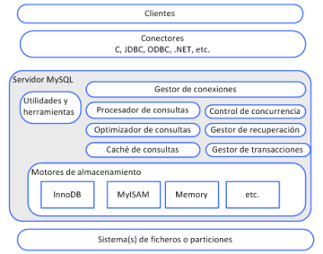

# Unidad 6 - Acceso a datos

## MySQL

MySQL es un sistema de gestión de bases de datos relacional (SGBD) basado en el modelo cliente-servidor. Para su funcionamiento, es necesario contar con:

-   **Clientes**: Herramientas que permiten acceder al servidor MySQL.
    -   **Modo texto**: Acceso mediante consola o línea de comandos (ej. MySQL).
    -   **Modo gráfico**: Interfaces visuales como Workbench, PhpMyAdmin o MySQLCC.
-   **Servidor**: Programa que gestiona las bases de datos almacenadas en memoria o disco.
    

Un Gestor de Bases de Datos sirve de intermediario entre los datos y los programas utilizados para su manipulación.
Las funciones esenciales de un GBD son:

Un SGBD actúa como intermediario entre los datos y las aplicaciones que los manipulan. Sus funciones principales incluyen:

-   **Diccionario de datos**: Catálogo que describe los metadatos de la base de datos.
-   **Lenguaje de definición de datos (DDL)**: Para definir la estructura de la base de datos y sus restricciones.
-   **Lenguaje de manipulación de datos (DML)**: Para insertar, modificar, eliminar y consultar datos.
-   **Lenguaje de control de datos (DCL)**: Para gestionar permisos, copias de seguridad y recuperación de datos.
-   **Mantenimiento de la integridad**: Asegura que se respeten las restricciones de los datos.
-   **Seguridad y recuperación**: Protege los datos y permite su recuperación en caso de fallos.
-   **Acceso concurrente**: Gestiona el acceso simultáneo de múltiples usuarios.
-   **Interacción con el sistema de archivos**: Traduce las operaciones de la base de datos al lenguaje del sistema operativo.

### Lenguaje de definición de datos (DDL)

El **Lenguaje de Definición de Datos (DDL)** en MySQL permite crear, modificar y eliminar estructuras de bases de datos y tablas. A continuación, se describen las principales sentencias y su uso.

**Creación de una base de datos**

Antes de crear tablas, es necesario crear la base de datos. Para ello, se utiliza la sentencia `CREATE DATABASE`:

```sql
CREATE {DATABASE | SCHEMA} [IF NOT EXISTS] db_name
    [DEFAULT] CHARACTER SET [=] charset_name
    [DEFAULT] COLLATE [=] collation_name;
```

-   **`IF NOT EXISTS`** → Evita errores si la base de datos ya existe.
-   **`CHARACTER SET`** → Define el conjunto de caracteres (ej: `utf8`).
-   **`COLLATE`** → Especifica las reglas de comparación de caracteres.

**Creación de tablas**

Una vez creada la base de datos, se pueden definir tablas utilizando la sentencia `CREATE TABLE`. Esta sentencia permite especificar columnas, tipos de datos y restricciones:

```sql
CREATE TABLE [IF NOT EXISTS] table_name (
	column_name data_type [Restricciones a nivel de columna]
	[, column_name data_type [Restricciones a nivel de columna]...]
	[Restricciones a nivel de tabla [, Restricciones a nivel de tabla]...]
) [ENGINE=engine_type];
```

**Restricciones comunes**

-   **`PRIMARY KEY`** → Define la clave primaria de la tabla. Solo puede haber una por tabla.
-   **`NULL | NOT NULL`** → Indica si una columna puede contener valores nulos.
-   **`DEFAULT valor`** → Asigna un valor predeterminado si no se proporciona uno.
-   **`UNIQUE`** → Garantiza que todos los valores en la columna sean únicos.
-   **`CHECK (expresión)`** → Valida que los datos cumplan una condición específica.
-   **`FOREIGN KEY`** → Establece una relación con otra tabla para mantener la integridad referencial.
    Opciones:
    -   **`ON DELETE CASCADE`** → Elimina las filas relacionadas automáticamente.
    -   **`ON DELETE SET NULL`** → Establece `NULL` en las filas relacionadas.
    -   **`ON DELETE SET DEFAULT`** → Asigna el valor predeterminado a las filas relacionadas.
-   **`AUTO_INCREMENT`** → Genera valores numéricos únicos automáticamente, comúnmente usado para claves primarias.

```sql
CREATE TABLE certificado (
  denominacion VARCHAR(30) CHECK (denominacion LIKE "TITULO%"),
  dni CHAR(10),
  anno_emision DATE NOT NULL,
  CONSTRAINT pk_certificado PRIMARY KEY (denominacion, dni),
  CONSTRAINT fk_demandante_certificado FOREIGN KEY (dni)
      REFERENCES demandante (dni) ON DELETE CASCADE
);

CREATE TABLE demandante (
  dni CHAR(10) PRIMARY KEY,
  apellidos VARCHAR(15) NOT NULL,
  nombre VARCHAR(15) NOT NULL
);

CREATE TABLE prestamos (
  num_prestamo INT(2) PRIMARY KEY,
  socio_no INT(4),
  CONSTRAINT fk_socio_prestamos FOREIGN KEY (socio_no)
    REFERENCES socios (socio_no) ON UPDATE SET NULL
);

CREATE TABLE socio (
  socio_no INT(4) PRIMARY KEY,
  apellidos VARCHAR(15) NOT NULL,
  nombre VARCHAR(15) NOT NULL,
  direccion VARCHAR(45) UNIQUE
);
```

### **Modificación de tablas (`ALTER TABLE`)**

La sentencia `ALTER TABLE` permite modificar la estructura de una tabla existente.

Algunas operaciones comunes incluyen:

**Añadir una columna**:

```sql
ALTER TABLE table_name
  ADD [COLUMN] NombreColumna TipoDato [Restricciones];
```

**Eliminar una columna**:

```sql
ALTER TABLE table_name
  DROP [COLUMN] NombreColumna;
```

**Modificar una columna**:

```sql
ALTER TABLE table_name
  MODIFY [COLUMN] NombreColumna TipoDatoNuevo [Restricciones];
```

**Cambiar el nombre de una columna**:

```sql
ALTER TABLE table_name
  CHANGE [COLUMN] NombreColumnaAntiguo NombreColumnaNuevo TipoDato [Restricciones];
```

**Añadir una restricción**:

```sql
ALTER TABLE table_name
  ADD {RestricciónColumna | RestricciónTabla};
```

**Eliminar una restricción**:

```sql
ALTER TABLE table_name
  DROP {PRIMARY KEY | FOREIGN KEY NombreConstraint};
```

**Renombrar la tabla**:

```sql
ALTER TABLE table_name
  RENAME [TO] NombreTablaNueva;
```

### **Eliminación de bases de datos y tablas (`DROP`)**

Para eliminar una base de datos o una tabla, se utilizan las siguientes sentencias:

**Eliminar una base de datos**:

```sql
DROP {DATABASE | SCHEMA} [IF EXISTS] db_name;
```

**Eliminar una tabla**:

```sql
DROP TABLE [IF EXISTS] table_name;
```

-   **`IF EXISTS`** → Evita errores si la base de datos o tabla no existe.

## Lenguaje de manipulación de datos (DML)

El **Lenguaje de Manipulación de Datos (DML)** en SQL permite interactuar con los datos almacenados en las tablas de una base de datos. Las operaciones principales son **INSERTAR**, **ACTUALIZAR**, **ELIMINAR** y **CONSULTAR** datos. A continuación, se detallan las sentencias más comunes.

### **Inserción de datos (`INSERT`)**

La sentencia `INSERT` se utiliza para añadir nuevos registros a una tabla.

Su formato básico es:

```sql
INSERT INTO table_name [(column_name [, column_name...])]
  {VALUES | VALUE} (values_list) [, (values_list)]...;
```

-   **Especificación de columnas**: Puedes indicar las columnas a las que se asignarán valores. Si no se especifican, se asume que se proporcionan valores para todas las columnas.
-   **Valores múltiples**: Es posible insertar varios registros en una sola sentencia.

**Inserción con columnas específicas**:

```sql
INSERT INTO Opositor(nombre_completo, titulacion_ac, idioma)
	VALUES ("José Javier García", "Técnico Superior", "español");
```

**Inserción de múltiples registros**:

```sql
INSERT INTO Opositor(nombre_completo, titulacion_ac)
  VALUES ("Miguel Román", "Arquitecto"),
	("Ana Iglesias", "Técnico Superior Laboratorio"),
	("Pedro Alonso", "Técnico Superior Administración de Sistemas"),
	("Olga Martinez", "Técnico Superior Administración de Sistemas");
```

**Inserción sin especificar columnas** (se asumen todas):

```sql
INSERT INTO Opositor VALUES (null, "Rosa Gómez", "Ingenieria", "inglés");
```

-   **Nota**: `null` se usa como comodín para campos autoincrementables.

### **Actualización de datos (`UPDATE`)**

La sentencia `UPDATE` permite modificar los datos existentes en una tabla. Su formato básico es:

```sql
UPDATE table_name
  SET column_name = valor [, column_name = value]...
  [WHERE condición]
  [ORDER BY...]
  [LIMIT...];
```

-   **`WHERE`** → Especifica las filas a actualizar. Si se omite, se actualizan todas las filas.
-   **`ORDER BY`** → Ordena las filas antes de aplicar la actualización.
-   **`LIMIT`** → Limita el número de filas a actualizar.

```sql
UPDATE Empleados
  SET salario = salario * 1.10
  WHERE departamento_id = 2;
```

### **Eliminación de datos (`DELETE`)**

La sentencia `DELETE` se utiliza para eliminar registros de una tabla. Su formato básico es:

```sql
DELETE FROM table_name
  [WHERE condición];
```

-   **`WHERE`** → Especifica las filas a eliminar. Si se omite, se eliminan todas las filas de la tabla (pero no la tabla en sí).

```sql
DELETE FROM Empleados
  WHERE id = 5;
```

### **Consulta de datos (`SELECT`)**

La sentencia `SELECT` permite recuperar datos de una o varias tablas. Su formato básico es:

```sql
SELECT {* | [ALL / DISTINCT] column_name [[AS] alias] [, column_name [[AS] alias]...] }
  FROM table_name [alias]
  [WHERE condición]
  [ORDER BY {column_name | posición} [ASC | DESC]
    [, {column_name | posición} [ASC | DESC]...]]
  [LIMIT [m, ] n];
```

**Componentes principales:**

-   **`*`** → Recupera todas las columnas de la tabla.
-   **`ALL` o `DISTINCT`**:
    -   **`ALL`** → Recupera todos los valores (opción por defecto).
    -   **`DISTINCT`** → Recupera solo valores únicos.
-   **`AS alias`** → Asigna un nombre alternativo a una columna o tabla para mejorar la legibilidad.
-   **`WHERE`** → Filtra las filas según una condición.
-   **`ORDER BY`** → Ordena los resultados por una o más columnas, en orden ascendente (`ASC`) o descendente (`DESC`).
-   **`LIMIT`** → Limita el número de filas devueltas.
    -   **`m`** → Indica el inicio de la recuperación (por defecto 0).
    -   **`n`** → Especifica el número de filas a recuperar.

**Consulta simple**:

```sql
SELECT * FROM Empleados;
```

**Consulta con filtro y ordenación**:

```sql
SELECT nombre, salario FROM Empleados
  WHERE departamento_id = 2
  ORDER BY salario DESC;
```

**Consulta con alias y límite**:

```sql
SELECT nombre AS Nombre_Empleado, salario AS Salario_Mensual
  FROM Empleados
  LIMIT 5;
```

**Consulta con valores únicos**:

```sql
SELECT DISTINCT departamento_id FROM Empleados;
```

## Funciones predefinidas

Las **funciones predefinidas** en SQL son herramientas que permiten realizar operaciones específicas sobre los datos, ya sea para transformarlos, calcular valores, o manipular cadenas, fechas y números. Estas funciones pueden ser utilizadas directamente en las consultas y se dividen en varias categorías según su propósito.

### Funciones numéricas

Estas funciones realizan operaciones matemáticas y devuelven valores numéricos.

Se clasifican en:

**Funciones individuales**:

| **Función**        | **Descripción**                                                           |
| ------------------ | ------------------------------------------------------------------------- |
| `ABS(n)`           | Devuelve el valor absoluto de `n`.                                        |
| `MOD(n1, n2)`      | Devuelve el resto de la división entera entre `n1` y `n2`.                |
| `PI()`             | Devuelve el valor de π (pi).                                              |
| `RAND()`           | Genera un número aleatorio entre 0 y 1.                                   |
| `ROUND(n1, n2)`    | Redondea `n1` a `n2` decimales. Si `n2` se omite, redondea a 0 decimales. |
| `TRUNCATE(n1, n2)` | Trunca `n1` a `n2` decimales. Si `n2` se omite, trunca a 0 decimales.     |
| `SIGN(n)`          | Devuelve `-1` si `n < 0`, `0` si `n = 0`, o `1` si `n > 0`.               |

**Funciones de grupo**:

| **Función**               | **Descripción**                                                        |
| ------------------------- | ---------------------------------------------------------------------- |
| `COUNT({* \| expresión})` | Cuenta filas `*` o las veces que aparece una expresión.                |
| `SUM(expresión)`          | Suma los valores de una expresión.                                     |
| `AVG(expresión)`          | Calcula la media aritmética de una expresión, ignorando valores nulos. |
| `MAX(expresión)`          | Devuelve el valor máximo de una expresión.                             |
| `MIN(expresión)`          | Devuelve el valor mínimo de una expresión.                             |

### **Funciones de cadenas de caracteres**

Estas funciones manipulan y transforman cadenas de texto:

| **Función**                       | **Descripción**                                                      |
| --------------------------------- | -------------------------------------------------------------------- |
| `LENGTH(string)`                  | Devuelve la longitud de la cadena.                                   |
| `LOWER(string)`                   | Convierte la cadena a minúsculas.                                    |
| `UPPER(string)`                   | Convierte la cadena a mayúsculas.                                    |
| `CONCAT(string1, string2, ...)`   | Concatena varias cadenas en una sola.                                |
| `SUBSTR(string, n1, n2)`          | Extrae una subcadena desde la posición `n1` con longitud `n2`.       |
| `RTRIM(string)` / `LTRIM(string)` | Elimina espacios en blanco al final (`RTRIM`) o al inicio (`LTRIM`). |
| `REPLACE(string, old, new)`       | Reemplaza todas las ocurrencias de `old` por `new` en la cadena.     |

### **Funciones de fecha y hora**

Estas funciones permiten manipular y formatear fechas y horas:

| **Función**                        | **Descripción**                                                    |
| ---------------------------------- | ------------------------------------------------------------------ |
| `ADDDATE(fecha, n)`                | Devuelve la fecha más `n` días.                                    |
| `SUBDATE(fecha, n)`                | Devuelve la fecha menos `n` días.                                  |
| `DATE_ADD(fecha, INTERVAL n tipo)` | Añade un intervalo (`DAY`, `MONTH`, `YEAR`, etc.) a una fecha.     |
| `DATE_SUB(fecha, INTERVAL n tipo)` | Resta un intervalo a una fecha.                                    |
| `DATEDIFF(fecha1, fecha2)`         | Devuelve la diferencia en días entre `fecha1` y `fecha2`.          |
| `DAYNAME(fecha)`                   | Devuelve el nombre del día de la semana.                           |
| `MONTHNAME(fecha)`                 | Devuelve el nombre del mes.                                        |
| `DAYOFWEEK(fecha)`                 | Devuelve el número del día de la semana (1 = Domingo, 7 = Sábado). |
| `DAYOFMONTH(fecha)`                | Devuelve el día del mes (1-31).                                    |
| `DAYOFYEAR(fecha)`                 | Devuelve el día del año (1-366).                                   |
| `WEEKOFYEAR(fecha)`                | Devuelve el número de la semana del año (1-52).                    |
| `MONTH(fecha)`                     | Devuelve el mes (1-12).                                            |
| `YEAR(fecha)`                      | Devuelve el año.                                                   |
| `HOUR(time)`                       | Devuelve la hora (0-23).                                           |
| `MINUTE(time)`                     | Devuelve los minutos (0-59).                                       |
| `SECOND(time)`                     | Devuelve los segundos (0-59).                                      |
| `CURDATE()`                        | Devuelve la fecha actual (`yyyy-mm-dd`).                           |
| `CURTIME()`                        | Devuelve la hora actual (`hh:mm:ss`).                              |
| `NOW()` / `SYSDATE()`              | Devuelve la fecha y hora actual.                                   |

**Formateo de fechas y horas**

Las funciones `DATE_FORMAT(fecha, formato)` y `TIME_FORMAT(hora, formato)` permiten personalizar el formato de salida.

Algunas secuencias comunes son:

| **Secuencia** | **Descripción**                        |
| ------------- | -------------------------------------- |
| `%a`          | Nombre abreviado del día (ej. Mon).    |
| `%b`          | Nombre abreviado del mes (ej. Jan).    |
| `%c`          | Mes numérico (1-12).                   |
| `%m`          | Mes numérico con dos dígitos (01-12).  |
| `%e`          | Día del mes (1-31).                    |
| `%H`          | Hora en formato 24 horas (00-23).      |
| `%h`          | Hora en formato 12 horas (01-12).      |
| `%i`          | Minutos (00-59).                       |
| `%s`          | Segundos (00-59).                      |
| `%M`          | Nombre completo del mes (ej. January). |
| `%Y`          | Año con 4 dígitos (ej. 2023).          |
| `%y`          | Año con 2 dígitos (ej. 23).            |

### **Funciones de comparación**

Estas funciones comparan valores y devuelven resultados booleanos o específicos:

| **Función**                      | **Descripción**                                                                                   |
| -------------------------------- | ------------------------------------------------------------------------------------------------- |
| `GREATEST(val1, val2, ...)`      | Devuelve el valor más grande de una lista.                                                        |
| `LEAST(val1, val2, ...)`         | Devuelve el valor más pequeño de una lista.                                                       |
| `IFNULL(expresión1, expresión2)` | Devuelve `expresión2` si `expresión1` es `NULL`; de lo contrario, devuelve `expresión1`.          |
| `ISNULL(expresión)`              | Devuelve `1` si `expresión` es `NULL`; de lo contrario, devuelve `0`.                             |
| `STRCMP(string1, string2)`       | Compara dos cadenas: `0` si son iguales, `1` si `string1 > string2`, `-1` si `string1 < string2`. |

### **Otras funciones**

Algunas funciones adicionales que pueden ser útiles incluyen:

| **Función**  | **Descripción**                                 |
| ------------ | ----------------------------------------------- |
| `DATABASE()` | Devuelve el nombre de la base de datos actual.  |
| `USER()`     | Devuelve el usuario actual de la base de datos. |
| `VERSION()`  | Devuelve la versión del servidor MySQL.         |

## Acceso a datos

En PHP, el acceso a bases de datos se puede realizar mediante dos enfoques principales: la extensión **MySQLi** (específica para MySQL/MariaDB) y la librería **PDO** (PHP Data Objects), que ofrece una interfaz común para trabajar con múltiples bases de datos. A continuación, se presenta un resumen unificado y mejorado de ambas opciones, incluyendo ejemplos de código.

### **Extensión MySQLi**

**Interface Procedimental**

1. **Conexión y desconexión:**

    - `mysqli_connect()` → Establece la conexión con el servidor MySQL.
    - `mysqli_select_db()` → Selecciona la base de datos a utilizar.
    - `mysqli_close()` → Cierra la conexión.

    ```php
    <?php
    	$db_host = "localhost";
    	$db_usuario = "root";
    	$db_clave = "root";
    	$db_nombre = "ciclo";
    	$conexion = mysqli_connect($db_host, $db_usuario, $db_clave);

    	if (mysqli_connect_errno()) {
        echo "No es posible acceder a la Base de datos $db_nombre";
    	} else {
        mysqli_select_db($conexion, $db_nombre);
        // Operaciones con la base de datos
        mysqli_close($conexion);
    	}
    ?>
    ```

2. **Consultas no preparadas:**

    - `mysqli_query()` → Ejecuta una consulta SQL y devuelve un resultset.
    - `mysqli_fetch_array()` → Recupera filas como arrays indexados o asociativos.
    - `mysqli_fetch_row()` → Recupera filas como arrays indexados.
    - `mysqli_fetch_assoc()` → Recupera filas como arrays asociativos.
    - `mysqli_fetch_object()` → Recupera filas como objetos.
    - `mysqli_affected_rows()` → Devuelve el número de filas afectadas por una operación.
    - `mysqli_num_rows()` → Devuelve el número de filas en un resultset.
    - `mysqli_insert_id()` → Devuelve el último ID insertado en un campo AUTO_INCREMENT.
    - `mysqli_free_result()` → Libera la memoria asociada a un resultset.

    ```php
    <?php
    	$consulta = "SELECT * FROM alumno";
    	$resultados = mysqli_query($conexion, $consulta);

    	while ($fila = mysqli_fetch_array($resultados)) {
        echo $fila[0] . " " . $fila[1] . " " . $fila[2] . " " . $fila[3] . "<br>";
    	}

    	mysqli_free_result($resultados);
    ?>
    ```

3. **Consultas preparadas:**

    - `mysqli_prepare()` → Prepara una consulta SQL para su ejecución.
    - `mysqli_stmt_bind_param()` → Asocia parámetros a una consulta preparada.
    - `mysqli_stmt_execute()` → Ejecuta una consulta preparada.
    - `mysqli_stmt_bind_result()` → Asocia variables a los resultados de una consulta.
    - `mysqli_stmt_fetch()` → Recupera los resultados de una consulta preparada.

    ```php
    <?php
    	$edad = 18;
    	$preparada = mysqli_prepare($conexion, "SELECT nombre FROM alumno WHERE edad = ?");
    	mysqli_stmt_bind_param($preparada, "i", $edad);
    	mysqli_stmt_execute($preparada);
    	mysqli_stmt_bind_result($preparada, $nom);

    	echo "Estos son los alumnos con " . $edad . " años:<br>";
    	while (mysqli_stmt_fetch($preparada)) {
        echo $nom . "<br>";
    	}

    	mysqli_stmt_close($preparada);
    ?>
    ```

4. **Control de errores:**

    - `mysqli_connect_errno()` → Devuelve el código del último error de conexión.
    - `mysqli_connect_error()` → Devuelve el mensaje del último error de conexión.

    ```php
    <?php
    	if (mysqli_connect_errno()) {
        echo "Error de conexión: " . mysqli_connect_error();
    	}
    ?>
    ```

5. **Transacciones:**

    - `mysqli_begin_transaction()` → Inicia una transacción.
    - `mysqli_autocommit(false)` → Desactiva el modo autocommit.
    - `mysqli_commit()` → Confirma los cambios de una transacción.
    - `mysqli_rollback()` → Revierte los cambios de una transacción.

    ```php
    <?php
    	mysqli_begin_transaction($conexion);
    	mysqli_autocommit($conexion, false);

    	$consulta = "DELETE FROM alumno WHERE edad = 21";
    	if (mysqli_query($conexion, $consulta)) {
        mysqli_commit($conexion);
    	} else {
        mysqli_rollback($conexion);
    	}
    ?>
    ```

### **Interface Orientada a Objetos (POO)**

1. **Conexión y desconexión:**

    - `new mysqli(host, usuario, contraseña, BD)` → Crea una instancia de la clase `mysqli`.
    - `$conexion->close()` → Cierra la conexión.

    ```php
    <?php
    	$db_host = "localhost";
    	$db_usuario = "root";
    	$db_clave = "root";
    	$db_nombre = "ciclo";

    	$conexion = new mysqli($db_host, $db_usuario, $db_clave, $db_nombre);

    	if ($conexion->connect_errno) {
        echo "Fallo en la conexión<br>";
    	} else {
        echo "Conexión establecida<br>";
        // Operaciones con la base de datos
        $conexion->close();
    	}
    ?>
    ```

2. **Consultas no preparadas:**

    - `$conexion->query()` → Ejecuta una consulta SQL.
    - `$resultados->fetch_array()` → Recupera filas como arrays.
    - `$resultados->fetch_assoc()` → Recupera filas como arrays asociativos.
    - `$resultados->fetch_row()` → Recupera filas como arrays indexados.
    - `$resultados->free()` → Libera la memoria asociada a un resultset.

    ```php
    <?php
    	$consulta = "SELECT * FROM alumno";
    	$resultados = $conexion->query($consulta);

    	while ($fila = $resultados->fetch_array()) {
        echo $fila[0] . " " . $fila[1] . " " . $fila[2] . " " . $fila[3] . "<br>";
    	}

    	$resultados->free();
    ?>
    ```

3. **Consultas preparadas:**

    - `$conexion->prepare()` → Prepara una consulta SQL.
    - `$stmt->bind_param()` → Asocia parámetros a una consulta preparada.
    - `$stmt->execute()` → Ejecuta una consulta preparada.
    - `$stmt->bind_result()` → Asocia variables a los resultados.
    - `$stmt->fetch()` → Recupera los resultados.

    ```php
    <?php
    	$edad = 18;
    	$preparada = $conexion->prepare("SELECT nombre FROM alumno WHERE edad = ?");
    	$preparada->bind_param("i", $edad);
    	$preparada->execute();
    	$preparada->bind_result($nom);

    	echo "Estos son los alumnos con " . $edad . " años:<br>";
    	while ($preparada->fetch()) {
        echo $nom . "<br>";
    	}

    	$preparada->close();
    ?>
    ```

4. **Control de errores:**

    - `$conexion->connect_errno` → Código del último error de conexión.
    - `$conexion->connect_error` → Mensaje del último error de conexión.

    ```php
    <?php
    	if ($conexion->connect_errno) {
    	  echo "Error de conexión: " . $conexion->connect_error;
    	}
    ?>
    ```

5. **Transacciones:**

    - `$conexion->autocommit(false)` → Desactiva el modo `autocommit`.
    - `$conexion->commit()` → Confirma los cambios.
    - `$conexion->rollback()` → Revierte los cambios.

    ```php
    <?php
    	$conexion->autocommit(false);

    	$consulta = "DELETE FROM alumno WHERE edad = 21";
    	if ($conexion->query($consulta)) {
        $conexion->commit();
    	} else {
        $conexion->rollback();
    	}
    ?>
    ```

### Extensión PDO (**PHP Data Objects**)

PDO es una librería que permite acceder a múltiples bases de datos (relacionales y no relacionales) utilizando una sintaxis común. Ofrece un enfoque orientado a objetos y manejo de excepciones para el control de errores.

1. **Conexión y desconexión:**

    - `new PDO(dsn, usuario, contraseña)` → Crea una instancia de la clase `PDO`.
    - `$conexion = null` → Cierra la conexión.

    ```php
    <?php
    	$db_usuario = "root";
    	$db_clave = "root";

    	try {
        $conexion = new PDO("mysql:host=127.0.0.1;dbname=ciclo", $db_usuario, $db_clave);
        $conexion->setAttribute(PDO::ATTR_ERRMODE, PDO::ERRMODE_EXCEPTION);
        echo "Conexión establecida con éxito utilizando PDO<br>";
    	} catch (PDOException $e) {
        die("Error: " . $e->getMessage());
    	} finally {
        $conexion = null;
    	}
    ?>
    ```

2. **Consultas no preparadas:**

    - `$conexion->query()` → Ejecuta una consulta SQL.
    - `$resultados->fetch(PDO::FETCH_BOTH)` → Recupera filas como arrays indexados y asociativos.
    - `$resultados->fetch(PDO::FETCH_ASSOC)` → Recupera filas como arrays asociativos.
    - `$resultados->fetch(PDO::FETCH_OBJ)` → Recupera filas como objetos.
    - `$resultados->closeCursor()` → Libera la memoria asociada a un `resultset`.

    ```php
    <?php
    	$consulta = "SELECT * FROM alumno";
    	$resultados = $conexion->query($consulta);

    	while ($fila = $resultados->fetch(PDO::FETCH_ASSOC)) {
    	  echo $fila["id_al"] . " " . $fila["nombre"] . " " . $fila["edad"] . " " . $fila["codigo"] . "<br>";
    	}

    	$resultados->closeCursor();
    ?>
    ```

3. **Consultas preparadas:**

    - `$conexion->prepare()` → Prepara una consulta SQL.
    - `$stmt->execute(array de parámetros)` → Ejecuta una consulta preparada.
    - `$stmt->fetch(PDO::FETCH_ASSOC)` → Recupera filas como arrays asociativos.

    ```php
    <?php
    	$edad = 18;
    	$consulta = "SELECT nombre FROM alumno WHERE edad = ?";
    	$stmt = $conexion->prepare($consulta);
    	$stmt->execute([$edad]);

    	while ($fila = $stmt->fetch(PDO::FETCH_ASSOC)) {
        echo $fila["nombre"] . "<br>";
    	}

    	$stmt->closeCursor();
    ?>
    ```

4. **Control de errores:**

    - PDO utiliza excepciones para el manejo de errores:

    ```php
    <?php
    	try {
        $conexion = new PDO("mysql:host=127.0.0.1;dbname=ciclo", "root", "root");
        $conexion->setAttribute(PDO::ATTR_ERRMODE, PDO::ERRMODE_EXCEPTION);
    	} catch (PDOException $e) {
        die("Error: " . $e->getMessage());
    	}
    ?>
    ```

5. **Transacciones:**

    - `$conexion->beginTransaction()` → Inicia una transacción.
    - `$conexion->commit()` → Confirma los cambios.
    - `$conexion->rollback()` → Revierte los cambios.

    ```php
    <?php
    	$conexion->beginTransaction();
    	$insertar = "INSERT INTO alumno (id_al, nombre, edad, codigo) VALUES (10, 'Monica', 20, NULL)";
    	$r3 = $conexion->query($insertar);

    	if (!$r3) {
        echo "Error: " . $r3->errorInfo();
        $conexion->rollback();
        echo "<br>La transferencia no ha sido realizada.<br>";
    	} else {
        $conexion->commit();
    	}

    	$r3->closeCursor();
    ?>
    ```

### Ficheros

En el desarrollo de aplicaciones web, una fuente de datos común es el sistema de ficheros local. PHP ofrece la librería `Filesystem` para gestionar flujos de datos y manipular archivos de forma eficiente.

**`Streams` en PHP**

Muchas funciones de manipulación de archivos utilizan **`streams`**, que son objetos de tipo `resource` que permiten leer o escribir datos de manera secuencial. Para ello, es necesario especificar un **esquema** (en este caso, `file`) y un **objetivo**, que es el archivo local.

**Operaciones con ficheros**

-   **Apertura y cierre de ficheros**
    -   `fopen(fichero, modo)` → Abre un archivo y devuelve un **manejador de archivo**.
        | Modo | Descripción |
        | ------ | -------------------------------------------------------------- |
        | `'r'` | Solo lectura, puntero al inicio. |
        | `'r+'` | Lectura y escritura, puntero al inicio. |
        | `'w'` | Solo escritura, trunca el archivo. Si no existe, lo crea. |
        | `'w+'` | Lectura y escritura, trunca el archivo. Si no existe, lo crea. |
        | `'a'` | Solo escritura, puntero al final. Si no existe, lo crea. |
        | `'a+'` | Lectura y escritura, puntero al final. Si no existe, lo crea. |
    -   `fclose(fichero)` → Cierra el archivo, liberando recursos.
-   **Escritura en ficheros**

    -   `fwrite(fichero, dato [,bytes])` o `fputs(fichero, dato)` → Escribe datos en un archivo.

        ```php
        $nombreFichero = "modulos.txt";
        $fichero = fopen($nombreFichero, "a+");

        $dato = "dwes;9\n";
        fwrite($fichero, $dato);

        $dato = "dwec;8\n";
        fputs($fichero, $dato);

        fclose($fichero);
        ```

    -   `file_put_contents(fichero, dato, [flag])` → Abre, escribe y cierra un archivo en una sola operación.
        ```php
        $dato = "diw;6\n";
        file_put_contents($fichero, $dato, FILE_APPEND | LOCK_EX);
        ```
    -   `fputcsv(fichero, dato)` → Escribe un array en un archivo CSV.

        ```php
        $nombreFichero = "calificar.csv";
        $fichero = fopen($nombreFichero, "w");

        $dato = array('4,25', '5,75', '5', 'aprobado');
        fputcsv($fichero, $dato);

        $tabla = array(array('5', '5', '5', 'aprobado'), array('6', '6', '6', 'bien'));
        foreach($tabla as $campos) {
        	fputscsv($fichero, $campos, ",");
        }
        fclose($fichero);
        ```

-   **Lectura de ficheros**

    -   `fread(fichero, bytes)` → Lee un archivo completo.

        ```php
        $nombreFichero = "alumnos.txt";
        $fichero = fopen($nombreFichero, "r");

        if ($fichero) {
          $contenido = fread($fichero, filesize($nombreFichero));
          echo $contenido;
          fclose($fichero);
        } else {
          echo "No se encuentra el fichero";
        }
        ```

    -   `fgets(fichero)` → Lee el archivo línea por línea.
    -   `fscanf(fichero, formato)` → Extrae datos formateados de un archivo.
    -   `file_get_contents(fichero)` → Lee el contenido completo de un archivo en una sola operación.

**Control del puntero interno**

-   `feof(fichero)` → Comprueba si se ha alcanzado el final del archivo.
-   `rewind(fichero)` → Reinicia el puntero al inicio del archivo.
-   `fseek(fichero, posición)` → Mueve el puntero a una posición específica.
-   `ftell(fichero)` → Obtiene la posición actual del puntero.

```php
function visitas() {
  $nombreFichero = "visitas.txt";
  $fcont = fopen($nombreFichero, "r+");
  $visitas = fread($fcont, filesize($nombreFichero));
  $nuevas_visitas = $visitas + 1;

  echo "Eres la visita número $nuevas_visitas<br>";

  fseek($fcont, 0);
  fwrite($fcont, $nuevas_visitas);
  fclose($fcont);
}

echo "Bienvenido a mi web<br>";
visitas();
```

### **Manipulación de ficheros XML**

PHP ofrece la extensión **`SimpleXML`** para manejar archivos XML. La función `simplexml_load_file()` permite cargar un XML y tratarlo como un objeto.

```php
$alumnos = simplexml_load_file("alumnos.xml");
$n_alumnos = count($alumnos->alumno);

echo "<table border=1>";
echo "<tr><th>ID</th><th>Nombre</th><th>Edad</th><th>Curso</th></tr>";

foreach ($alumnos->alumno as $alumno) {
  echo "<tr><td>{$alumno->id_al}</td><td>{$alumno->nombre}</td><td>{$alumno->edad}</td><td>{$alumno->codigo}</td></tr>";
}

echo "</table>";
```

### **`Feeds` RSS**

Los **`feeds` RSS (Really Simple Syndication)** son flujos de información en formato XML que permiten agregar contenido en sitios web.

**Estructura de un canal RSS**

-   **Elementos obligatorios:**
    -   `title` → Título del canal.
    -   `link` → URL del sitio web.
    -   `description` → Breve descripción del canal.
-   **Elementos opcionales:**
    -   `language` → Idioma del canal (ej. `es-es`).
    -   `copyright` → Información de derechos de autor.
    -   `webMaster` → Correo del administrador.
    -   `pubDate` → Fecha de publicación.
    -   `lastBuildDate` → Última actualización.
    -   `image` → Imagen asociada.
-   **Estructura de un ítem RSS:**
    -   `title` → Título de la noticia.
    -   `link` → URL del ítem.
    -   `description` → Resumen del contenido.

## Modelo - Vista - Controlador

### Arquitectura web organizada en capas

Una arquitectura en capas divide el software en distintas partes, cada una con un rol específico, lo que facilita la organización y escalabilidad de la aplicación. Este enfoque permite optimizar recursos y mejorar la flexibilidad del sistema.

La arquitectura web moderna se compone de tres capas principales:

-   **Capa de presentación**: Maneja la interacción con el usuario, procesando sus solicitudes y enviándolas a la capa de lógica de negocio. También recibe datos de la capa inferior y los adapta para su presentación. Sus funciones incluyen:
    -   Navegación del sistema
    -   Validación de datos
    -   Formato de salida
    -   Internacionalización
    -   Renderizado de la interfaz
-   **Capa de lógica de negocio**: Define los procesos y reglas de la aplicación, permitiendo la ejecución de operaciones sensibles a la interacción del usuario. Es aquí donde se gestionan las transacciones y las operaciones intensivas en datos. Por ejemplo, en una tienda en línea, esta capa maneja la selección de productos, el carrito de compras y el pago.
-   **Capa de datos o persistencia**: Interactúa con bases de datos, gestionando la inserción, eliminación, búsqueda y actualización de información. Su función es garantizar la persistencia y el manejo eficiente de grandes volúmenes de datos.

### Arquitectura MVC

El patrón **Modelo-Vista-Controlador (MVC)** es ampliamente utilizado en el desarrollo web, ya que facilita la separación de responsabilidades dentro de una aplicación. Al dividir la aplicación en capas, se crean interfaces claras entre ellas, lo que mejora la mantenibilidad y escalabilidad del software.

Las tres componentes principales del MVC son:

-   **Modelo**: Contiene la lógica de negocio y la gestión de datos de la aplicación.
-   **Vista**: Presenta la información al usuario de manera estructurada.
-   **Controlador**: Actúa como intermediario entre el Modelo y la Vista, gestionando las interacciones del usuario y los eventos de la aplicación.

Gracias a esta separación, la aplicación se mantiene modular y flexible. Los cambios en la interfaz o la base de datos no afectan la lógica central, y los datos pueden ser accedidos sin necesidad de trasladarlos completamente al cliente.
