# Unidad 1 - Planificación y usabilidad de interfaces web

## Etapas iniciales del diseño

### Diseño gráfico

-   **Funciones del diseño gráfico:**
    -   **Función comunicativa:** El diseño debe ser comprensible para el receptor.
    -   **Función publicitaria:** Debe atraer la atención del usuario.
    -   **Función estética:** El diseño busca ser agradable visualmente.
-   **Problema:** Los diseñadores gráficos tradicionales a menudo no están familiarizados con las nuevas tecnologías, lo que da lugar a la figura del **diseñador web**, que se sitúa entre el diseñador gráfico y el informático.

### Lenguaje visual

-   **Diseño:**
    -   Se encarga del embellecimiento exterior, pero también debe cubrir exigencias prácticas.
    -   El diseño debe integrar tanto la vertiente estética como la funcional.
    -   El diseñador debe dominar el **lenguaje visual** y comprender los principios y reglas que lo rigen.

## Usuarios

### Interfaces web

-   Todas las páginas web tienen un propósito, y el éxito para lograrlo depende del diseño de la interfaz.
-   La **interfaz** debe estar diseñada teniendo en cuenta las **necesidades del usuario**.
-   El éxito de un sistema interactivo depende en gran parte de la interfaz entre el usuario y el ordenador.
-   Cada día aumenta el número de usuarios con diferentes niveles de preparación y expectativas.

### Objetivos de una interfaz web

-   **Objetivo principal:** Que los usuarios accedan a los contenidos de manera rápida y sencilla.
-   Una interfaz web efectiva permite a los usuarios interactuar cómodamente y de forma eficiente.
-   **Aspectos clave:**
    -   Los usuarios tienen poca paciencia.
    -   El gusto es subjetivo, pero debe buscarse un diseño coherente y agradable.
    -   Cumplir con las expectativas del usuario: evitar enlaces vacíos o con información errónea.

### Características de una interfaz web

-   Para satisfacer a los usuarios, debemos entender cómo perciben y procesan la información.
-   Existen características deseables y otras imprescindibles que dependen del público objetivo.
-   **Usabilidad:** La interfaz debe ser fácil de usar para que los usuarios tomen decisiones rápidamente.
-   **Página visual:** Los elementos gráficos deben estar alineados con los objetivos del sitio, no solo como decoración.
-   **Educativa:** La interfaz debe ser fácil de aprender.
-   **Actualizada:** Debe ofrecer contenidos nuevos periódicamente.

## Prototipado

-   **Wireframes:** Etapas tempranas, estructura básica y de baja calidad. Ahorra tiempo y costes, y aporta valor informativo.

    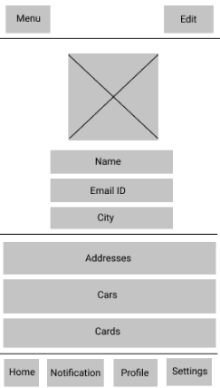
    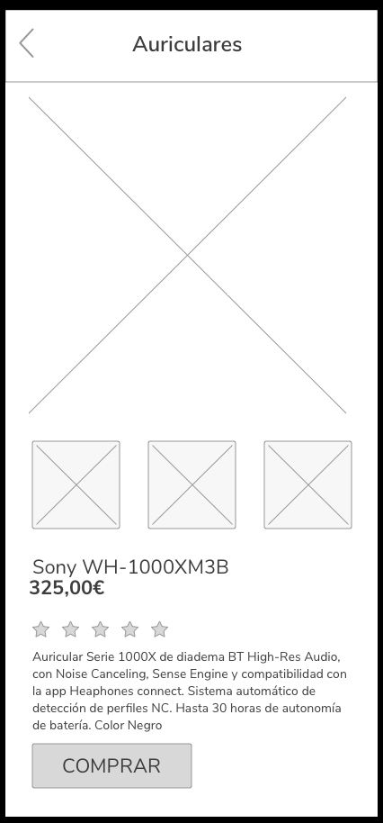

-   **Mockups:** Etapas intermedias, alta fidelidad y ajustes visuales cercanos al diseño final, incluyendo tipografías y colores.

    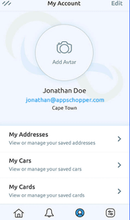

-   **Prototipos:** Etapas intermedias, alta fidelidad con interactividad. Permiten corregir errores de usabilidad y funcionalidad.

    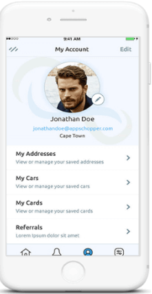
    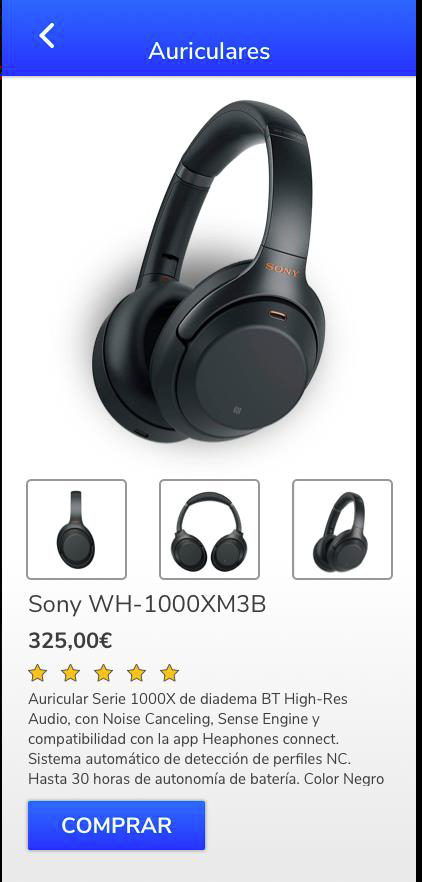

## Diseño de un sitio web

### Homogeneidad

-   Los diseños han evolucionado hacia interfaces homogéneas, con componentes gráficos y funcionales similares, facilitando la comunicación efectiva con el usuario.
-   Elementos de diseño y funcionalidad similares en todos los sitios aseguran una **comunicación efectiva**.

### Componentes de una interfaz

-   **Cabecera:** Situada en la parte superior con el logotipo de la empresa (HTML5: `<header>`), su función principal es **identificar el sitio**.
    -   Es común a todas las páginas, separando la navegación de la zona de lectura.
    -   Excepción: páginas de aterrizaje (landing pages) no suelen tener cabecera.
        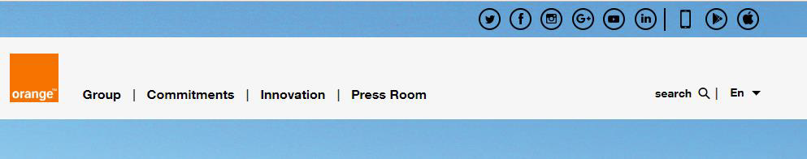
        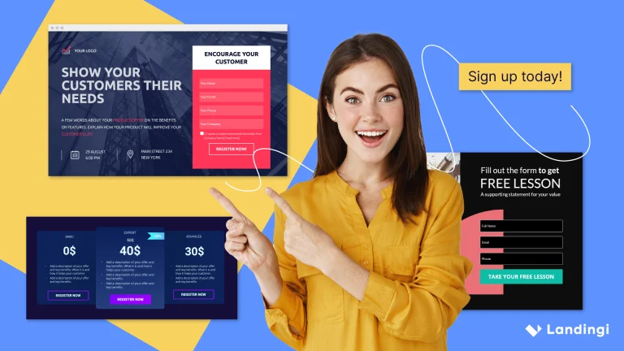
-   **Menús de navegación:** Permiten desplazarse por el sitio (HTML5: `<nav>`), generalmente con texto, gráficos u otros elementos.
    
    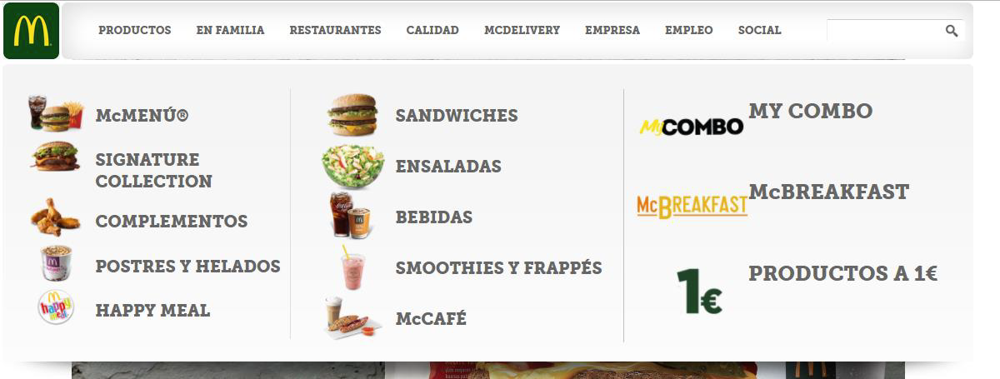
    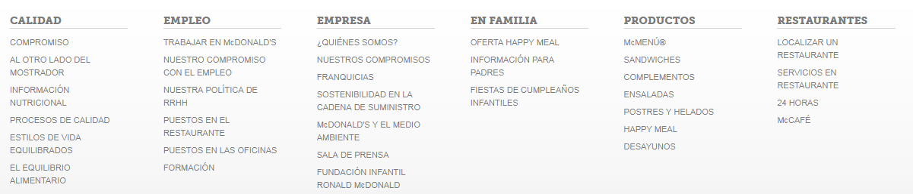
-   **Cuerpo de la página:** Donde se presenta la información relevante. Incluye un título `<h1>` para mejorar el SEO.
-   **Pie de página:** Situado al final, ayuda a estructurar el sitio e incluye enlaces a servicios, contactos y avisos legales.

### Estructura de enlaces

-   **Maquetación web:** Distribuir los elementos de una página considerando el espacio disponible y asegurando consistencia en todas las páginas del sitio.

    -   Los bocetos preliminares y el diseño coherente son esenciales.

        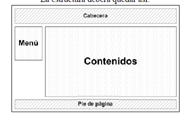

-   **Mapa de navegación:** Un esquema previo que ayuda a organizar las secciones y bloques de contenido, facilitando tanto el diseño como la navegación del sitio.
    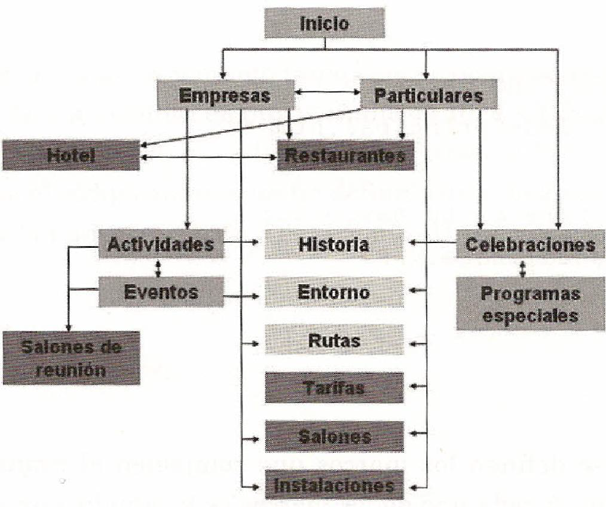

## Homepage

### Diseño de la página de inicio

-   La página de inicio determina el éxito o fracaso de un sitio web. Una buena página retiene a las visitas y las convierte en clientes.
-   **Cómo estructurar el contenido:**
    -   El contenido debe estar bien organizado, permitiendo que los usuarios encuentren fácilmente lo que buscan.
    -   **Presentación:** El menú de navegación debe ser claro y conciso, con un máximo de 5-7 pestañas en el primer nivel.
    -   Los títulos, subtítulos (`<h1>`, `<h2>`, `<h3>`) y los textos deben estar distribuidos de manera equilibrada.
    -   Imágenes: Maximizar el ancho de las imágenes horizontales y evitar las imágenes verticales.

## Información

### Pirámide invertida de la información

-   La información debe presentarse de mayor a menor importancia, similar al estilo periodístico.
-   No solo el texto, sino también imágenes y videos juegan un papel crucial.
-   La página de inicio debe presentar poco texto en la parte superior para aumentar el impacto visual, con detalles adicionales hacia la parte inferior.
-   Esta estructura contribuye a:
    -   **Retener visitas:** El diseño atrae inicialmente, pero la información retiene al usuario.
    -   **Aumentar la credibilidad:** Las imágenes y el logotipo en posiciones clave transmiten profesionalidad.
    -   **Informar rápidamente:** El usuario debe captar el servicio o producto desde el primer momento.
        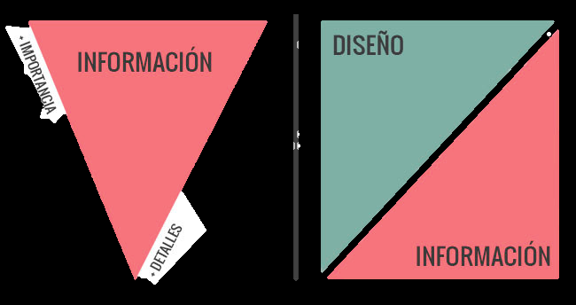

### Distribución de la información

1. **Espacio para la marca:** Logotipo destacado y menú de navegación jerárquico.
2. **Productos o servicios:** Enlaces a otras partes del sitio como la tienda online o más información.
3. **Información siempre visible:** Formas de contacto y enlaces a secciones destacadas o redes sociales.

## Color

El color es fundamental en cualquier tipo de diseño. Su correcta elección puede tener un impacto significativo en la percepción y acciones de los usuarios, ya sea en un logo, una página web o publicidad. Es importante considerar aspectos como la psicología del color y las armonías cromáticas, ya que estas pueden influir en las decisiones de los usuarios. Aprender a utilizar el color de forma estratégica permite crear una experiencia positiva que motive a los visitantes a interactuar más con tu sitio web.

### Psicología del color

El color tiene un poder inmenso, ya que afecta tanto los sentimientos como las acciones de las personas. La psicología del color puede fortalecer tu marca, incrementar ventas y guiar a los visitantes hacia ciertas acciones dentro de tu web. Se ha demostrado que las personas toman decisiones sobre productos en menos de 90 segundos, y el 90% de esa decisión está basada en el color. Además, el color puede aumentar el reconocimiento de una marca hasta en un 80%.

-   **Rojo:** Simboliza pasión, energía y movimiento, pero también peligro o violencia. Se utiliza para captar atención, pero debe evitarse el exceso en sectores como artículos de lujo o páginas profesionales.
-   **Amarillo:** Asociado con optimismo y juventud, pero también con engaño y vulgaridad. Es efectivo en pequeñas cantidades para botones de acción, pero puede resultar molesto si se abusa de él.
    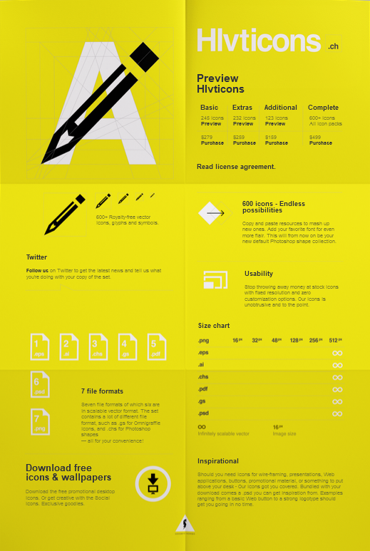
-   **Naranja:** Evoca energía y entusiasmo, ideal para llamadas a la acción. Sin embargo, un uso excesivo puede resultar sobrecargado.
-   **Verde:** Relacionado con la naturaleza, el bienestar y la calma. Es apropiado para temas de salud, medioambiente y ciencia, pero menos para tecnología o bienes de lujo.
-   **Azul:** Asociado con confianza y seguridad, es común en empresas grandes y bancos. Sin embargo, ciertos tonos pueden hacer que una página se vea fría y distante.
-   **Morado:** Vinculado con la realeza y el lujo, es ideal para productos de belleza o marcas femeninas. No es adecuado si se busca captar atención, ya que puede resultar relajante.
-   **Marrón:** Simboliza estabilidad y naturaleza, siendo adecuado para alimentos y temas de naturaleza. No es recomendable para elementos de llamada a la acción.
-   **Negro:** Representa elegancia y poder, pero en exceso puede generar una sensación amenazante. Es ideal para productos de lujo y moda.

### Psicología del color y el género

Los hombres tienden a preferir colores oscuros y vivos, mientras que las mujeres suelen inclinarse por tonos claros y suaves. Esta información puede ser útil para segmentar tu audiencia y elegir colores más efectivos según el género predominante de tus usuarios.

### Pasos para elegir el color de tu página

1. **Determinar el propósito de tu página**: Entender por qué los usuarios la visitan y quiénes son.
2. **Elegir colores relevantes**: Utiliza la psicología del color para seleccionar uno o dos colores que representen el propósito y la audiencia.
3. **Añadir un color llamativo**: Selecciona un color de acento para destacar elementos clave como botones de llamada a la acción.

### Armonías de color

Existen varias armonías cromáticas que ayudan a crear combinaciones estéticas y funcionales:

-   **Monocromática**: Utiliza diferentes tonalidades de un solo color.

    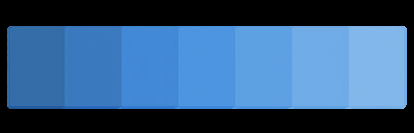

-   **Complementaria**: Colores opuestos en la rueda de color, ideales para crear contraste.

    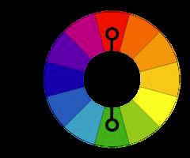

-   **Tríadica**: Colores equidistantes en la rueda, donde uno es dominante.

    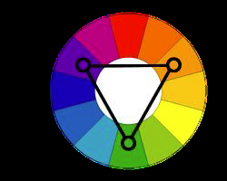

-   **Tetrádica**: Cuatro colores en pares complementarios, con uno como dominante.

    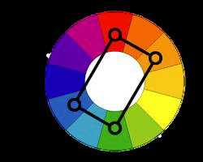

-   **Análoga**: Colores adyacentes en la rueda, creando armonía y serenidad.

    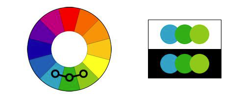

-   **Split Complementaria**: Variación del esquema complementario con menos tensión visual.

    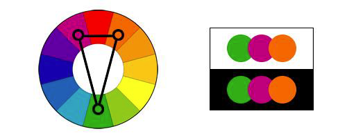

### Usos del color

Para captar la atención, los colores saturados deben usarse con moderación, especialmente en áreas donde los usuarios pasan mucho tiempo. Un fondo neutro puede hacer que los colores de acento se destaquen más.

-   **Fortalecer la identidad de marca**: Utiliza los colores de la marca de manera coherente en el sitio para reforzar su personalidad.
-   **Elegancia y minimalismo**: En algunos casos, menos color puede transmitir simplicidad y sofisticación, especialmente en marcas de lujo.

### Color para novatos

-   Usa un solo color impactante combinado con blanco y negro.
-   Utiliza fotografías para aportar color de forma sutil y efectiva.

## Tipografía

La tipografía es otro pilar del diseño web, ya que puede influir enormemente en la experiencia del usuario. Es importante no utilizar más de tres fuentes en una página para mantener la coherencia visual.

### Tipos de tipografía

-   **Serifada**: Letras con pequeños trazos o pinceladas. Aunque elegantes, no se recomiendan para textos largos en pantalla.
    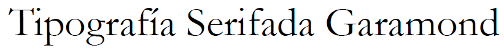
-   **Sans Serif**: Letras sin trazos, son más legibles y modernas. Ideal para textos de cuerpo y navegación.
    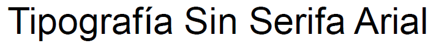
-   **Manuscritas**: Atractivas pero difíciles de leer en grandes cantidades. Son más adecuadas para títulos o frases cortas.
-   **Decorativas**: Ideales para resaltar breves textos, pero deben usarse con cautela en sitios profesionales.

### Consejos para usar la tipografía

-   Establecer una **jerarquía tipográfica** clara.
-   Evitar tamaños de texto demasiado pequeños (mínimo 14 puntos).
-   Escoger tipografías legibles para los cuerpos de texto y no abusar de las letras mayúsculas o textos centrados, ya que dificultan la lectura.
-   Utilizar un **interlineado correcto** para evitar una sensación de densidad en el texto.
-   Asegurar un **contraste adecuado** entre el texto y el fondo para mejorar la legibilidad.

### Generación de documentos y sitios web

El desarrollo de un sitio web implica varias fases: análisis, desarrollo, pruebas y documentación. La guía de estilo es esencial para mantener la coherencia visual y técnica a lo largo del proyecto.

### Guías de estilo

Una guía de estilo debe incluir elementos clave como logos, colores, iconografía y tipografía, garantizando uniformidad en todas las páginas del sitio. Es imprescindible cuando el proyecto es desarrollado por un equipo.

### Estudio de la marca

El estudio de la marca busca reflejar visual y emocionalmente su esencia, considerando los siguientes elementos:

**Paleta de colores:** Incluye los colores principales y sus variaciones (patrones o tonos sólidos), especificando códigos exactos y detalles de saturación y luminosidad.

**Tipografías:** Lista de fuentes utilizadas, con reglas sobre su uso: nombres, tamaños, estilos y colores. Se recomiendan imágenes para ilustrar estos detalles.

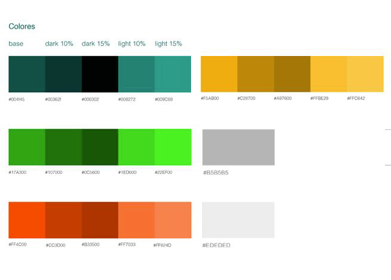

**Estilos de botones y navegación:** Combinación de tipografía y colores en botones, enlaces y elementos de navegación. Se describen estados como hover, selección e inactividad, así como menús, submenús y breadcrumbs.

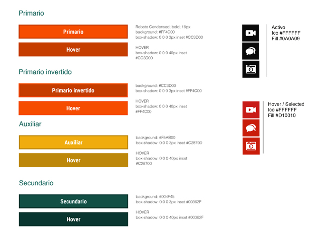

**Imágenes:** Define tamaños, proporciones, efectos y variaciones según su uso (galerías, fotos destacadas, etc.), especificando formato y dimensiones.

**Iconografía:** Se eligen iconos familiares para los usuarios, manteniendo coherencia de estilo. Se sugieren fuentes como Iconfinder, FontAwesome y Google Icons.

**Estructura:** Describe la maquetación, mapas de navegación y prototipos de páginas.

**Otros:** Incluye diseño de formularios (errores y éxitos), espaciado (márgenes y paddings), paginadores y otros elementos específicos del sitio.

## Usabilidad web

### ¿Qué es?

La usabilidad web se refiere a la facilidad con la que los usuarios acceden y navegan por un sitio web de manera rápida y sencilla. Aunque su falta es notoria, cuando está bien implementada, pasa desapercibida, permitiendo a los usuarios interactuar con el sitio sin fricciones.

### Aspectos clave de la usabilidad:

1. **Diseño gráfico**: La estética debe ser atractiva y funcional.
2. **Presentación de la información**: Los contenidos deben estar organizados de manera clara y lógica.
3. **Funcionamiento del sitio**: Debe ser rápido, sin errores, y fácil de usar.

### Accesibilidad

Una web accesible garantiza que todos los usuarios, independientemente de sus capacidades o del dispositivo que utilicen, puedan acceder a sus contenidos sin dificultades. Esto significa no depender de plugins específicos o navegadores limitados.

### Principios de la usabilidad

-   **Eficiencia**: Los usuarios deben lograr sus objetivos sin dificultad.
-   **Eficacia**: El sitio debe responder rápidamente a las acciones del usuario.
-   **Satisfacción**: Una buena experiencia asegura que los usuarios quieran regresar.

### Beneficios

-   **Reducción del abandono**: Una navegación fácil y rápida disminuye la tasa de rebote.
-   **Aumento del tiempo de visita**: Los usuarios permanecen más tiempo si la experiencia es agradable.
-   **Mayor conversión**: Un proceso de compra sencillo incrementa las conversiones.
-   **Mejor experiencia de usuario**: Encontrar lo que buscan de manera fácil mejora su satisfacción.
-   **Fidelización**: Usuarios satisfechos tienden a volver y recomendar el sitio.
-   **Mayores ingresos**: La combinación de usabilidad y conversión genera más ventas.

### Cómo mejorar la usabilidad

-   **Contenido relevante**: Textos claros y breves, con una jerarquía bien definida en títulos y encabezados.
-   **Diseño congruente**: Cuidar colores, tipografía y estructura, aprovechando los espacios en blanco.
-   **Navegación sencilla**: Un menú claro y lógico facilita el desplazamiento por las secciones.
-   **Velocidad de carga**: Optimizar la velocidad mejorando la calidad de los elementos multimedia y usando herramientas como PageSpeed Insights.
-   **Detección de errores**: Revisar las URL y asegurar que todo el contenido esté disponible.
-   **Interacción con los usuarios**: Implementar chats en vivo, secciones de comentarios y enlaces a redes sociales.
-   **Diseño adaptable**: Usar diseño responsivo para que el sitio se vea bien en todos los dispositivos.
-   **Búsqueda interna**: Incluir un campo de búsqueda en sitios con mucho contenido.
-   **Generar confianza**: Mostrar profesionalismo e incluir textos legales y direcciones físicas.

### Buenas practicas

-   Seguir los estándares (logo a la izquierda con enlace a la homepage, links subrayados, iconografía clara).
-   Incluir siempre un título `<h1>`, breadcrumbs en sitios grandes, y destacar links visitados.
-   Facilitar la navegación con formularios cortos, autocompletado y uso de etiquetas `alt` en imágenes.
