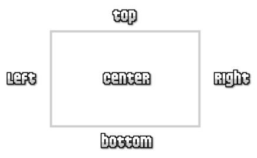
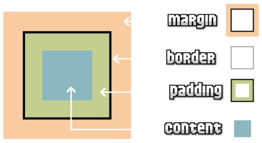
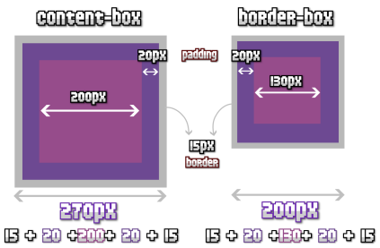
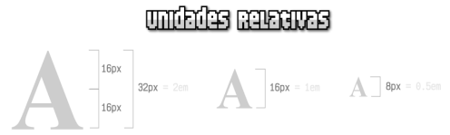
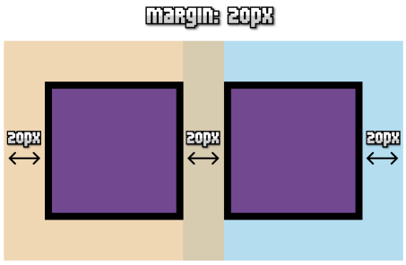
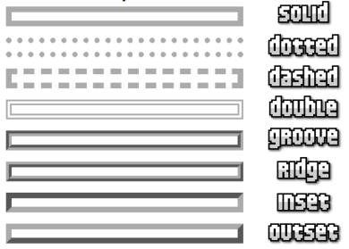
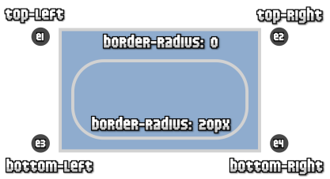

# Unidad 3 - CSS básico

## ¿Qué es CSS?

-   CSS (Cascading Style Sheets, o "Hojas de estilo en cascada") es un lenguaje que define la presentación de documentos HTML, separando el diseño visual del contenido.
-   El término "cascada" describe cómo el navegador aplica las reglas CSS, siguiendo un orden jerárquico y de herencia, resolviendo conflictos mediante reglas específicas.
-   CSS permite centralizar el diseño en un único archivo, lo que facilita cambios globales en múltiples páginas vinculadas.

### **Ventajas de usar CSS**

1. **Centralización del diseño**: Un único archivo CSS puede definir el diseño de múltiples páginas.
2. **Facilidad de mantenimiento**: Los cambios se aplican globalmente desde un solo lugar.
3. **Optimización de carga**: Menos código repetido reduce el tamaño de las páginas y mejora su velocidad.
4. **Adaptabilidad a dispositivos**: Permite crear diseños específicos para cada dispositivo.

### **Métodos de uso de CSS**

1. **Archivo CSS externo** (recomendado): Se vincula mediante `<link rel="stylesheet" href="styles.css">` en la etiqueta `<head>`.
2. **Bloque de estilos interno** (menos recomendado): Código CSS dentro de una etiqueta `<style>` en el documento HTML.

    ```html
    <style>
        body {
            background-color: #f4f4f4;
        }
    </style>
    ```

3. **Estilos en línea** (desaconsejado): Se incluyen directamente en el atributo `style` de los elementos HTML.

    ```html
    <body style="background-color: #ccc;"></body>
    ```

### **Estructura de CSS**

-   **Selector**: Identifica los elementos a los que se aplicará un estilo.
-   **Propiedad**: Define una característica (color, tamaño, etc.).
-   **Valor**: Especifica cómo se aplicará la propiedad.
-   **Regla**: Conjunto de propiedades aplicadas a un selector.

**Buenas prácticas**:

-   Usa una regla por línea y añade indentación para mejorar la legibilidad.
-   Escribe siempre el punto y coma final en bloques de reglas.
-   Añade comentarios con `/* texto */`.

### **Tipos de selectores**

1. **Selector universal (`*`)**: Aplica estilos a todos los elementos.

    ```css
    * {
        margin: 0;
        padding: 0;
    }
    ```

2. **Selector de etiqueta**: Estiliza todos los elementos de un tipo específico (`p`, `h1`, etc.).

    ```css
    p {
        color: blue;
    }
    ```

3. **Selector de clase (`.nombre`)**: Permite aplicar estilos a múltiples elementos que comparten un atributo `class`.

    ```css
    .destacado {
        color: red;
    }
    p.destacado {
        color: red;
    }
    p .destacado {
        color: red;
    }
    ```

4. **Selector de ID (`#nombre`)**: Aplica estilos a un único elemento identificado por su atributo `id`.

    ```css
    #destacado {
        font-size: 20px;
    }
    p#destacado {
        font-size: 20px;
    }
    p #destacado {
        font-size: 20px;
    }
    ```

5. **Selectores combinados y jerárquicos**:

    - **Hijos directos (`>`)**: Selecciona elementos directamente anidados.
        ```css
        #destacado > p {
            font-size: 20px;
        }
        ```
    - **Descendientes**: Selecciona elementos dentro de otros, sin importar la profundidad.
        ```css
        #destacado p {
            font-size: 20px;
        }
        ```
    - **Adyacentes (`+`)** y **posteriores (`~`)**: Seleccionan elementos en relación con otros.

        ```css
        #destacado + p {
            font-size: 20px;
        }

        #destacado ~ p {
            font-size: 20px;
        }
        ```

6. **Selectores por atributos**: Aplican estilos según la presencia o valores de atributos en los elementos.

    ```css
    /* Se muestran de color azul todos los enlaces que tengan un atributo "class", independientemente de su valor */
    a[class] {
    	color: blue;
    }

    /* Se muestran de color azul todos los enlaces que tengan un atributo "class" con el valor "externo" */
    a[class="externo"] {
    	color: blue;
    }

    /* Se muestran de color azul todos los enlaces que apunten al sitio "http://www.ejemplo.com" */
    a[href="http://www.ejemplo.com"] {
    	color: blue;
    }

    /* Se muestran de color azul todos los enlaces que tengan un atributo "class" en el que al menos uno de sus valores sea "externo" */
    a[class~="externo"] {
    	color: blue;
    }

    /* Todos los que tengan el atributo disabled se muestran en beige */
    [disabled] {
    	background-color: beige;
    	color: white;
    }

    a[target="_blank"] {
    	text-decoration: line-through;
    	color: sienna;
    }

    /* Selecciona todos los elementos de la página cuyo atributo "lang" sea igual a "en", es decir, todos los elementos en inglés */
    *[lang=en] {...}

    /* Selecciona todos los elementos de la página cuyo atributo "lang" empiece por "es", es decir, "es", "es-ES", "es-AR", etc. */
    *[lang|="es"] { color : red }

    /* Se muestran de color azul todos los enlaces que empiecen por el valor https*/
    a[href^=https] { color: blue; }

    /* Se muestran de color azul todos los enlaces que acaben en .com */
    a[href$=com"] { color: blue; }

    /* Se muestran de color azul todos los enlaces que contengan la palabra ejemplo*/
    a[href*=ejemplo] { color: blue; }

    /* Todos los enlaces que empiecen por https */
    a[href^="https"] {
    	color: rgb(51,153,73);
    }

    /* Se muestran sin subrayar todos los enlaces con el atributo href que acaben en .com/ o .com */
    a[href$="*.com"] {
    	color: rgb(10, 210,255);
    	text-decoration:none;
    }

    /* Cualquier link que tenga la palabra css en el interior se pintara de color naranja. */
    a[href*="css"], a[href*="CSS"] {
    	color: rgb(255, 136, 0);
    }
    ```

### **Pseudoclases**

Permiten aplicar estilos basados en el estado o características dinámicas de los elementos:

-   **Interacción con enlaces**:
    -   `link` → Se aplica a todos los enlaces que todavía no han sido visitados por el usuario.
    -   `visited` → Se aplica a todos los enlaces que han sido visitados al menos una vez por el usuario.
    -   `:hover` → Se activa cuando el usuario pasa el ratón o cualquier otro elemento apuntador por encima de un elemento.
    -   `:active` → Se activa cuando el usuario activa un elemento, por ejemplo cuando pulsa con el ratón sobre un elemento.
    -   `:focus` → Se activa cuando el elemento tiene el foco del navegador, es decir, cuando el elemento está seleccionado.
    ```css
    a:hover {
        text-decoration: underline;
    }
    ```
-   **Posicionamiento**:
    -   `:first-child` → Selecciona el primer elemento hijo de un elemento.
    -   `:last-child` → Selecciona el ultimo elemento hijo de un elemento.
    -   `:nth-child(n)` → Elemento hijo número `n` (de cualquier tipo).
    ```css
    p:first-child {
        font-weight: bold;
    }
    ```
    -   `:first-of-type` → Representa el primero de los hermanos de su tipo en la lista de hijos de su elemento padre.
    -   `:last-of-type` → Representa el último elemento hermano de un tipo dado en la lista del elemento hijo de su elemento padre.
-   **Otros:**
    -   `empty` → Corresponde a un elemento sin ningún nodo de hijo.

### **Pseudoelementos**

-   **`::first-line`** → Aplica estilos a la primera línea de un texto.
-   **`::first-letter`** → Aplica estilos a la primera letra de un texto.
-   Se usan principalmente para añadir detalles estéticos a bloques de texto.

```css
p::first-letter {
    font-size: 2em;
    color: red;
}
```

-   Los pseudo-elementos `:before` y `:after` se utilizan en combinación con la propiedad `content` de CSS para añadir contenidos antes o después del contenido original de un elemento.
    ```css
    H1::before {
        content: "Capítulo - ";
    }
    p::after {
        content: ".";
    }
    ```

### Herencia

-   CSS permite heredar valores de propiedades de elementos padres a descendientes.
-   Se puede sobrescribir una herencia con un valor explícito.
-   La propiedad `inherit` fuerza la herencia en propiedades que no lo hacen por defecto.

### Colisiones

-   Varias reglas CSS pueden aplicarse a un mismo elemento, generando conflictos resueltos mediante:
    1. Orden de origen y prioridad (`!important`).
    2. Especificidad del selector (más específico, mayor prioridad).
    3. Orden de declaración (última regla prevalece si hay empate).
-   Regla general: a mayor especificidad, mayor prioridad.

## Modelo de cajas en CSS

-   Todos los elementos HTML se representan como cajas rectangulares con:
    -   **Contenido (`content`)** → Área donde se muestra el contenido.
    -   **Relleno (`padding`)** → Espacio entre el contenido y el borde.
    -   **Borde (`border`)** → Línea que rodea el contenido y el relleno.
    -   **Margen (`margin`)** → Espacio entre la caja y otras cajas.
        
        
-   Propiedades clave para ajustar dimensiones:
    -   **Anchura y altura** (`width`, `height`) → Determinan el tamaño del contenido. No admiten valores negativos y pueden ser relativas al contenedor padre.
    -   **Rangos de dimensiones** (`max-width`, `min-width`, `max-height`, `min-height`): Especifican límites máximos y mínimos.
    -   **Desbordamiento (`overflow`)** → Controla cómo manejar contenido que excede las dimensiones de una caja (ej. `visible`, `hidden`, `scroll`, `auto`).
        | Propiedad | Valor | Significado |
        | ------------ | -------------------------------------- | -------------------------------------------------------------- |
        | `overflow-x` | `visible`, `hidden`, `scroll` o `auto` | Establece el desbordamiento del eje X (en horizontal) |
        | `overflow-y` | `visible`, `hidden`, `scroll` o `auto` | Establece el desbordamiento del eje Y (en vertical) |
        | `overflow` | `[overflow-x] [overflow-y]` | Propiedad de atajo que establece desbordamiento de ambos ejes. |

### `box-sizing`

-   Controla cómo se calculan las dimensiones totales:
    -   Por defecto, `content-box` calcula solo el contenido.
    -   `border-box` incluye bordes y relleno en el tamaño total.



### Unidades absolutas

### Unidades de Medida

-   Absolutas: Completamente definidas, independientes de otras referencias:
    -   `px` (píxeles), `pt` (puntos), `cm`, `mm`, `in` (pulgadas), `pc` (picas).
-   Relativas: Dependen de otra referencia:
    -   `em`: Basada en el tamaño de fuente del elemento actual.
        
    -   `rem`: Basada en el tamaño de fuente del elemento raíz (`<html>` o `:root`).
    -   Porcentajes: Relativos al tamaño del elemento padre.

### Propiedades de Estilo

-   Margen (`margin`) → Controla el espacio externo de una caja:
    -   Propiedades individuales (`margin-top`, `margin-right`, `margin-bottom`, `margin-left`) o `margin` para definir valores simultáneos.
    -   **Colapso de márgenes**: Cuando dos márgenes adyacentes se superponen.
        
-   Relleno (`padding`) → Define el espacio interno entre el contenido y el borde.
    -   Similar a `margin`, admite notación abreviada.
    ```css
    body {
        padding: 2em;
    } /* Todos los rellenos valen 2em */
    body {
        padding: 1em 2em;
    } /* Superior e inferior = 1em, Izquierdo y derecho = 2em */
    body {
        padding: 1em 2em 3em;
    } /* Superior = 1em, derecho = 2em, inferior = 3em, izquierdo = 2em */
    body {
        padding: 1em 2em 3em 4em;
    } /* Superior = 1em, derecho = 2em, inferior = 3em, izquierdo = 4em */
    ```
-   Bordes (`border`) → Personaliza los bordes de una caja:
    -   **Estilo** (`border-style`): `none`, `hidden`, `dotted`, `dashed`, `solid`, `double`, `groove`, `ridge`, `inset`, `outset`.
        
    -   **Color** (`border-color`).
    -   **Ancho** (`border-width`): Se puede especificar individualmente o mediante notación abreviada.
    -   **Esquinas redondeadas**: Utilizar `border-radius` para suavizar las esquinas.
        

## **Pseudoclases**

Las pseudoclases permiten aplicar estilos a elementos HTML en función de su comportamiento o estado específico, diferenciando elementos con características aparentemente similares:

**Interacción con el usuario:**

-   `:hover` → Aplica estilos cuando el usuario pasa el ratón sobre un elemento. Poco relevante en dispositivos móviles.
-   `:active` → Estiliza elementos mientras están siendo pulsados por el usuario.
-   `:focus` → Destaca elementos que tienen el foco, común en formularios (`<input>`, `<textarea>`).
    ```css
    input:focus {
        border: solid 2px red;
    }
    ```
-   `:focus-within` → Estiliza el contenedor relacionado con un elemento que tiene el foco.
    ```css
    label:focus-within {
        background-color: aqua;
    }
    ```

**Enlaces:**

-   `:link` → Selecciona enlaces no visitados.
-   `:visited` → Estiliza enlaces previamente visitados.

**Elementos raíz y posición:**

-   `:root` → Representa el elemento raíz del documento (`<html>`). Se usa para definir valores globales, como fuentes en `rem`.
    ```css
    :root {
        font-size: 14px;
    }
    ```
-   `:first-child`, `:last-child` → Seleccionan el primer o último hijo de un grupo de elementos.

    ```css
    section#carrusel figure:first-child {
        background-color: blue;
    }

    section#carrusel figure:last-child {
        background-color: red;
    }
    ```

**Selección por posición:**

-   `:nth-child(A)` → Selecciona un hijo específico según su posición o expresión.
-   `:nth-last-child(A)` → Igual que el anterior, pero comienza desde el último hijo. Ejemplo:

    ```css
    table tr:nth-child(even) {
        background-color: beige;
    }

    table tr:nth-child(odd) {
        background-color: grey;
        color: white;
    }
    ```

**Formularios:**

-   `:checked` → Estiliza elementos marcados, como checkboxes o radios.
-   `:default` → Selecciona elementos de formulario con valores predeterminados.
-   `:enabled` y `:disabled` → Seleccionan elementos activados o desactivados.
-   `:read-only` → Selecciona campos de solo lectura.
-   `:placeholder-shown` → Estiliza elementos que muestran un `placeholder`.

## **Cascada CSS**

La cascada es el sistema que usa el navegador para resolver conflictos y decidir qué estilos aplicar.

1. **Herencia de propiedades:**
    - Propiedades heredables: `color`, tipografía (`font-*`), texto (`text-*`), `visibility`, `list-style-type`.
    - Forzar herencia:
        - `inherit` → Hereda del padre.
        - `initial` → Usa el valor inicial predeterminado.
        - `unset` → Combina `inherit` para heredables y `initial` para no heredables.
2. **Reinicio de estilos:**
    - `all`: Resetea todas las propiedades CSS de un selector.
3. **Prioridad en fuentes de estilos:**
    - **Inline styles** (`style=""` en HTML): Mayor prioridad.
    - **Bloque `<style>` interno**: Prioridad intermedia.
    - **Archivo CSS externo**: Menor prioridad.
4. **Conflictos entre selectores:**
    - **Estructura:** Si varias reglas apuntan al mismo elemento, prevalece la última definida.
    - **Especificidad:** La especificidad es el mecanismo que el navegador usa para resolver conflictos. Se puede representar como tres valores (A, B, C):
        - **Valor A:** Número de `#id` en el selector.
        - **Valor B:** Número de `.clase`, `[atributo]` o `:pseudoclase`.
        - **Valor C:** Número de elementos o `::pseudoelementos`.
          El sufijo `!important` puede sobrescribir la especificidad, pero debe usarse con moderación, ya que es considerado una mala práctica.
