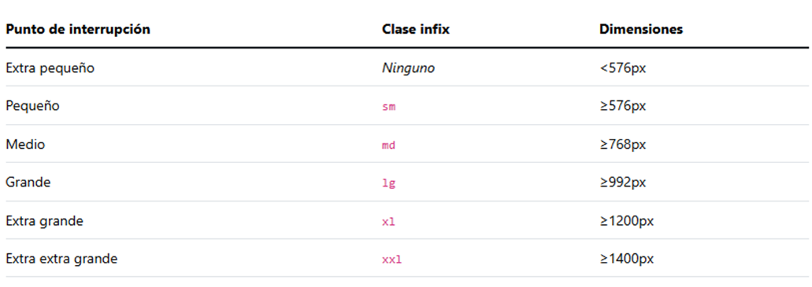
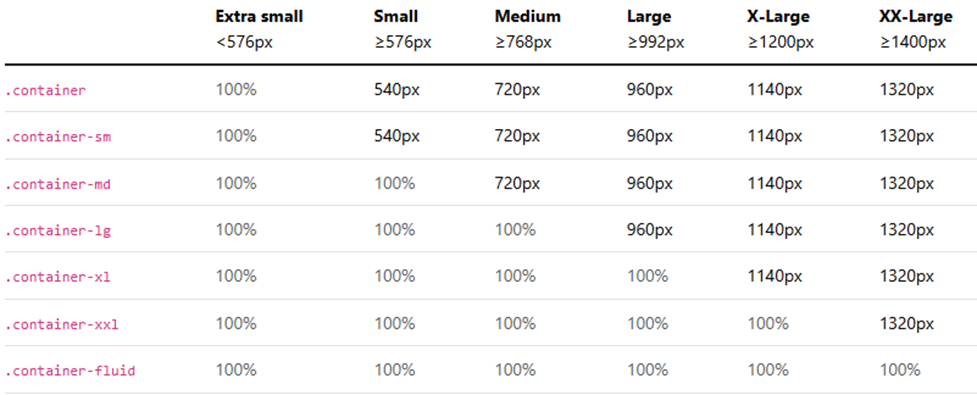

# Unidad 5 - Bootstrap

## **¿Qué es Bootstrap?**

Bootstrap es un framework CSS de código abierto que simplifica la creación de sitios y aplicaciones web responsivas. Desarrollado inicialmente por Twitter, se ha convertido en una de las herramientas más populares gracias a su flexibilidad, facilidad de uso y compatibilidad con más del 95% de los navegadores.

## Características

-   **Sistema de rejilla responsivo:** Organiza el diseño en filas y columnas adaptables a cualquier dispositivo.
-   **Componentes predefinidos:** Incluye botones, formularios, barras de navegación, alertas, tarjetas y más.
-   **Compatibilidad total:** Asegura una visualización correcta en los navegadores más utilizados.
-   **Personalización sencilla:** Permite modificar estilos fácilmente con variables Sass o CSS.
-   **Extensiones con JavaScript:** Incorpora plugins para funcionalidades avanzadas como carruseles, menús desplegables y modales.

-   **Sistema de rejilla responsivo:** Permite construir diseños adaptables a diferentes dispositivos (móviles, tabletas y ordenadores) con una estructura basada en filas y columnas.
-   **Componentes predefinidos:** Incluye una variedad de elementos listos para usar, como botones, formularios, barras de navegación, alertas, tarjetas y modales.
-   **Compatibilidad con navegadores:** Garantiza que los sitios se visualicen correctamente en los navegadores más utilizados.
-   **Personalización sencilla:** Facilita la modificación de estilos mediante variables de Sass o CSS.
-   **Extensiones con JavaScript:** Incorpora plugins JavaScript (o jQuery) para agregar funcionalidades como carruseles, menús desplegables y ventanas emergentes.

## Ventajas

-   **Facilidad de uso:** Ideal para principiantes y expertos.
-   **Diseño consistente:** Mantiene una apariencia uniforme en todo el proyecto.
-   **Comunidad activa:** Ofrece documentación detallada y soporte comunitario.
-   **Desarrollo ágil:** Acelera la creación de interfaces modernas sin necesidad de escribir estilos desde cero.

## Cómo comenzar con Bootstrap

### **1. Inclusión de Bootstrap en el proyecto**

Para usar Bootstrap, agrega el siguiente enlace en la cabecera de tu HTML:

```html
<link
    href="https://cdn.jsdelivr.net/npm/bootstrap@5.1.3/dist/css/bootstrap.min.css"
    rel="stylesheet"
    integrity="sha384-1BmE4kWBq78iYhFldvKuhfTAU6auU8tT94WrHftjDbrCEXSU1oBoqyl2QvZ6jIW3"
    crossorigin="anonymous"
/>
```

### 2. Incluir JavaScript

Algunos componentes requieren JavaScript. Puedes cargarlo de dos maneras:

```html
<!-- Cargar scripts por separados -->
<script
    src="https://cdn.jsdelivr.net/npm/@popperjs/core@2.11.2/dist/umd/popper.min.js"
    integrity="sha384-q9CRHqZndzlxGLOj+xrdLDJa9ittGte1NksRmgJKeCV9DrM7Kz868XYqsKWPpAmn"
    crossorigin="anonymous"
></script>
<script
    src="https://cdn.jsdelivr.net/npm/bootstrap@5.1.3/dist/js/bootstrap.min.js"
    integrity="sha384-QJHtvGhmr9XOIpI6YVutG+2QOK9T+ZnN4kzFN1RtK3zEFEIsxhlmWl5/YESvpZ13"
    crossorigin="anonymous"
></script>

<!-- Cargar script agrupado -->
<script
    src="https://cdn.jsdelivr.net/npm/bootstrap@5.1.3/dist/js/bootstrap.bundle.min.js"
    integrity="sha384-ka7Sk0Gln4gmtz2MlQnikT1wXgYsOg+OMhuP+IlRH9sENBO0LRn5q+8nbTov4+1p"
    crossorigin="anonymous"
></script>
```

## **Componentes que requieren JavaScript**

-   **Alerts** → Para ocultarlas dinámicamente.
-   **Buttons** → Alternación de estados y funcionalidad de checkbox/radio.
-   **Carousel** → Control de diapositivas, indicadores y transiciones.
-   **Collapse** → Mostrar u ocultar contenido.
-   **Dropdowns** → Menús desplegables (requiere Popper.js).
-   **Modals** → Manejo de ventanas emergentes.
-   **Navbar** → Comportamiento responsivo del menú de navegación.
-   **Offcanvas** → Paneles laterales deslizables.
-   **Toasts** → Mensajes emergentes.
-   **Tooltips y popovers** → Información emergente (requiere Popper.js).
-   **Scrollspy** → Sincronización de desplazamiento con la navegación.

## Estructura básica de Bootstrap

Para configurar correctamente Bootstrap en tu proyecto, sigue estos pasos:

1. **Definir el doctype HTML5:**

    ```html
    <!DOCTYPE html>
    <html lang="es"></html>
    ```

2. **Agregar la meta etiqueta responsiva:**

    ```html
    <meta name="viewport" content="width=device-width, initial-scale=1" />
    ```

3. **Configurar box-sizing:** Bootstrap usa `border-box` por defecto. Algunos widgets externos pueden requerir ajustes manuales.
4. **Aplicar Reboot CSS:** Normaliza estilos entre navegadores para una apariencia uniforme.

## **Uso modular de Bootstrap**

Si no necesitas todo el framework, puedes importar solo los módulos específicos que requieras, optimizando el rendimiento de tu sitio.

## Sistema de rejilla en Bootstrap

El sistema de cuadrícula de Bootstrap está basado en **flexbox** y permite diseñar interfaces flexibles y personalizadas con un esquema de **doce columnas**.

## Puntos de interrupción (Breakpoints)

Los breakpoints determinan cómo se adapta el diseño en distintos tamaños de pantalla:

-   Se gestionan con **media queries** para definir estilos específicos por tamaño de dispositivo.
-   Bootstrap sigue un enfoque **mobile-first**, aplicando estilos base para móviles y añadiendo reglas adicionales para pantallas más grandes.
-   Optimiza la distribución del contenido asegurando que los elementos se alineen correctamente.



## Contenedores

Bootstrap ofrece tres tipos de contenedores para estructurar el diseño:

-   **`.container`** → Ancho máximo adaptado a cada breakpoint.
-   **`.container-{breakpoint}`** → Se expande al 100% del ancho hasta alcanzar el punto de interrupción especificado.
-   **`.container-fluid`** → Ocupa el 100% del ancho en todas las pantallas.



## Grid

El sistema de cuadrícula de Bootstrap es altamente flexible y basado en **flexbox**, permitiendo la creación de diseños personalizados con un sistema de **doce columnas** y seis niveles de respuesta predefinidos.

### **Características de la cuadrícula**

-   Soporta **seis puntos de interrupción responsivos**.
-   Los **contenedores** centran y ajustan horizontalmente su contenido.
-   Las **filas** (`.row`) actúan como contenedores de columnas y utilizan **`gutter`** (padding horizontal) para el espaciado entre columnas.
-   Las **columnas** (`.col-*`) permiten definir el tamaño de los elementos y pueden adaptarse dinámicamente al espacio disponible.
-   El **espaciado entre columnas (gutters)** es personalizable y responsive.
-   Utiliza **variables, mapas y mixins de Sass** para mayor flexibilidad y personalización.

### **Opciones del grid**

-   El diseño se estructura **desde el más pequeño hasta el más grande**.
-   Las columnas deben estar **contenidas dentro de una fila (`.row`)**.
-   Las clases `col-12` pueden omitirse si ocupan el ancho completo de la fila.

## **Distribución automática del ancho**

-   Si no se define el tamaño de las columnas (`.col` sin número), se repartirán equitativamente el espacio disponible.
    -   Ejemplo: Tres columnas `.col` → cada una tendrá un **33%** de ancho.
    -   Ejemplo: `.col-3`, `.col-6`, `.col-3` → Distribución **25%-50%-25%**.
-   Para que una columna ajuste su tamaño al contenido, usa `.col-auto` o `.col-md-auto`.

## Filas y anidamiento de columnas

-   Para definir el número de columnas por fila en distintos tamaños de pantalla, usa `row-cols-{breakpoint}-{número}`.
-   Se pueden anidar filas dentro de columnas existentes, asegurando que la suma de las columnas anidadas no supere **12 unidades**.
